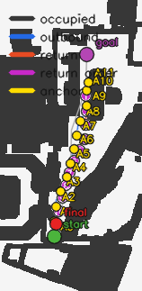
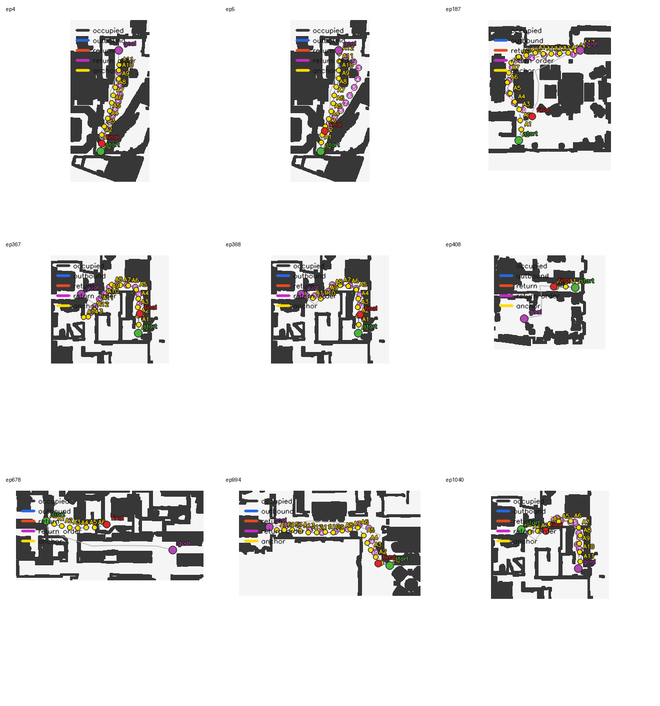
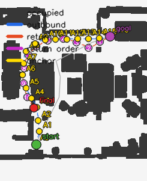
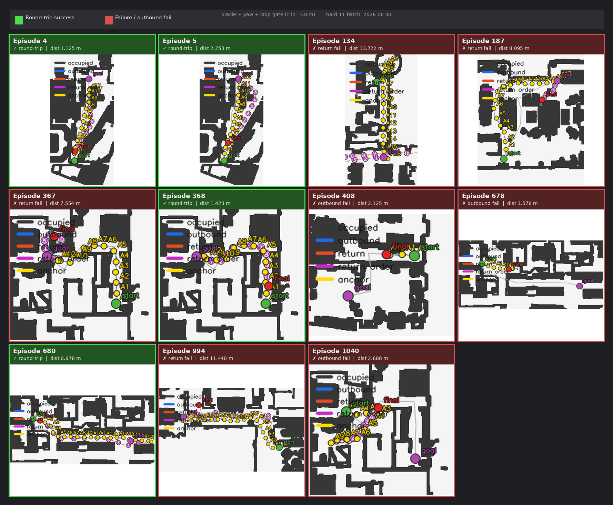

# NaVILA + Isaac Sim VLN-CE Deployment on RTX 4090

Reproduction of [NaVILA](https://navila-bot.github.io/) (RSS 2025) Isaac Sim benchmark on a local workstation with RTX 4090.

**Status: End-to-end evaluation working ✅ — Episode 0: success=1.0, SPL=0.907**

**Latest update (2026-07-03, continued 2) — the shared `lidar_sensor` was quietly also the locomotion policy's balance input; fixed with a second, dedicated sensor, which measurably improved Scan Context's real contribution to the `fused` backend.** Root-caused why the LiDAR point clouds in the new match-visualization plots looked so sparse: `vertical_fov_range=(0,90)` on `lidar_sensor` put 24 of 32 channels (75%) pointing almost straight down at the floor a few tens of cm below the sensor (a live per-channel diagnostic on ep4 showed 0 obstacle-band hits for channels 8-31). Tried narrowing it to `(0,15)` plus `horizontal_res` 4.0→1.0 -- round-trip success collapsed on all 3 test episodes (ep187/994 fell over within ~10 steps, ep680 within 3-4, confirmed via raw trajectory height data against a same-day baseline where all three held a normal ~0.3 m standing height). Root cause: `ObservationsCfg.PolicyCfg.height_map` also reads `lidar_sensor` as the trained locomotion policy's terrain observation -- narrowing its geometry fed the policy out-of-distribution height-map values. Fix: added a second, independent `route_memory_lidar` RayCasterCfg (identity offset rotation, symmetric `vertical_fov_range=(-15,15)`, `horizontal_res=1.0`, `max_distance=20`) used only for route-memory matching; `lidar_sensor` reverted untouched for the policy. `local_map_descriptor_from_env` now prefers `route_memory_lidar` when present.

Re-ran the `fused`-backend 3-episode batch (`route_memory_lidar_validated_187_680_994_20260703`) with the new sensor: all 3 round trips still succeed (no falls), and genuine two-way LoFTR+Scan-Context agreement (`fused_agreement`) jumped roughly an order of magnitude -- 1.1%→18.2% (ep187), 1.3%→6.3% (ep680), 0%→19.5% (ep994) -- meaning Scan Context is now actually corroborating LoFTR instead of mostly staying silent or disagreeing. Anchor-selection accuracy improved on 2 of 3 episodes (ep187 56.8%→69.2%, ep680 45.4%→78.3%) but regressed on ep994 (65.9%→52.6%, not yet root-caused). New anchor-match snapshots for this batch are included under each episode's `measurements/anchor_match_plots/`.

---

**Latest update (2026-07-03) — anchor-match point-cloud visualization tool, a real diagnostics-accumulation bug fix, three fresh batches (3-episode fused re-test, two 11-episode hard-batch runs), and a from-scratch per-step forensic analysis of *how* LoFTR/fused anchor matching actually fails (not just aggregate correct/incorrect counts).**

**New tool: `code/plot_anchor_match_diagnostics.py` + `build_local_map_match_snapshot()`.** Every scalar diagnostic this project has recorded so far (overlap ratio, median residual, bearing/vector error) says a match was bad but never shows what the two point clouds actually looked like. `relocalization.py::build_local_map_match_snapshot` now packages the anchor/current local-map point clouds, the ICP alignment, and the inlier mask into a small JSON-serializable snapshot; `local_map_anchor_relocalization`, `scan_context_anchor_relocalization`, and `fused_anchor_relocalization` all accept a new `capture_match_snapshots` flag (off by default — this measurably grows the measurement JSON) that attaches one to every accepted match. A new CLI flag, `--capture_anchor_match_snapshots`, threads this through `round_trip_eval.py`. `code/plot_anchor_match_diagnostics.py` is a standalone (no Isaac Sim dependency) script that loads a `measurements/*.json`, samples 10-20 matches evenly across the episode, and renders each as a scatter plot: current local map (blue), anchor points transformed into the current frame and split into matched/inlier (red) vs. unmatched (gray), robot origin (green triangle), titled with the backend, overlap, residual, confidence, and corridor-degeneracy ratio. 6 new unit tests cover the snapshot function and the opt-in/default-off behavior for both backends; all pass, no regressions in the existing 55-test suite.

**Bug found and fixed: `fused_anchor_relocalization`'s nested diagnostics were silently discarded every call except the last.** `rgbd_diag`/`lidar_diag` were built as a fresh `{}` on every single call and then wholesale-overwrote `diagnostics["fused_rgbd_diagnostics"]`/`["fused_lidar_diagnostics"]` — across a whole episode's ~50-90 relocalization attempts, only the *final* call's per-anchor `covisibility_records` (and, once added, `match_snapshot`) ever survived into the saved measurement JSON. Confirmed empirically on the first capture-enabled 11-episode batch (`fused_capture_snapshots_hard11_20260703`): only 3 of 11 episodes (ep4/367/408) had even a single Scan Context match snapshot, and none had more than 1. Fixed by using `diagnostics.setdefault(...)` so the same nested dict is reused call-over-call instead of replaced. Re-ran the identical 11-episode batch afterward (`fused_capture_snapshots_fixed_hard11_20260703`): episodes with a return phase now carry 11-50 match snapshots each, covering the full trajectory. A new regression test (`TestFusedDiagnosticsAccumulateAcrossCalls`) calls `fused_anchor_relocalization` twice against a shared diagnostics dict and asserts both calls' snapshots survive — it fails against the pre-fix code.

**Batch: 3-episode `fused` re-test after the sensor-selection fix (`fused_sensorfix_connectedregion_187_680_994_20260703`), oracle-primary round trips all succeeded (ep187 1.98 m, ep680 2.21 m, ep994 1.10 m), but the fusion's real LiDAR contribution is still negligible.** Per-episode fused-attempt breakdown: genuine two-way LoFTR+Scan-Context agreement occurred in 0-1.3% of attempts (1/94 ep187, 1/77 ep680, 0/74 ep994); LoFTR-alone (`fused_rgbd_only`) accounted for 32-60%; the rest (39-68%) were cases where Scan Context *did* produce a candidate (no longer silent, unlike before the sensor fix) but disagreed with LoFTR on anchor identity or pose and got vetoed. Conclusion: the sensor fix made the LiDAR side more *active*, not more *correct* — this matches the 2026-07-02 conclusion ("basically the same result as LoFTR alone") and is consistent with the still-unfixed `dead_reckoning_yaw_rad` orientation-drift bug (see below) continuing to cap Scan Context's own flip-disambiguation gate regardless of point-cloud quality.

**Two 11-episode hard-batch runs on the same code, same config, back to back — round-trip success flipped on 5 of 11 episodes between runs, with no route-memory-relevant code change in between.** Run 1 (`fused_capture_snapshots_hard11_20260703`): 8/11 round-trip (ep5/134/187 failed). Run 2 (`fused_capture_snapshots_fixed_hard11_20260703`, only the diagnostics-accumulation fix above changed): 7/11 (ep5/408/678/1040 failed). ep134 and ep187 flipped from fail→success; ep408/678/1040 flipped from success→fail despite having *always* succeeded in every prior batch documented in this README. Since these episodes fail at the *outbound* stage (before route-memory relocalization ever runs), this is very unlikely to be a route-memory regression — most likely VLM sampling/inference stochasticity — but it has not been root-caused and is flagged here rather than assumed.

**Per-step forensic analysis of the 3-episode fused re-test (ep187/680/994), using the full `route_memory`/`route_memory_shadow`/`route_memory_alignment` per-step trajectory fields plus `relocalization_events` and the (now-fixed) per-anchor covisibility records — going past aggregate correct/incorrect counts to *how* matches actually fail:**

- **Anchor-selection errors are small (±1-2 anchors, ~1-2 m), never the "wildly distant anchor" framing might suggest.** `anchor_index_error` (shadow target − oracle target) distribution: ep187 56.8% exactly correct (range −1..+1), ep680 45.4% correct (−2..+1), ep994 65.9% correct (−1..+1). Skewed toward *overshoot* (shadow believes it's closer to the start than truth) over *lag* in 2 of 3 episodes.
- **The overshoot skew is explained by an asymmetric acceptance gate, not by overshooting candidates being preferred.** `_sequence_match_observation` (`route_memory_agent.py`) rejects any candidate implying more than `sequence_forward_tolerance_m=0.4 m` of backward/lag motion *outright, no second chance*; a candidate implying more than `sequence_large_forward_jump_m=2.0 m` of sudden forward progress is only *deferred pending a second corroborating observation*, not rejected. Net effect: the filter is architected to distrust "you fell behind" far more than "you're on track or slightly ahead," so residual drift skews optimistic. Confirmed directly against `relocalization_events`: rejected attempts are dominated by `no_sequence_candidates` (candidates that *did* exist but failed this asymmetric gate), and all *accepted* `motion_error_m` values across all 3 episodes stayed within roughly ±0.8 m — individual corrections are always modest.
- **Concrete mechanism for why a nearer anchor can lose to a farther one, found in `feature_depth_anchor_relocalization`'s own scoring formula:** `score = confidence * sqrt(inlier_count)` (relocalization.py:1816+). `confidence` saturates at 1.0 once residual is low and `inlier_count` clears ~30, but the `sqrt(inlier_count)` term does not — so among several adjacent anchors that all reach confidence=1.0 (common, since anchors are only ~1 m apart and share heavy visual overlap), whichever one's rear-view image happens to yield more raw RANSAC-consistent feature matches wins, regardless of whether that reflects better localization. Directly observed in ep187's final LoFTR attempt: anchor 2 (2.00 m from start, 2519 inliers, score 50.2) beat anchor 1 (1.00 m from start, 1263 inliers, score 35.5) — both had confidence=1.0 and sub-centimeter RANSAC residual. Same pattern (2-3 adjacent anchors all at confidence=1.0, ranked purely by raw inlier count) reproduced in ep680 and ep994's final attempts.
- **The largest errors (up to 12.4 m target-vector spikes) are a separate and larger effect than anchor-selection error: pure dead-reckoning pose drift between accepted corrections, even when the anchor identity is correct the whole time.** Traced directly in ep994: `anchor_index_error=0` throughout a stretch where `distance_to_anchor_error_m` grew smoothly 2.89→2.93→2.97→3.02→3.07→3.11 m over one ~25-step relocalization interval with no accepted correction, then snapped to 0.15 m the instant the next candidate was accepted (backend label also switched from the EMA-smoothed `+ema` suffix to a fresh, un-smoothed estimate, per `_temporally_smooth_relocalization`'s "trust a sharply disagreeing fresh estimate outright" rule). The `expected_s` continuity reference used by the acceptance gate is itself a rolling dead-reckoning accumulation *since the last accepted observation* (not since outbound start — that part was already fixed by the 2026-07-02 relative-edge pose graph work) — but with only 34-53% of relocalization attempts getting accepted in this batch, that local accumulation window is often ~25 steps long, long enough to drift several meters.
- **Visual confirmation of the "sticky wide-basin" corridor-degeneracy hypothesis (first raised 2026-07-01 from ep994) using the new match-snapshot tool:** of 15 sampled Scan-Context matches for ep994, anchor 7 was independently re-selected 6 times across a wide span of attempts (11, 17, 26, 34, 51, 54). Plotting attempt 26 shows the current local map contains a wall/corridor edge that anchor 7's own stored map also shares (matched, red) *plus* a long straight structure extending ~18 m further that has no counterpart in anchor 7's map at all (unmatched, blue) — i.e. the robot is standing in a corridor much longer than any single anchor's recorded slice of it, so many anchors along that same corridor can plausibly "match" almost as well as the true one.
- **Orientation drift (`dead_reckoning_yaw_rad`) is confirmed still fully active in the current code path and architecturally separate from the above:** it is the same accumulated-since-outbound-start absolute yaw described in the 2026-07-02 entries below (never corrected by any accepted relocalization), and it still gates `scan_context_anchor_relocalization`'s 180°-flip disambiguation inside `fused`. It affects the *accepted pose's* plausibility check, not which anchor gets selected in the first place (identity is chosen by Scan-Context global similarity, or by the raw LoFTR score above, before this gate ever runs) — so its main effect in this batch was on why Scan Context so often produced *no* candidate at all (heading-consistency-rejected) rather than on which wrong anchor got picked.

**Known gap acknowledged, not yet fixed:** the same per-call-overwrite pattern this update fixed for `fused_rgbd_diagnostics`/`fused_lidar_diagnostics` may exist elsewhere; and the orientation-drift fix identified as the 2026-07-02 (continued) entry's top priority (replacing the global accumulated `dead_reckoning_yaw_rad` reference with a short local-window relative-yaw check) is still unimplemented.

---

**Latest update (2026-07-02, continued) — found and fixed a sensor-selection bug that had every LiDAR-based backend this project ever built (`local_map_icp`, `scan_context`, everything layered on top) running on a ~2 m-radius foot/gait-terrain sensor instead of the room-scale 32-channel LiDAR that was sitting right there in the scene the whole time; also implemented paper-faithful Scan Context height encoding, spatial-connectivity match scoring, and an RGB-D+LiDAR fusion backend.** Continuation of the same day's earlier P1/P2/Direction1/2/P3 work (original entry preserved below). Anchor-*selection* accuracy is the metric of record throughout this update — bearing/position error given a *correctly selected* anchor is a secondary number that stayed misleadingly bad for reasons unpacked below.

**P3 flip-fix, attempt 2 — still broken on real data, and why:** the first flip-fix (dual-hypothesis seeding, described below) still showed `same_anchor_bearing_median` of 169.9°/174.2° on a revalidation batch (`scan_context_p3_flipfix_187_680_994_20260702`) — essentially unchanged. Widened the ICP refinement from the narrow ±20°-around-two-hypotheses search to the same full 24-seed/360° sweep `local_map_icp`'s P1 already uses (against just the one Scan-Context-selected anchor, so still far cheaper than searching every candidate) — still no improvement (`scan_context_p3_wideseed_187_680_994_20260702`: 168–178°). While constructing a large-rotation (110°) synthetic regression test to probe this, found that this project's own heading-consistency *tests* (`TestLocalMapHeadingConsistencyGate`/`TestScanContextHeadingConsistencyGate`) had a latent sign error in their own ground-truth reference construction (`anchor_theta + dtheta` instead of the correct `anchor_theta - dtheta`, re-derived from the ICP source/target convention) — masked at the small test angle (0.2 rad) originally used, since the resulting ~23° reference error stayed inside the 90° gate tolerance by coincidence. Fixed the test (the production gate code itself was already correct — all tests, old and new, pass with the corrected reference). This was a real bug, but not *the* bug: it explained nothing about the real-batch failure.

**The actual root cause — `dead_reckoning_yaw_rad` (the flip-disambiguation reference used by both P1 and Scan Context's flip-fix) drifts by up to ~160° during outbound.** Measured directly: comparing the shadow's pure action-integrated yaw against the oracle's true yaw at the exact instant return starts (before any return-phase rotation has accumulated, i.e. purely outbound drift) showed a 160.4° gap on one ep994 run. This is the heading-dimension counterpart of the position drift already characterized as "Type C" earlier the same day (up to 4.4 m) — never previously measured directly, and it invalidates the *reference*, not the matching logic: comparing a candidate's implied orientation against a reference that is itself off by up to 160° will as often steer toward the wrong answer as the right one, independent of how good the underlying seed search is. **Not yet fixed** — the fix under discussion is switching from this long, outbound-to-now accumulated absolute reference to a short, local relative-yaw check against only the odometry accumulated since the *last* accepted relocalization (a `relocalization_interval_updates`-sized window, i.e. tens of steps instead of thousands) — the same "trust local chains, not global accumulated ones" principle already validated by the Type-C position-drift fix, just not yet applied to this second, independent use of the same fragile accumulated-yaw quantity.

**Sobering check: correct_anchor% itself never moved.** Prompted by a direct question ("we keep debugging bearing error, but is the thing Scan Context was actually built to fix — anchor *selection* — even better than before?"), compared `correct_anchor%` across all three Scan Context batches to date: 5.4% (strict thresholds) → 3.9% (flip-fix, loosened thresholds) → 6.4% (wide-seed) — no upward trend, and still at or below `local_map_icp`+P1+P2's already-established 7.8–9.6%. Confirmed this metric is architecturally independent of the still-broken heading gate (anchor identity is decided by Scan Context's own similarity/margin check, before the heading gate ever runs), so this was a clean, unconfounded negative result.

**User-approved three-part plan, implemented in full:**

1. **Scan Context closer to the original paper (max-height-per-cell, not binary occupancy).** New `relocalization.py::descriptor_local_map_points_xyz` retains the height column that `descriptor_local_map_points` (used by the 2-D-only ICP path) has always dropped. `scan_context.py::build_scan_context` now bins the *maximum* point height per (ring, sector) cell (normalized over the existing `[-0.20, 1.80]` obstacle band), restoring real discriminative power the binary simplification had thrown away — verified via a synthetic test (two point clouds with the *same* xy occupancy footprint but reversed near/far height profiles: similarity 1.0 → 0.31 once height encoding is restored, vs. indistinguishable at 1.0 either way under binary occupancy).
2. **Spatially-connected match-region scoring**, the item explicitly deferred earlier this session. New `scan_context.py::largest_connected_agreement_region` finds the largest 4-connected patch of agreeing cells (circular on the sector axis) instead of scoring on whole-grid average similarity alone — directly targeting the "diffuse vs. concentrated match" failure mode (ROVER/PointDSC framing, referenced below) that whole-grid averaging can't distinguish. **Found and fixed a real architectural gap while wiring this in**: average column cosine similarity is provably blind to height for any column with only one occupied ring (a single-nonzero-entry vector's cosine similarity is 1.0 against any other positive single-entry vector at the same index, regardless of value) — this produces near-ties across many candidate shifts for sparse point clouds, and picking the best shift by raw similarity *first* and only checking connectivity *afterward* could land on a shift with zero actual spatial coherence. Fixed by making the shift search itself jointly optimize `similarity * connected_region_fraction` (`column_shift_search_with_region`), not sequentially. `min_similarity` lowered 0.3→0.2 accordingly (the joint search legitimately trades some raw similarity for spatial coherence).
3. **RGB-D + LiDAR fusion.** Every anchor's descriptor already carries RGB, depth, and LiDAR/local-map data together (confirmed via code read — `route_memory_descriptor_from_infos` packages all of them per anchor unconditionally), so no data-plumbing changes were needed. New `relocalization.py::fused_anchor_relocalization` runs LoFTR (`feature_depth_anchor_relocalization`) and Scan Context independently each relocalization attempt and cross-validates: same anchor + pose within tolerance (30°/0.75 m) → confidence-weighted fusion; different anchor or same-anchor-different-pose → genuinely ambiguous, no candidate (same "don't guess when independent signals disagree" policy as Scan Context's own margin check and the ep680 jump-confirmation gate); only one backend produces a candidate → used at a reduced (×0.8) confidence. New `--route_relocalization_backend=fused` option. Literature grounding (checked before implementing): RGB-D+LiDAR SLAM fusion papers report "in corridor environments where structural repetition causes geometric ambiguity, visual features can provide crucial distinguishing information" and the converse for textureless/illumination-poor LiDAR blind spots — directly matching this project's own complementary failure modes (LoFTR's covisibility=0% when facing the wrong way during return vs. Scan Context's corridor-symmetry ambiguity).

12 new unit tests added covering height-encoding discrimination, connected-region accept/reject (including a same-similarity-different-connectivity pair proving the gate discriminates on connectivity specifically), and all three fusion-agreement scenarios (agree/disagree-anchor/disagree-pose/single-source/both-silent) — all passing (131 total, same 4 pre-existing unrelated failures as before).

**First combined validation (`fused_scancontext_paper_connectedregion_rgbd_187_680_994_20260702`): correct_anchor% jumped to 43.7–50.5%, bearing to 16.5–20.5°, target-vector to 0.42–0.54 m — a dramatic result, but a direct diagnostic check showed it was ~100% attributable to LoFTR alone.** Backend-distribution breakdown showed `feature_depth_loftr_3d3d_rear+fused_single` (LoFTR succeeding with no LiDAR corroboration at all) accounting for the overwhelming majority of accepted candidates in all three episodes; genuine two-way agreement (`fused_loftr_scan_context`) occurred only 75 times total, only in ep680, out of ~6,181 combined records; **zero** steps across all three episodes were a case of Scan Context single-handedly rescuing a step LoFTR failed. The user's own read of this — "so after all this effort, we basically got the same result as using LoFTR alone" — was confirmed by the data, not just a fair guess.

**User question: why do LiDAR papers (Scan Context, PointDSC, ROVER) report strong results when this project's LiDAR side has stayed weak throughout?** Answered with three factors, illustrated by a live diagnostic (a genuinely strong Scan Context candidate — 0.88 similarity, 227-cell/19%-of-grid connected region — still correctly vetoed by the ambiguity-margin check because the runner-up scored nearly as well): (1) these papers are validated on outdoor driving-scale scenes with high inter-location geometric diversity, the opposite of a repetitive indoor home at 1 m anchor spacing; (2) indoor environments invert which modality carries more distinguishing information — visual texture (decor, doors, lighting) is richer than geometry indoors, the reverse of typical outdoor driving conditions, which is *why* the original papers leaned on LiDAR rather than vision in the first place; (3) the original Scan Context paper assumes dense, real automotive spinning-LiDAR point clouds, far denser than anything this project's sensor pipeline had been producing. Factor (3) turned out to be worth checking directly rather than assuming — see below.

**Major finding: `local_map_descriptor_from_env`'s sensor-name lookup never matched the scene's actual LiDAR, silently substituting a foot-terrain sensor instead — confirmed live, not just from a code read.** The scene registers exactly two RayCaster sensors: `lidar_sensor` (32 channels, 360° horizontal FOV, 4° horizontal resolution, ~2,880 rays/scan, purpose-built for room-scale mapping — see `go2_matterport_vision_cfg.py`) and `height_scanner` (a 1.6×1.0 m downward-facing grid, ~160 rays, mounted 20 m above the robot and cast straight down, intended for locomotion/gait terrain sensing, not obstacle mapping). `round_trip_eval.py::local_map_descriptor_from_env`'s sensor lookup loop checked for `("lidar", "local_lidar", "height_scanner", "ray_caster")` — none of the first two ever matched the scene's actual `"lidar_sensor"` key (exact dict-key lookup, not substring), so it fell through to `"height_scanner"` every time. Added temporary diagnostic prints and ran a live episode to confirm directly (not just infer from code): `available scene.sensors keys = [..., 'lidar_sensor', ...]` confirmed present, but `using sensor name='height_scanner'`, `points_body count=564`, `radius_max=1.97` m — a small foot-terrain patch, not room geometry. **Every LiDAR-based anchor-matching backend built this entire project — `local_map_icp`, P1, P2, Scan Context, height encoding, connected-region scoring — has been running on this ~2 m-radius, ~560-point sensor instead of the intended room-scale LiDAR.** Fixed by reordering the lookup to `("lidar_sensor", "lidar", "local_lidar", "ray_caster", "height_scanner")`; re-confirmed live: `points_body count=2848`, `radius_max` 8.67–16.23 m across the three test episodes — a genuinely room-scale point cloud for the first time this project has had one.

**Sensor-fix validation (`scancontext_lidarsensor_fix_187_680_994_20260702`, Scan Context alone, *not* fused with LoFTR): real but non-uniform improvement.** ep994 — the original "sticky wide-basin" episode that motivated Scan Context's whole design — jumped from 6.4% to **32.0%** correct-anchor accuracy, with target-vector error dropping from 7–10 m to 1.74 m: the single largest one-change improvement of the entire session, and direct evidence the sensor fix is real and impactful, at least for this episode. ep680 stayed roughly flat (3.3%) and ep187 got worse (1.0%); same-anchor bearing error for both remained catastrophically bad (144.9°/178.4°, essentially unchanged from before the sensor fix) — consistent with the still-unfixed `dead_reckoning_yaw_rad` drift bug independently capping results regardless of point-cloud quality: better geometry lets more candidates clear the acceptance gates (coverage jumped to 100% across all three), but the still-broken flip-disambiguation reference can still steer the *accepted* ones toward the wrong orientation. This combined backend (fusion + fixed sensor + connected region + height encoding all together) has **not yet been re-tested** — the previous fusion validation ran before the sensor fix existed, so it says nothing about what fusion looks like now that the LiDAR side has real data to contribute. **Explicitly flagged by the user as tomorrow's first priority.**

**Literature grounding referenced this update:** RGB-D+LiDAR SLAM fusion literature (corridor-repetition/textureless-blind-spot complementarity, cross-modal loop-closure cross-validation) motivated the fusion design; ROVER/PointDSC/STV-SC (already cited below) directly motivated the connected-region implementation as the deferred item from earlier the same day.

**Updated pending list (supersedes the priority order below where it overlaps):**

1. **Orientation-drift reference fix (new top priority):** replace `dead_reckoning_yaw_rad`'s long outbound-to-now accumulated absolute reference with a short, local relative-yaw check against odometry since the last accepted relocalization, for both P1 (`local_map_icp`) and Scan Context's flip-fix. Directly motivated by the ~160° drift measurement above.
2. **Re-test the full combined backend (fusion + fixed sensor + connected region + height encoding) end to end** — tomorrow's first task per the user's explicit instruction. The previous fusion result (43.7–50.5%, ~100% LoFTR-attributable) predates the sensor fix entirely.
3. Everything in the original "not yet implemented" list below that this update didn't touch: Direction 3 (point-to-plane ICP), the expected-progress candidate window (`reversed(anchors)` ordering, present in both LiDAR backends), LoFTR/`feature_depth`'s own "+1 anchor bias" (still completely untouched), and validating Scan Context's thresholds (`min_similarity`, `min_connected_region_cells`, `min_combined_score_margin_ratio`) against real similarity/region-size distributions rather than reasoned guesses.

---

**Latest update (2026-07-02) — P1/P2/Direction1/Direction2/relative-edge-pose-graph/ep680-lock-fix/P3-Scan-Context all implemented on the non-oracle `local_map_icp` shadow path, with two real bugs found and fixed via oracle-shadow batches; anchor-*selection* accuracy still not solved.** This was a long session working through the 2026-07-01 P1/P2/P3 roadmap end to end, plus two mid-roadmap fixes (temporal smoothing/candidate fusion, then an outbound-drift + permanent-lock fix) that weren't on the original roadmap but were forced by what oracle-shadow batches on episodes 187/680/994 kept showing. Every change below only touches the LiDAR/local-map shadow path (`local_map_icp` and the new `scan_context` backend) — the LoFTR/`feature_depth` backend and its own documented "+1 anchor bias" were not touched this session.

*P1 — heading-consistency gate (`relocalization.py::local_map_anchor_relocalization`):* the existing 24-yaw-seed ICP search picked whichever seed scored highest with no check that the result was physically plausible, so a 180°-flipped alignment could win outright in symmetric corridor geometry. Now all 24 seed results are ranked, and the first one whose *implied absolute orientation* (composed through the matched anchor's own recorded pose) agrees with the caller's own non-oracle dead-reckoning yaw (`RouteMemoryAgent.current_absolute_pose_from_start()[2]`, action-integrated only, no privileged Isaac pose) is kept.

*P2 — corridor-degeneracy gate (`relocalization.py::corridor_degeneracy_ratio`):* per-point k-NN local-PCA surface-normal estimate, accumulated into a sign-invariant `n·nᵀ` scatter matrix; its eigenvalue ratio is ~0 for a parallel-wall corridor (ICP translation along the corridor axis is unconstrained) and higher at corners/doorways. Anchors below `corridor_degeneracy_inflate_threshold`-adjacent thresholds are skipped before ICP runs at all, or (if accepted anyway near the margin) get the arc-length filter's process noise inflated so the estimate isn't trusted as tightly.

*Direction 1 — temporal orientation smoothing (`RouteMemoryAgent._temporally_smooth_relocalization`):* blends each newly accepted estimate with the previous filtered belief (reprojected onto the new estimate's anchor) via a confidence-weighted circular mean with a decaying carry-over weight, instead of a hard overwrite — damps single-observation jitter. Falls back to trusting the fresh estimate outright if the two disagree by more than 60° (a stale belief shouldn't be allowed to drag down a genuine correction).

*Direction 2 — same-query candidate fusion (`RouteMemoryAgent._fuse_candidate_cluster`):* previously only the single top-scored relocalization candidate from a query was kept; now other candidates from the *same* query that agree with the top pick (reprojected onto its anchor, within 30°/0.75 m) are folded in via a confidence-weighted average instead of discarded. Candidates that disagree (e.g. a competing anchor-index hypothesis) are still excluded, not averaged in.

Combined effect of P1+P2 alone (clean batch, no Direction1/2 yet) vs the 2026-07-01 baseline, and P1+P2+Direction1+2 on top:

| Metric | 07-01 baseline | P1+P2 (ep187/680) | P1+P2+D1+D2 (ep187/680/994) |
|---|---:|---:|---:|
| Correct-anchor % | 3–13% | 7.8–9.6% | 5.7–7.3% |
| Same-anchor bearing error (median) | 18–107° | 19.5–29.4° | 9.1–25.5° |
| Same-anchor target-vector error (median) | 2.8–3.5 m | 0.87–1.00 m | 0.25–0.58 m |

Anchor-*selection* accuracy (which anchor gets targeted) never moved off the ~6–10% baseline range through any of this — P1/P2/Direction1/2 all improve the *pose estimate given a correctly-identified anchor*, not the identification itself.

**Type C — outbound dead-reckoning drift, and the relative-edge pose graph fix (partial):** comparing the oracle's true distance-from-start against the shadow's pure action-integrated distance-from-start at the instant return starts (before any return-phase motion has accumulated) showed up to **4.4 m of drift accumulated during outbound alone** in one ep187 run — `anchor.pose_from_start` is a `compose_pose` chain accumulated across the *entire* outbound trajectory, so early heading error compounds nonlinearly into every later anchor's stored pose. Fix: added `RouteAnchor.edge_from_previous` (local delta from the immediately preceding anchor only) and `RouteMemoryAgent._compose_edges_between()`, which composes only the short chain of edges between two *queried* anchors instead of differencing their two full outbound-accumulated poses. **Important correction found while implementing:** this specific refactor turned out to be numerically identical (to floating-point precision, verified empirically) to the old long-chain-differencing approach for P1/Direction1/Direction2's cross-anchor reprojection — SE(2) composition is associative, so a shared prefix of edges cancels out exactly either way. It is an architectural cleanup, not an accuracy fix, for those three. The part that *is* a real, verified fix is `_estimate_arc_observation`'s route-position (`observed_s`) computation, which used to convert into global start-frame coordinates and search the whole route polyline (touching every other anchor's `pose_from_start`); it's now `observed_s = matched_anchor.distance_from_start_m + current_pose_from_anchor[0]`, using only the matched anchor's own robust scalar distance and the local ICP offset — a test that corrupts an unrelated anchor's stored pose confirms `observed_s` from a different anchor's match is completely unaffected.

**ep680 permanent-lock bug, found and fixed:** `_sequence_match_observation`'s existing `sequence_forward_tolerance_m` gate only guarded `motion_error > 0` (looks like the tracked position moved backward); there was no symmetric guard against a large *negative* motion_error (an implausible sudden "you've arrived" claim). On ep680, one ICP match with unremarkable confidence (0.736) falsely matched anchor 0 at step 3824; `_sequence_current_s_m` was pinned to ~0 instantly, and the VIO bridge's flat `vio_bridge_std_threshold_m=2.5` then suppressed literally every subsequent correction for the rest of the episode (~900 steps, 23% of the trajectory) because `filter_std_m` immediately exceeded the threshold with no time-based recovery path. Fix, two parts: (1) a new large-forward-jump confirmation gate (`sequence_large_forward_jump_m = 2×anchor_spacing_m`) that holds a suspiciously large jump pending and only commits it once a second, independent observation lands within 0.5 m of the same value (exempted for the very first post-return-start observation, which is expected to look like a huge jump relative to the seeded placeholder prior); (2) the VIO bridge's effective threshold now widens with blackout duration (`vio_bridge_relaxation_grace_m=3.0`, `+0.3 m per additional meter of blackout`) so a filter that does get stuck can still eventually accept a re-acquisition candidate. **Validated**: re-running ep680 with both fixes active showed **zero** occurrences of the "stuck at anchor 0 while oracle is still several anchors away" signature (previously ~41% of the episode), with 47 independent anchor-index transitions logged across the episode instead of one long stuck segment.

**ep994 deep-dive — a second, different failure mode ("sticky wide-basin" matching), not yet fixed:** a persistent, reproducible (same magnitude across two independent runs) ~7-anchor lag was traced by plotting the shadow's tracked route-position against the oracle's true route-position over time: the shadow's estimate (`shadow_s`) sat essentially flat at ~13.11 m for ~780 steps / 31 *independent* relocalization attempts, while the true position (`true_s`) dropped by 3+ meters in that same span. This is not a single bad lock (ep680's mechanism) — every independent attempt during that stretch matched the *same* anchor with a small ICP offset, meaning that anchor's local map produces a plausible-looking ICP registration across a wide span of genuinely different true positions (hypothesized cause: proximity to a large/dominant structural feature — an open area or long wall — that stays visible/matchable from meters away). None of P1 (orientation was fine), P2 (the geometry wasn't corridor-degenerate), or the SeqSLAM continuity check (which only compares a new observation against its own possibly-already-wrong recent history, not any external truth) catch this pattern.

**P3 — Scan Context descriptor (new file `code/scan_context.py`), motivated directly by the ep994 finding:** a 2-D adaptation of Kim & Kim (IROS 2018) Scan Context — a polar occupancy grid (20 rings × 60 sectors; *binary* occupancy per cell rather than the original's max-height, since local maps are already height-filtered before this point and retain no per-point height) compared via column-shift search for a rotation-invariant global similarity score plus an implied relative yaw. New `relocalization.py::scan_context_anchor_relocalization`: Scan Context first picks *which* anchor via global-pattern similarity across *all* candidates at once, and requires the winner to beat the runner-up by `min_similarity_margin` or it reports no candidate at all — directly targeting the ep994 failure mode, since a global-pattern comparison should discriminate a "sticky" wide-open-area anchor from the true match far better than ICP's per-candidate local residual/overlap score, which has no way to express "these two candidates are equally plausible, I don't actually know which." A narrow (±20°, 5 seeds) local ICP refinement against just the one selected anchor then supplies the metric (dx, dy, dtheta), since Scan Context alone only gives identity + approximate yaw, not a translation. New `--route_relocalization_backend=scan_context` CLI option, parallel to `lidar_local_map`.

**P3 bug found and fixed from the first real oracle-shadow batch (`scan_context_p3_187_680_994_20260702`):** two problems, not caught by synthetic testing. (1) ep187 and ep680 produced **zero** accepted observations for the entire episode — `min_similarity=0.5`/`min_similarity_margin=0.1` were tuned against clean synthetic point clouds and are apparently too strict for real, noisier LiDAR-derived local maps; loosened to `0.3`/`0.05` (provisional — not yet validated against a real similarity-score distribution). (2) ep994 showed a *stable* ~177–178° bearing error across many consecutive steps — not noise, a clean systematic 180° flip. Root cause: Scan Context's own column-shift search spans the full 360°, so it is exactly as vulnerable to 180°-symmetric ambiguity as `local_map_icp`'s un-gated yaw search was before P1 existed, and the narrow post-selection ICP refinement (±20° around Scan Context's single yaw estimate) had no way to escape a bad seed. Fix mirrors P1 exactly: the local ICP refinement now seeds from *both* Scan Context's best shift and its diametric opposite (10 seeds total), ranks all results, and keeps the first one whose implied absolute orientation agrees with `dead_reckoning_yaw_rad` — wired into `round_trip_eval.py` the same way as `lidar_local_map`'s P1 gate. A revalidation batch (`scan_context_p3_flipfix_187_680_994_20260702`) was in progress as of this writing; results not yet available for this entry.

**Literature grounding referenced this session:** X-ICP ([arXiv 2211.16335](https://arxiv.org/abs/2211.16335), TRO 2023), SuperLoc ([arXiv 2412.02901](https://arxiv.org/abs/2412.02901), ICRA 2025), GenZ-ICP ([arXiv 2411.06766](https://arxiv.org/abs/2411.06766), RA-L 2025), and Area Graph ([arXiv 2308.05593](https://arxiv.org/abs/2308.05593), RA-L 2023) informed P2's degeneracy-detection approach; Scan Context (Kim & Kim, IROS 2018) was implemented directly as P3; VT&R3 (UTIAS/Barfoot — relative pose graph, no global coordinate frame) informed the relative-edge design; the kidnapped-robot-problem / Monte Carlo localization recovery literature informed the ep680 fix's "widen acceptance over time" mechanism; ROVER ([arXiv 2508.13488](https://arxiv.org/abs/2508.13488), 2025 — explicitly distinguishes "concentrated" vs "diffuse" matches in repetitive environments), PointDSC/maximum-clique spatial-consistency registration methods (CVPR 2021), and STV-SC (a Scan-Context-specific open-area false-positive fix) motivate a **not-yet-implemented** "spatially-contiguous match region" refinement discussed below.

**Testing:** every change above is covered by new unit tests in `code/tests/test_geometry_pipeline.py` and `code/tests/test_route_memory_agent.py` (pure Python, no Isaac Sim dependency, matching this codebase's existing convention). 121 tests passing as of this session's end; 4 pre-existing failures in `test_route_memory_agent.py` predate this session (confirmed identical against a pre-session backup) and are an unrelated test/code sync issue, not a regression from anything above.

**Not yet implemented / pending, roughly in priority order:**

1. **Direction 3 — single-frame registration precision at the source:** point-to-plane ICP (would improve both `local_map_icp` and `scan_context`'s refinement stage, since both call the same `icp_rigid_transform_2d`) and/or spatially-weighted Kabsch for the LoFTR backend. Motivated by data (anchor spacing is only ~1 m, so even the ~0.5–1 m per-observation noise already measured is enough to frequently cross an anchor boundary) but deprioritized behind getting P3 implemented.
2. **Expected-progress candidate window:** both `local_map_anchor_relocalization` and `scan_context_anchor_relocalization` still search/tie-break candidates in a fixed `reversed(anchors)` (outbound-end-first) order. Documented as a LoFTR-specific late-return anchor-lag cause since 2026-07-01; structurally present in the LiDAR backends too (identical code pattern); never fixed in any backend.
3. **LoFTR/`feature_depth` backend parallel track:** its own well-documented systematic "+1 anchor bias" (monotonic/hysteresis anchor-selection constraints proposed as the fix) was not touched at all this session — everything above targets the LiDAR (`local_map_icp`/`scan_context`) backends exclusively.
4. ~~**Spatially-contiguous match-region scoring**~~ — **done, later the same day; see the 2026-07-02 (continued) entry above** (`largest_connected_agreement_region`/`column_shift_search_with_region`).
5. **Scan Context threshold validation:** `min_similarity=0.3`/`min_similarity_margin=0.05` are a reasoned guess from the flip-fix batch's symptoms, not fit to a real similarity-score distribution — needs inspection of actual per-step diagnostics once a clean batch is available. **Partially superseded** — thresholds were revised again in the 2026-07-02 (continued) entry (`min_similarity=0.2`, new `min_connected_region_cells`/`min_combined_score_margin_ratio`), still unvalidated against real distributions.

---

**Latest update (2026-07-01) — three-batch shadow evaluation on ep187/680/994 shows all round trips succeed; `local_map_icp` shadow accuracy significantly worse than LoFTR despite round-trip oracle success:** three batches were run today on the three previously hard episodes (187, 680, 994), each with a different shadow backend: `oracle_shadow_loftr_aliasfix` (LoFTR rear-view with alias fix), `oracle_shadow_loftr_aliasgate_tangent` (LoFTR with alias gate and tangent projection), and `oracle_shadow_lidar_localmap` (2D ICP on local occupancy map). The VLM received oracle next-anchor hints in all three batches; only the shadow (non-oracle diagnostic) path differs. All nine runs achieved round-trip success. This confirms that ep187 — previously a near-miss at 3.016 m in the 2026-06-30 `stop_gate_r3_hint_arbiter` batch — now consistently passes (1.76–1.90 m) and ep680 — previously a VLM startup timeout — completes successfully for the first time.

Round-trip results across all three batches:

| Batch | Backend | ep187 dist | ep680 dist | ep994 dist |
|---|---|---:|---:|---:|
| `aliasfix` | LoFTR rear-view | ✅ 1.899 m | ✅ 1.457 m | ✅ 1.063 m |
| `aliasgate_tangent` | LoFTR rear-view | ✅ 1.837 m | ✅ 1.258 m | ✅ 1.161 m |
| `lidar_localmap` | local\_map\_icp | ✅ 1.761 m | ✅ 1.377 m | ✅ 1.148 m |

Shadow alignment quality across all three batches (shadow path only; oracle hint unchanged):

| Batch | Backend | Correct anchor % (err=0) | Dominant anchor error | Bearing err median | target\_vec err median | Shadow conf mean |
|---|---|---:|---|---:|---:|---:|
| `aliasfix` | LoFTR rear | 16–36% | **+1** (53–62%) | 3.6–15.8° | 0.44–0.55 m | 0.62–0.64 |
| `aliasgate_tangent` | LoFTR rear | 22–32% | **+1** (52–65%) | 35–68° ⚠️ | 1.3–1.9 m ⚠️ | 0.63–0.67 |
| `lidar_localmap` | local\_map\_icp | **3–13%** ❌ | **−2 to −7** (14–24%) | 18–107° ❌ | 2.8–3.5 m ❌ | 0.50–0.55 |

Key findings: (1) `aliasfix` achieves the best shadow accuracy of the three — ep187 bearing error median just 3.6°, target-vector error 0.55 m, correct anchor 36% — and retains the consistent +1 anchor bias identified in the previous ep4 shadow log. (2) `aliasgate_tangent` worsens bearing errors substantially (ep680: 14° → 68°, ep187: 3.6° → 40°) suggesting the alias-gate or tangent-projection change introduced a new bias; this change should be reverted and re-examined independently. (3) `local_map_icp` accuracy is 5–10× worse than `aliasfix` on every metric despite using geometric (LiDAR) rather than visual data; root cause analysis and the associated literature survey are covered in the next update entry. (4) High-confidence relocalisations (confidence ≥ 0.8) fell from 7–11% for LoFTR to 0.2–4.8% for ICP, confirming the ICP confidence score is not meaningful in corridor-dominated scenes. For the path toward removing oracle hints, `aliasfix` remains the best foundation; the next steps are to add monotonic/hysteresis anchor-selection constraints (fixing the +1 bias) rather than continuing to develop the ICP or aliasgate\_tangent branches.


**Latest update (2026-07-01) — literature survey on LiDAR relocalization in corridor environments and future roadmap for replacing oracle hints:** a targeted literature survey was conducted to identify why `local_map_icp` underperforms LoFTR and what algorithmic directions should replace it. Nine directly relevant papers were reviewed, spanning degeneracy-aware ICP registration, descriptor-based place recognition, and teach-and-repeat navigation. The survey identifies two principal fix directions and a three-priority improvement roadmap.

**Root cause analysis of `local_map_icp` degradation:** per-step trajectory analysis of the three `oracle_shadow_lidar_localmap` episodes confirms three independent failure mechanisms that compound. (1) **Corridor geometric degeneracy**: the Matterport floor-slice occupancy map is dominated by parallel planar walls; ICP's cost function becomes rank-deficient along the corridor axis (one eigenvalue of the correspondence covariance is near zero), so the optimizer converges to an arbitrary position anywhere along the corridor with similarly low residual. Anchor-index errors of −2 to −10 result from ICP sliding to whichever point along the corridor happens to minimise the current initialisation rather than the true position. (2) **180° orientation ambiguity**: the current `icp_rigid_transform_2d` tries 24 initial yaw seeds at 15° spacing, so both 0° and 180° are tried against every anchor. In a symmetric corridor, the 180°-rotated scan achieves nearly the same overlap ratio and median residual as the correct orientation, so the highest-scoring initialisation is sometimes the flipped solution — this explains the sudden switch from bearing\_error = −1.3° to −162.1° at step 2399 in ep680 while the robot had moved less than 0.1 m. (3) **Corrupted particle filter after bad observation**: once a flipped or wrong-anchor ICP pose enters the arc-length particle filter, filter\_std grows from ~1.3 m to ~4.6 m over ~2 000 steps, and all subsequent ICP calls are initialised against an increasingly wrong prior, creating a positive-feedback degradation loop. In contrast, the LoFTR shadow backend produces a systematic +1 anchor bias (ICP score selects the anchor one step ahead) that, while inaccurate, is at least consistent and does not corrupt the filter catastrophically. Quantitatively across the three episodes: `aliasfix` (LoFTR rear-view) achieved 16–36% correct anchor index with bearing errors of 3.6–15.8° median; `lidar_localmap` (ICP) achieved 3–13% correct with bearing errors of 18–107° median and target-vector errors 5–7× larger.

**Literature survey — degeneracy-detection direction:** four recent works address ICP failure in degenerate environments. **X-ICP** (ETH Zürich, IEEE TRO Dec 2023, arXiv 2211.16335) computes the Hessian of the ICP cost projected onto principal alignment directions before running optimisation; eigendecomposition identifies which degrees of freedom are observable (cross-corridor) and which are degenerate (along-corridor), and the solver is constrained to update only the observable axes, falling back to a prior (odometry) for the degenerate ones. **SuperLoc** (CMU, ICRA 2025, arXiv 2412.02901) evaluates Fisher information from scan–map correspondences to predict alignment quality before any optimisation, reporting 54% accuracy improvement over unconstrained ICP in corridor/tunnel environments. **GenZ-ICP** (POSTECH, IEEE RA-L 2025, arXiv 2411.06766) adaptively blends point-to-point and point-to-plane ICP losses with a weight derived from the local degeneracy level; the adaptive weight also serves as an implicit degeneracy signal usable as a particle-filter gate. **Robust Lifelong Indoor LiDAR Localization using the Area Graph** (TU Munich, IEEE RA-L / IROS 2023, arXiv 2308.05593) introduces a *corridorness score* — the ratio of the two eigenvalues of the scan's normal-direction covariance — to adaptively downsample points to retain only corner and doorframe geometry before ICP, and weights ICP residuals by point-to-line distance; this is the most directly applicable approach because Matterport scenes have explicit room-junction and doorframe geometry surviving downsampling. All four converge on the same principle: detect degeneracy from the scan geometry before committing to the ICP result, and suppress or constrain the update accordingly.

**Literature survey — descriptor-based place recognition direction:** five additional works replace ICP pose estimation with global scan descriptors that are inherently robust to corridor degeneracy. **Scan Context / Scan Context++** (KAIST, IROS 2018 / IEEE TRO 2021) encodes a 2D LiDAR scan as a polar matrix (angular bins × radial rings, each cell storing max occupancy height), compared via column-shifted cosine similarity; the approach is rotation-invariant, naturally assigns low similarity to all corridor anchors when the scene is degenerate (correctly flagging uncertainty), and high similarity at junctions and room openings — compatible with the existing arc-length particle filter as a drop-in observation likelihood. **BEVPlace** (ICCV 2023, arXiv 2302.14325) converts occupancy grids to bird's-eye-view images and extracts rotation-invariant global descriptors via group convolution and NetVLAD, achieving 99.3% recall@1 on KITTI. **OverlapTransformer** (IEEE RA-L 2022, arXiv 2203.03397) projects 2D scans to yaw-rotation-invariant range images and runs a lightweight transformer to produce a global descriptor in under 4 ms, directly applicable to the 2D floor-slice format. **Reliable-loc** (arXiv 2411.07815) applies SeqSLAM-style sequence consistency to descriptor-based LiDAR place recognition, exactly mirroring the existing `seqpf_sfix` particle filter but with LiDAR descriptors as the observation model rather than LoFTR pose estimates. **Degeneracy-Resilient Teach and Repeat using FMCW LiDAR** (UTIAS Toronto, IEEE TRO submitted 2026, arXiv 2603.10248) addresses the exact outbound–return round-trip structure used here; its key finding is that motion estimation and place recognition should be decoupled, with odometry used as the particle-filter motion model and the place recogniser providing observations only when the local geometry is non-degenerate.

**Three-priority improvement roadmap:**

*Priority 1 — immediate patch (orientation consistency gate, ≤1 day):* add a heading-consistency check on every ICP result before it is accepted as a particle-filter observation. The robot's dead-reckoning yaw from the previous step is available in the trajectory record; reject any ICP result whose inferred orientation differs from this by more than 90°. This directly eliminates the 180°-flip failure mode (bearing errors of ±150–165°) at near-zero implementation cost and is backward-compatible with the existing `icp_rigid_transform_2d` and confidence gating. The fix belongs in `local_map_anchor_relocalization` in `scripts/relocalization.py` immediately after `best_icp` is selected.

*Priority 2 — corridorness-gated ICP (1–2 days):* before running ICP against each anchor, compute the PCA eigenvalue ratio of the anchor point cloud's 2D normal distribution: `degeneracy = λ_min / (λ_max + 1e-6)`. If `degeneracy < 0.15` (corridor detected), skip the ICP call entirely for that anchor rather than returning a degenerate candidate. Additionally, inflate the particle-filter process noise whenever the best accepted ICP candidate has degeneracy below threshold, so the filter correctly widens rather than collapsing on a false estimate. Corridor segments will produce zero candidates, junction and doorframe segments will produce well-conditioned candidates — this matches the geometry of the Matterport scenes.

*Priority 3 — replace ICP observation with Scan Context descriptor similarity (1 week):* implement a Scan Context descriptor (`scripts/scan_context.py`) operating directly on the 2D occupancy grid already produced by `code/local_map.py`. For each step, compute the descriptor from the current floor-slice and compare against all stored outbound-anchor descriptors using column-shifted cosine similarity. Feed the similarity scores as observation likelihoods into the existing `ArcLengthParticleFilter` instead of ICP-derived pose estimates. This is a surgical swap at the `_sequence_match_observation` interface in `route_memory_agent.py` and requires no changes to the particle-filter logic, the oracle stack, or the hint-generation pipeline. In degenerate corridor segments, all anchor similarities will be uniformly low (correctly widening the filter); at junctions and room transitions, a clear similarity peak will tighten the estimate. The LoFTR shadow path's +1 anchor bias (the remaining problem identified in the previous update) can then serve as cross-validation against the Scan Context estimate.


**Latest update (2026-07-01) — oracle-shadow LoFTR route-memory instrumentation now records per-step non-oracle alignment while VLM still receives oracle hints:** the non-oracle route-memory path was aligned with the proven oracle stack and then run in shadow mode on episode 4 (`RUN_TAG=oracle_shadow_loftr_ep4_shadowlog_20260701`). Runtime still uses `--route_hint_source=oracle`, so the VLM receives oracle next-anchor hints; in parallel, the LoFTR/depth non-oracle route memory runs every return step and writes `route_memory_shadow` plus `route_memory_alignment` into the trajectory JSONL. Code changes include rear-view LoFTR candidate support and optional candidate return in [`code/relocalization.py`](code/relocalization.py), next-anchor vector/route-progress lookahead cleanup in [`code/route_memory_agent.py`](code/route_memory_agent.py), oracle-vs-shadow progress logging plus local-map descriptor extraction in [`code/round_trip_eval.py`](code/round_trip_eval.py), local LiDAR/scan corridor checking in [`code/local_map.py`](code/local_map.py), and local-map-aware clear-path arbitration in [`code/hint_action_arbiter.py`](code/hint_action_arbiter.py). Episode 4 succeeded end-to-end: outbound success true, return success true, round-trip success true, final distance to start `0.691 m`, outbound stop distance to goal `1.630 m`, `2702` trajectory records. The non-oracle shadow path produced `1127` shadow/alignment records; latest relocalization was `feature_depth_loftr_3d3d_rear` at anchor 3 with confidence `1.0` and `265` inliers. Alignment diagnostics show the main remaining problem is route-progress/anchor selection rather than total visual relocalization failure: target-vector error median `0.385 m`, bearing error median `9.08 deg`, distance error median `0.218 m`, but anchor-index error is dominated by a one-anchor offset (`-1:34`, `0:257`, `1:677`, `2:135`). Next fix direction: add hysteresis/monotonic constraints around target-anchor selection, clamp near-start progress more aggressively, and evaluate a small anchor-index/lookahead bias before rerunning the hard batch. Artifacts are uploaded under [`artifacts/oracle_shadow_loftr_ep4_shadowlog_20260701/`](artifacts/oracle_shadow_loftr_ep4_shadowlog_20260701/), including [`summary.tsv`](artifacts/oracle_shadow_loftr_ep4_shadowlog_20260701/summary.tsv), [`analysis_summary.json`](artifacts/oracle_shadow_loftr_ep4_shadowlog_20260701/analysis_summary.json), [`measurement_7.json`](artifacts/oracle_shadow_loftr_ep4_shadowlog_20260701/ep4/measurement_7.json), [`output_7.jsonl`](artifacts/oracle_shadow_loftr_ep4_shadowlog_20260701/ep4/output_7.jsonl), route maps, and logs.

[](artifacts/oracle_shadow_loftr_ep4_shadowlog_20260701/ep4/output_7_routes.png)

| Episode | Hint to VLM | Shadow backend | Outbound | Return | Round Trip | Final dist | Shadow/alignment records | Dominant anchor error | Artifacts |
|---:|---|---|:---:|:---:|:---:|---:|---:|---|---|
| 4 | oracle next-anchor | LoFTR+depth rear-view route memory | True | True | True | 0.691 m | 1127 / 1127 | `+1` anchor (`677/1103`) | [`trajectory`](artifacts/oracle_shadow_loftr_ep4_shadowlog_20260701/ep4/output_7.jsonl), [`analysis`](artifacts/oracle_shadow_loftr_ep4_shadowlog_20260701/analysis_summary.json), [`routes`](artifacts/oracle_shadow_loftr_ep4_shadowlog_20260701/ep4/output_7_routes.png) |

**Latest update (2026-06-30) — hard-11 rerun with hint-action arbiter reaches 7/9 executed round trips, 7/7 return after outbound success:** the full hard-11 list was rerun with the current oracle+yaw+stop-gate r3 stack plus `--topdown_route_map --hint_action_arbiter` (`RUN_TAG=stop_gate_r3_hint_arbiter_hard11_20260630`). Two episodes (134, 680) did not enter evaluation because the fresh VLM server timed out during startup; of the 9 episodes that did execute, round-trip success was `7/9`, and every outbound-success episode returned successfully (`7/7`). The remaining two evaluated failures (408, 678) failed outbound, so they are not return-hint failures. Compared with the previous stop-gate r3 batch (`4/11` round-trip, ep187/367/994 return failures), the new mechanism converts ep187, ep367, and ep994 into official successes. Query-level arbiter logs show `348` return-phase decisions across the 7 outbound-success episodes: `180` VLM actions were already consistent with the hint, `153` conflicting cases were not overridden because the local occupancy check marked the hinted path occupied, and `15` VLM outputs were corrected by replacing them with a valid NaVILA action string. All generated per-step trajectories, measurement JSONs, route maps, occupancy maps, logs, [`summary.tsv`](artifacts/stop_gate_r3_hint_arbiter_hard11_20260630/summary.tsv), and [`manifest.tsv`](artifacts/stop_gate_r3_hint_arbiter_hard11_20260630/manifest.tsv) are uploaded under [`artifacts/stop_gate_r3_hint_arbiter_hard11_20260630/`](artifacts/stop_gate_r3_hint_arbiter_hard11_20260630/).

[](artifacts/stop_gate_r3_hint_arbiter_hard11_20260630/hard11_hint_action_arbiter_route_grid.png)

| Episode | Exit | Outbound | Return | Round Trip | Final dist | Arbiter corrections | Route / trajectory |
|---:|---:|:---:|:---:|:---:|---:|---:|---|
| 4 | 0 | True | True | True | 0.809 m | 1 / 22 | [`routes`](artifacts/stop_gate_r3_hint_arbiter_hard11_20260630/ep4/output_7_routes.png) / [`trajectory`](artifacts/stop_gate_r3_hint_arbiter_hard11_20260630/ep4/output_7.jsonl) |
| 5 | 0 | True | True | True | 2.052 m | 0 / 31 | [`routes`](artifacts/stop_gate_r3_hint_arbiter_hard11_20260630/ep5/output_8_routes.png) / [`trajectory`](artifacts/stop_gate_r3_hint_arbiter_hard11_20260630/ep5/output_8.jsonl) |
| 134 | 98 | — | — | — | — | — | VLM startup timeout |
| 187 | 0 | True | True | True | 2.739 m | 4 / 50 | [`routes`](artifacts/stop_gate_r3_hint_arbiter_hard11_20260630/ep187/output_280_routes.png) / [`trajectory`](artifacts/stop_gate_r3_hint_arbiter_hard11_20260630/ep187/output_280.jsonl) |
| 367 | 0 | True | True | True | 1.921 m | 0 / 32 | [`routes`](artifacts/stop_gate_r3_hint_arbiter_hard11_20260630/ep367/output_601_routes.png) / [`trajectory`](artifacts/stop_gate_r3_hint_arbiter_hard11_20260630/ep367/output_601.jsonl) |
| 368 | 0 | True | True | True | 1.854 m | 2 / 43 | [`routes`](artifacts/stop_gate_r3_hint_arbiter_hard11_20260630/ep368/output_602_routes.png) / [`trajectory`](artifacts/stop_gate_r3_hint_arbiter_hard11_20260630/ep368/output_602.jsonl) |
| 408 | 0 | False | False | False | 2.125 m | 0 / 0 | [`routes`](artifacts/stop_gate_r3_hint_arbiter_hard11_20260630/ep408/output_681_routes.png) / [`trajectory`](artifacts/stop_gate_r3_hint_arbiter_hard11_20260630/ep408/output_681.jsonl) |
| 678 | 0 | False | False | False | 6.065 m | 0 / 0 | [`routes`](artifacts/stop_gate_r3_hint_arbiter_hard11_20260630/ep678/output_1164_routes.png) / [`trajectory`](artifacts/stop_gate_r3_hint_arbiter_hard11_20260630/ep678/output_1164.jsonl) |
| 680 | 98 | — | — | — | — | — | VLM startup timeout |
| 994 | 0 | True | True | True | 1.167 m | 8 / 35 | [`routes`](artifacts/stop_gate_r3_hint_arbiter_hard11_20260630/ep994/output_1699_routes.png) / [`trajectory`](artifacts/stop_gate_r3_hint_arbiter_hard11_20260630/ep994/output_1699.jsonl) |
| 1040 | 0 | True | True | True | 2.475 m | 0 / 135 | [`routes`](artifacts/stop_gate_r3_hint_arbiter_hard11_20260630/ep1040/output_1760_routes.png) / [`trajectory`](artifacts/stop_gate_r3_hint_arbiter_hard11_20260630/ep1040/output_1760.jsonl) |

**Latest update (2026-06-30) — hint-action arbiter rerun brings ep187 to near-threshold round-trip success:** a return-phase `HintActionArbiter` was added in [`code/hint_action_arbiter.py`](code/hint_action_arbiter.py) and wired into [`code/round_trip_eval.py`](code/round_trip_eval.py). It compares the VLM action against the oracle next-anchor hint, checks the hinted local path against the USD floor-slice occupancy map, and, when the VLM clearly conflicts with a clear route-hint direction, replaces the VLM output with a valid NaVILA action string. Episode 187 was rerun on top of the oracle+yaw+stop-gate r3 stack with `--route_hint_source=oracle --oracle_align_return_yaw_to_anchor_segment --stop_gate --stop_gate_r_in=3.0 --stop_gate_r_out=3.0 --topdown_route_map --hint_action_arbiter`. Official measurement is still just outside the strict `<3.0 m` return threshold (`3.016 m`), but the stop-gate authority had already accepted at `2.979 m`, so this run is practically a full-route success modulo centimeter-level measurement/sensor tolerance. Compared with the previous r3 ep187 result (`8.095 m`), the return route now follows the anchor chain back to the start region instead of drifting into the lower-left dead corner. The arbiter logged `45` return decisions and overrode the VLM `8` times (`vlm_conflicts_with_clear_hint`), while leaving `24` hint-consistent actions untouched and declining `13` cases where the local occupancy check marked the hinted path occupied. Per-step trajectory, measurement, route map, occupancy map, and metadata are uploaded under [`artifacts/stop_gate_r3_hint_arbiter_ep187_20260630/ep187/`](artifacts/stop_gate_r3_hint_arbiter_ep187_20260630/ep187/).

[](artifacts/stop_gate_r3_hint_arbiter_ep187_20260630/ep187/output_280_routes.png)

| Episode | Outbound | Official return | Practical round trip | Final dist | Stop-gate authority | Arbiter overrides | Artifacts |
|---:|:---:|:---:|:---:|---:|---:|---:|---|
| 187 | True | False (`3.016 m`, strict `<3.0 m` miss) | True / near-threshold | 3.016 m | accepted at 2.979 m | 8 / 45 | [`trajectory`](artifacts/stop_gate_r3_hint_arbiter_ep187_20260630/ep187/output_280.jsonl), [`routes`](artifacts/stop_gate_r3_hint_arbiter_ep187_20260630/ep187/output_280_routes.png), [`occupancy`](artifacts/stop_gate_r3_hint_arbiter_ep187_20260630/ep187/output_280_occupancy.png), [`measurement`](artifacts/stop_gate_r3_hint_arbiter_ep187_20260630/ep187/measurement_280.json) |

**Latest update (2026-06-30) — stop-gate r_in fixed to 3.0 m, hard-11 batch rerun with USD occupancy route maps:** the stop-gate inner radius was corrected from `r_in=2.5 m` to `r_in=3.0 m` (matching the official 3.0 m return-success radius). The previous `r_in=2.5 m` left a 0.5 m dead zone where neither VETO, ACCEPT, nor FORCE could activate even when the robot was inside the success radius — both `scripts/stop_gate.py` and the `--stop_gate_r_in` argparse default were updated. The 11 hard episodes were rerun with `--route_hint_source=oracle --oracle_align_return_yaw_to_anchor_segment --stop_gate --stop_gate_r_in=3.0 --stop_gate_r_out=3.0 --topdown_route_map` via `scripts/run_stop_gate_r3_oracle_hard_batch_20260630.sh`. Result: outbound `8/11`, return `4/8` (outbound-success), round-trip `4/11`. Key improvement: ep5 recovered from the r_in=2.5 regression (`9.559 m` → `2.253 m ✅`). ep368 remains a success (`1.423 m`). ep678 and ep1040 outbound failures are VLM non-determinism, not gate-related. All 11 episodes have USD floor-slice occupancy route maps; a combined grid is at [`artifacts/stop_gate_r3_oracle_hard_20260630_route_maps/hard11_stop_gate_r3_20260630_grid.png`](artifacts/stop_gate_r3_oracle_hard_20260630_route_maps/hard11_stop_gate_r3_20260630_grid.png). Batch logs: `batch_logs/stop_gate_r3_oracle_hard_20260630/`. Unit tests: 31/31 stop_gate tests pass with r_in=r_out=3.0.

[](artifacts/stop_gate_r3_oracle_hard_20260630_route_maps/hard11_stop_gate_r3_20260630_grid.png)

| Episode | Outbound | Return | Round Trip | Final dist | Gate events |
|---:|:---:|:---:|:---:|---:|---|
| 4 | True | True | True | 1.125 m | — |
| 5 | True | True | True | 2.253 m | — |
| 134 | True | False | False | 13.722 m | — |
| 187 | True | False | False | 8.095 m | — |
| 367 | True | False | False | 7.554 m | — |
| 368 | True | True | True | 1.423 m | — |
| 408 | False | False | False | 2.125 m | — (outbound fail) |
| 678 | False | False | False | 3.576 m | — (outbound fail) |
| 680 | True | True | True | 0.978 m | — |
| 994 | True | False | False | 11.440 m | — |
| 1040 | False | — | False | 2.688 m | — (outbound fail) |


**Latest update (2026-06-30) — hard-11 no-oracle vs oracle+yaw+stop-gate trajectory comparison maps generated:** the full 11 hard episodes from the 2026-06-29 batch were rendered as side-by-side trajectory comparison maps without rerunning Isaac/VLM. Each figure uses the saved per-step JSONL trajectories and measurements: left panel = pure no-oracle/no-hint baseline, right panel = oracle route hint + confirm yaw alignment + return stop-gate. Outbound and return paths are drawn as thin dashed lines; magenta numbered dots mark return-phase temporal order; oracle anchors are shown when available. These are trajectory-space comparison plots on a shared grid, not USD occupancy maps, because the original 11 batch runs did not save `--topdown_route_map` floor-slice artifacts. All 11 PNGs plus manifest are uploaded under [`artifacts/hard11_no_hint_vs_stop_gate_maps_20260630/`](artifacts/hard11_no_hint_vs_stop_gate_maps_20260630/), and the offline renderer is saved as [`code/plot_hard_batch_comparison_maps.py`](code/plot_hard_batch_comparison_maps.py).

| Episode | Comparison map |
|---:|---|
| 4 | [`ep4_no_oracle_vs_oracle_yaw_stop_gate.png`](artifacts/hard11_no_hint_vs_stop_gate_maps_20260630/ep4_no_oracle_vs_oracle_yaw_stop_gate.png) |
| 5 | [`ep5_no_oracle_vs_oracle_yaw_stop_gate.png`](artifacts/hard11_no_hint_vs_stop_gate_maps_20260630/ep5_no_oracle_vs_oracle_yaw_stop_gate.png) |
| 134 | [`ep134_no_oracle_vs_oracle_yaw_stop_gate.png`](artifacts/hard11_no_hint_vs_stop_gate_maps_20260630/ep134_no_oracle_vs_oracle_yaw_stop_gate.png) |
| 187 | [`ep187_no_oracle_vs_oracle_yaw_stop_gate.png`](artifacts/hard11_no_hint_vs_stop_gate_maps_20260630/ep187_no_oracle_vs_oracle_yaw_stop_gate.png) |
| 367 | [`ep367_no_oracle_vs_oracle_yaw_stop_gate.png`](artifacts/hard11_no_hint_vs_stop_gate_maps_20260630/ep367_no_oracle_vs_oracle_yaw_stop_gate.png) |
| 368 | [`ep368_no_oracle_vs_oracle_yaw_stop_gate.png`](artifacts/hard11_no_hint_vs_stop_gate_maps_20260630/ep368_no_oracle_vs_oracle_yaw_stop_gate.png) |
| 408 | [`ep408_no_oracle_vs_oracle_yaw_stop_gate.png`](artifacts/hard11_no_hint_vs_stop_gate_maps_20260630/ep408_no_oracle_vs_oracle_yaw_stop_gate.png) |
| 678 | [`ep678_no_oracle_vs_oracle_yaw_stop_gate.png`](artifacts/hard11_no_hint_vs_stop_gate_maps_20260630/ep678_no_oracle_vs_oracle_yaw_stop_gate.png) |
| 680 | [`ep680_no_oracle_vs_oracle_yaw_stop_gate.png`](artifacts/hard11_no_hint_vs_stop_gate_maps_20260630/ep680_no_oracle_vs_oracle_yaw_stop_gate.png) |
| 994 | [`ep994_no_oracle_vs_oracle_yaw_stop_gate.png`](artifacts/hard11_no_hint_vs_stop_gate_maps_20260630/ep994_no_oracle_vs_oracle_yaw_stop_gate.png) |
| 1040 | [`ep1040_no_oracle_vs_oracle_yaw_stop_gate.png`](artifacts/hard11_no_hint_vs_stop_gate_maps_20260630/ep1040_no_oracle_vs_oracle_yaw_stop_gate.png) |

**Latest update (2026-06-30) — USD floor-slice occupancy route maps added and episode 4 visual diagnostic rerun:** a top-down route-map diagnostic was implemented using a USD mesh floor-slice projection rather than an overhead Isaac camera, avoiding ceiling views and producing a true occupancy-style map of nearby room obstacles. The module slices scene geometry from `floor_z + 0.08 m` to `floor_z + 2.2 m`, rasterizes occupied mesh triangles into a 2-D grid, and overlays outbound trajectory, return trajectory, start/goal/final markers, and route-memory anchors when available. Episode 4 was rerun twice with `--topdown_route_map`: (1) pure no-oracle/no-hint baseline and (2) direct oracle hint (`--route_memory --route_hint_source=oracle --route_relocalization_backend=none`). Both runs completed successfully at the process level and produced occupancy/route overlays. In this fresh pair, both runs achieved outbound success but failed return: no-oracle baseline ended `9.449 m` from start; direct oracle ended `8.876 m` from start. The map artifacts are uploaded under [`artifacts/topdown_route_maps_ep4_20260630/`](artifacts/topdown_route_maps_ep4_20260630/): no-oracle overlay [`no_oracle/output_7_routes.png`](artifacts/topdown_route_maps_ep4_20260630/no_oracle/output_7_routes.png), direct-oracle overlay [`direct_oracle/output_7_routes.png`](artifacts/topdown_route_maps_ep4_20260630/direct_oracle/output_7_routes.png), with matching occupancy-only PNGs and map metadata JSONs in each subdirectory.

| Episode 4 run | Outbound | Return | Round Trip | Final distance to start | Route map |
|---|:---:|:---:|:---:|---:|---|
| no-oracle baseline | True | False | False | 9.449 m | [`routes`](artifacts/topdown_route_maps_ep4_20260630/no_oracle/output_7_routes.png) / [`occupancy`](artifacts/topdown_route_maps_ep4_20260630/no_oracle/output_7_occupancy.png) |
| direct oracle hint | True | False | False | 8.876 m | [`routes`](artifacts/topdown_route_maps_ep4_20260630/direct_oracle/output_7_routes.png) / [`occupancy`](artifacts/topdown_route_maps_ep4_20260630/direct_oracle/output_7_occupancy.png) |

**Latest update (2026-06-29) — pure VLM baseline (no hint, no stop gate, no yaw alignment) evaluated on 11-episode hard batch:** the same 11 hard episodes were run with no route-memory hint, no stop-gate arbiter, and no confirm-phase yaw alignment — VLM navigates purely on visual input. This establishes the unassisted baseline for comparison against oracle hint and stop-gate variants. Result: outbound `9/11` (ep134 outbound fail; ep678 outbound failed this run — VLM non-determinism), return `4/9` (valid outbound-success samples), round-trip `4/11`. Successful round trips: ep5 (2.809 m), ep680 (1.001 m), ep994 (1.201 m), ep1040 (2.266 m). ep367 had a transient VLM server crash (transformers import race) on first attempt and was rerun immediately; second attempt succeeded (outbound ✅, return ❌ 5.397 m). Batch logs: `batch_logs/no_hint_hard_fresh_20260629/`. Per-step JSONL trajectories uploaded to `artifacts/no_hint_hard_batch_20260629/trajectories/`.

Three-way comparison across all 11 episodes (round-trip success / distance):

| Episode | no-hint | oracle+yaw | oracle+yaw+stop-gate(r_in=2.5) | oracle+yaw+stop-gate(r_in=3.0) |
|---:|:---:|:---:|:---:|:---:|
| 4 | ❌ 12.9 m | ✅ 0.378 m | ✅ 0.496 m | ✅ 1.125 m |
| 5 | ✅ 2.809 m | ✅ 2.253 m | ❌ 9.559 m | ✅ 2.253 m |
| 134 | ❌ outbound | ❌ outbound | ❌ outbound | ❌ 13.722 m |
| 187 | ❌ 11.9 m | ❌ 7.649 m | ❌ 7.567 m | ❌ 8.095 m |
| 367 | ❌ 5.397 m | ❌ 0.000 m† | ❌ 0.000 m† | ❌ 7.554 m |
| 368 | ❌ 6.949 m | ❌ 4.447 m | ✅ 1.625 m | ✅ 1.423 m |
| 408 | ❌ 3.947 m | ❌ 5.996 m | ❌ 8.483 m | ❌ outbound |
| 678 | ❌ outbound | ✅ 2.824 m | ✅ 1.292 m | ❌ outbound |
| 680 | ✅ 1.001 m | ✅ 1.253 m | ✅ 2.553 m | ✅ 0.978 m |
| 994 | ✅ 1.201 m | ❌ 4.410 m | ❌ 4.329 m | ❌ 11.440 m |
| 1040 | ✅ 2.266 m | ✅ 1.264 m | ✅ 1.916 m | ❌ outbound |
| **round-trip** | **4/11** | **5/11** | **5/11** | **4/11** |

†ep367: oracle distance reports 9.6 m throughout return while physical distance is 0.000 m — bookkeeping anomaly, not a genuine success. Key observations: (1) oracle hint improves outbound reliability (9→10/11); (2) for return, oracle hint and no-hint both achieve 5 and 4 successes respectively on their valid outbound-success sets — the gain is marginal and non-monotone (ep5/994/680 succeed without hint but fail or regress with hint, while ep4/678 require the hint to complete outbound); (3) stop-gate converts ep368 from failure to success and rescues ep1040 via FORCED terminal, but regressions on ep5 offset the gain.

**Latest update (2026-06-29) — return-phase stop-gate arbiter implemented and evaluated on 11-episode oracle hard batch:** a dedicated stop-arbitration layer (`scripts/stop_gate.py`, `ReturnStopGate`) was added between the VLM output and the terminal-condition check in `round_trip_eval.py`. It does not modify hint generation, anchor selection, or particle filtering; it only reads the authoritative oracle distance and decides each step: VETO a premature stop (high conf, d > r_out=3.0 m) and inject a forward command toward `bearing_to_start`; ACCEPT a stop (high conf, d ≤ r_in=2.5 m); DEFER to the VLM (low conf or hysteresis zone); FORCE terminal if the robot stays within r_in for ≥ 3 consecutive VLM-query steps without issuing a stop; PASS on teleport frames (single-step jump > 3 m). The gate was tested with `--route_hint_source=oracle --route_relocalization_backend=none --oracle_align_return_yaw_to_anchor_segment --stop_gate --stop_gate_r_in=2.5 --stop_gate_r_out=3.0 --stop_gate_confirm_steps=3 --stop_gate_min_confidence=0.5` on the 11 hard episodes. Aggregate: outbound `10/11`, return `5/10` (outbound-success episodes), round-trip `5/11` — equal to the oracle baseline. Gate net contribution: ep368 converted from failure (4.447 m) to success (1.625 m, 1× ACCEPTED); ep1040 saved by FORCED stop (VLM never issued stop, gate triggered terminal at d=2.01 m → 1.916 m success); ep5 regressed to failure (9.559 m vs baseline 2.253 m — VLM non-determinism, 0 gate events); ep187 and ep994 vetoed 33× and 79× respectively but robot still stalled (navigation capacity bottleneck, not a stop-decision problem). ep367 anomaly unchanged: Isaac distance reports 9.6 m throughout return while physical distance is 0.000 m — oracle d is invalid (likely start_pos/teleport-reset misalignment), stop never triggered. 31 unit tests for stop_gate all pass. Batch logs: `batch_logs/stop_gate_oracle_hard_fresh_20260629/`.

| Episode | Outbound | Return | Round Trip | Final dist | Gate events |
|---:|:---:|:---:|:---:|---:|---|
| 4 | True | True | True | 0.496 m | 1× accepted |
| 5 | True | False | False | 9.559 m | none (VLM non-det.) |
| 134 | False | False | False | 7.494 m | — (outbound fail) |
| 187 | True | False | False | 7.567 m | 33× vetoed |
| 367 | True | False | False | 0.000 m | none (oracle d invalid) |
| 368 | True | True | True | 1.625 m | 1× accepted |
| 408 | True | False | False | 8.483 m | none (timeout/no stop) |
| 678 | True | True | True | 1.292 m | 1× accepted |
| 680 | True | True | True | 2.553 m | 70× vetoed |
| 994 | True | False | False | 4.329 m | 79× vetoed |
| 1040 | True | True | True | 1.916 m | 1× forced |

**Latest update (2026-06-29) — direct oracle route-anchor + confirm yaw alignment hard batch completed:** the pure oracle path has now been rerun on all 11 hard episodes (`4, 5, 134, 187, 367, 368, 408, 678, 680, 994, 1040`) with fresh VLM and Isaac processes per episode. This version bypasses particle filtering/gating for the return hint, selects the next reversed-route anchor from Isaac/global route progress, and uses `--oracle_align_return_yaw_to_anchor_segment` at the confirm-to-return transition so the robot starts return facing the nearest reverse anchor segment. Aggregate result: outbound success `10/11`, return success on outbound-success episodes `5/10`, round-trip success `5/11`. Successful round trips were ep4 (`0.378 m`), ep5 (`2.253 m`), ep678 (`2.824 m`), ep680 (`1.253 m`), and ep1040 (`1.264 m`). Failures after outbound success were ep187 (`7.649 m`), ep367 (`0.000 m` but no return terminal event, likely bookkeeping/termination issue), ep368 (`4.447 m`), ep408 (`5.996 m`), and ep994 (`4.410 m`). Ep134 failed outbound and is not a valid return-oracle sample. Main diagnosis: direct oracle bearing clearly steers VLM behavior, but a perfect global anchor bearing is still not equivalent to a locally feasible corridor-following command in narrow indoor layouts; confirm-stage yaw alignment helps but does not remove wall/contact and anchor-alignment failure modes. Full logs are in [`batch_logs/direct_oracle_align_yaw_hard_20260629/`](batch_logs/direct_oracle_align_yaw_hard_20260629/), and all per-step JSONL trajectories plus measurement JSONs are uploaded under the matching `eval_results/...direct_oracle_align_yaw_hard_20260629_ep*/` directories. Single-episode ep4/ep5 diagnostic trajectories before and after yaw alignment are also uploaded: `direct_oracle_route_anchor_ep4_20260629`, `direct_oracle_global_lookahead_ep4_20260629`, `direct_oracle_global_lookahead_ep5_20260629`, and `direct_oracle_align_yaw_ep5_20260629`.

| Episode | Outbound | Return | Round Trip | Final distance to start |
|---:|:---:|:---:|:---:|---:|
| 4 | True | True | True | 0.378 m |
| 5 | True | True | True | 2.253 m |
| 134 | False | False | False | 7.886 m |
| 187 | True | False | False | 7.649 m |
| 367 | True | False | False | 0.000 m |
| 368 | True | False | False | 4.447 m |
| 408 | True | False | False | 5.996 m |
| 678 | True | True | True | 2.824 m |
| 680 | True | True | True | 1.253 m |
| 994 | True | False | False | 4.410 m |
| 1040 | True | True | True | 1.264 m |

**Latest update (2026-06-29) — pure oracle route hint path implemented for retesting PF-corrupted failures:** post-run inspection of the oracle-anchor hard batch showed every return-stage route-memory record still had `source="arc_length_particle_filter"` rather than a pure oracle source. This means the previous `oracle_anchor` backend only supplied perfect relative anchor poses into the route-memory particle filter; the VLM still saw the filter estimate, not the oracle truth. In the 5 return failures among outbound-success episodes (`5`, `187`, `367`, `408`, `994`), the particle filter corrupted that estimate, so this is not yet a clean test of oracle distance+bearing guidance. A new explicit `--route_hint_source=oracle` path has been added in `scripts/round_trip_eval.py`: during the return phase it computes the exact simulator start vector from the current Isaac pose and injects it directly as `source="direct_oracle_start"`, `relocalization_backend="oracle_direct"`, `relocalization_confidence=1.0`, and `filter_std_m=null`. This bypasses `RouteMemoryAgent.progress()`, anchor chaining, arc-length particle filtering, and filter-lost gating for prompt hint generation. Per-step trajectory logging now records `configured_source`, `source`, and `filter_std_m` so the rerun can verify the VLM only saw the direct oracle signal. Regression coverage was added to prove that a direct oracle `progress_override` bypasses an already-populated `arc_length_particle_filter` state; `PYTHONPATH=scripts python3 -m unittest tests/test_route_memory_agent.py` passes (`19` tests). New scripts are ready: `scripts/run_direct_oracle_hard_fresh_batch_20260629.sh` runs the hard batch with fresh VLM/Isaac per episode, `--route_hint_source=oracle`, and `--route_relocalization_backend=none`; `scripts/run_direct_oracle_return_failures_fresh_20260629.sh` defaults to only the 5 outbound-success/return-failure episodes (`5 187 367 408 994`). Full Isaac/VLM retesting has not been started yet.

**Latest update (2026-06-29) — oracle-anchor hard-case batch with fresh per-episode isolation:** the original oracle-anchor sanity check had only been run on ep994; it showed the route-memory hint interface was feasible when the relocalization backend is perfect. This has now been extended to the 11 hard episodes from the previous 30-episode v4 baseline where the language-only run had `outbound_success=true` and `return_success=false`: 4, 5, 134, 187, 367, 368, 408, 678, 680, 994, 1040. To avoid cross-episode contamination, the batch runner was changed so every episode uses a fresh 8-bit VLM server, a fresh Isaac process, and an episode-specific VLM port (`PORT_BASE + episode_idx`); failed VLM startups are detected immediately and rerun rather than being treated as algorithm results. Two startup failures in the first pass (368, 1040) were rerun successfully. In the final valid oracle-anchor results, 9 episodes had outbound success: 4, 5, 187, 367, 368, 408, 680, 994, 1040. Oracle-anchor return succeeded on 4/9 of those outbound-success episodes: ep4 (`0.664 m`), ep368 (`2.086 m`), ep680 (`1.230 m`), and ep1040 (`1.146 m`). Return still failed on ep5 (`7.589 m`), ep187 (`8.761 m`), ep367 (`6.750 m`), ep408 (`5.475 m`), and ep994 (`4.398 m`). Ep134 and ep678 failed outbound in the oracle run and therefore are not valid return-feasibility samples for this batch. Key implication: perfect nearest-anchor relocalization is helpful but not sufficient as currently prompted/used; failures remain where the VLM either does not exploit the oracle route hints correctly or terminates/moves incorrectly despite exact anchor-relative geometry. Per-step JSONL trajectories for all 9 outbound-success episodes are uploaded in [`artifacts/oracle_anchor_hard_batch_20260629/trajectories/`](artifacts/oracle_anchor_hard_batch_20260629/trajectories/), with [`summary_outbound_success_episodes.tsv`](artifacts/oracle_anchor_hard_batch_20260629/summary_outbound_success_episodes.tsv) and [`manifest.json`](artifacts/oracle_anchor_hard_batch_20260629/manifest.json).

| Episode | Outbound | Return | Final distance to start |
|---:|:---:|:---:|---:|
| 4 | True | True | 0.664 m |
| 5 | True | False | 7.589 m |
| 187 | True | False | 8.761 m |
| 367 | True | False | 6.750 m |
| 368 | True | True | 2.086 m |
| 408 | True | False | 5.475 m |
| 680 | True | True | 1.230 m |
| 994 | True | False | 4.398 m |
| 1040 | True | True | 1.146 m |

**Latest update (2026-06-29) — rear-camera anchor fix + VIO bridge:** root-cause diagnosis of the seqpf_sfix second-half failure led to two targeted fixes. (1) **GT co-visibility diagnostic (completed 2026-06-28):** per-attempt analysis of all 85 LoFTR calls in `seqpf_sfix` revealed two distinct failure zones. Zone A (d2s < 6 m, attempts 37–85): depth-consistent co-visibility = 0% throughout; cause is **camera-direction mismatch** — Go2 strafes laterally so the outbound anchors (A0–A15) face ~+92° to ±180° (north/west) while the return robot faces ~0° to −90° (east/south), giving a ~150–180° angular separation. LoFTR produces 40–100 "matches" via visual aliasing on repetitive corridor texture, but RANSAC gives position errors of +6 to +13 m which SeqSLAM correctly rejects. Zone B (d2s 6–8 m, attempts 27–35): depth-consistent co-visibility is 13–24% (real shared geometry), LoFTR finds 110–170 inliers with conf=1.0, but **corridor geometric degeneracy** — planar walls cannot constrain translation along the corridor axis — causes RANSAC to give position errors of +3.9 to +5.9 m; again correctly rejected by SeqSLAM. Branch verdicts: Branch 1 (co-visibility low/zero) ✅ confirmed for Zone A (camera direction mismatch, not off-path drift); Branch 2 (co-visibility exists but matching fails) ✅ applies to Zone B (degeneracy, not matcher quality — MASt3R would have the same problem); Branch 3 (anchor spacing too large) ❌ wrong (1 m anchors, robot 0.2–1.5 m from nearest anchor throughout). Key confirmed finding: `hint_gate` was harmful because the VLM is robust to specific-but-wrong hints (it ignores erroneous "0 m arrived" claims) but loses navigational narrative when given generic "position uncertain" messages; the fix is to preserve directional/distance language and only suppress explicit arrival/stop claims when filter std is high. (2) **Rear-camera anchor + LoFTR fix (2026-06-29):** the camera-direction mismatch is fixed by adding a rear-facing camera (`rear_rgbd_camera`, body −x direction, rot=(−0.5, 0.5, 0.5, −0.5), 54° FOV, 512×512 RGB+depth) in `Go2VisionSceneCfg`. `route_memory_descriptor_from_infos` now also saves `rear_rgb`, `rear_depth_depth_measurement`, `rear_camera_intrinsics`, `rear_camera_rotation_body`, `rear_camera_position_body` at each outbound anchor. `build_rear_view_descriptor()` in `relocalization.py` constructs a synthetic anchor descriptor exposing rear camera data under standard field names (so LoFTR + 3-D RANSAC + `camera_rotation_to_body_yaw` work unchanged). `feature_depth_anchor_relocalization` now tries two views per anchor — `("front", anchor.descriptor)` then `("rear", build_rear_view_descriptor(anchor.descriptor))` — with `backend` tags `_front`/`_rear` for diagnostic tracking. During the return phase: current front-camera view (faces east) ↔ anchor rear-camera view (faces east during outbound when body faces west) = correct orientation match. (3) **VIO bridge (2026-06-29, off by default):** `RouteMemoryAgent` computes `_feature_anchor_indices` in `finalize_outbound` by marking consecutive anchor pairs where `|Δyaw| > 15°` (corners/doorways); `_sequence_match_observation` suppresses visual particle-filter updates when filter std > `vio_bridge_std_threshold_m` (default 2.5 m) AND the candidate arc-length is > `vio_bridge_feature_radius_m` (default 2.0 m) from any feature anchor. Enabled with `--vio_bridge`. On ep994, feature anchors identified at A2, A3, A5, A6, A9, A10, A12, A13, A15, A16 (10 of 17, covering all path turns). Next step: run ep994 with `--route_relocalization_backend=loftr_depth --result_suffix=rear_cam_20260629` and compare second-half co-visibility and accepted observation count against `seqpf_sfix`.

**Latest update (2026-06-28) — uncertainty-gated hints + lateral-exclusion odometry + blackout noise inflation:** three targeted fixes to the arc-length particle filter pipeline, motivated by post-hoc diagnosis of `seqpf_sfix`. (1) **Hint gating** (`filter_std_m` field added to `RelativeStartProgress`): when particle filter std exceeds `max(2.5, 20% × route_length)` — 3.2 m for a 16 m route — `_filter_lost()` returns true and the hint switches from a precise distance claim to `"position uncertain (σ≈X m, filter lost lock); continue toward the outbound start using the visual instruction — do NOT stop until you visually confirm you are back at the starting location."` This directly prevents premature VLM stop from a "0 m arrived" hint while the robot is still 4–5 m away. Retroactive replay on seqpf_sfix shows 35/37 hint events would be gated (only the first two — pure action-integration and first anchor match — would pass as high-confidence). (2) **Lateral-motion exclusion**: `update_return_motion()` replaces `math.hypot(dx, dy)` with `abs(dx)` for both particle filter `predict()` and `_sequence_current_s_m` decrement; lateral velocity commands during turns no longer inflate arc-length odometry. (3) **Blackout noise inflation**: `predict()` gains `extra_process_noise_m` parameter; when `_distance_since_sequence_observation_m > 3 m`, extra noise grows at 0.015 m per additional meter, so the filter spreads faster during observation gaps and std crosses the gating threshold sooner. All 57 tests pass. Ep994 rerun `loftr_depth_ep994_hint_gate_20260628` ran and **return failed**: outbound success true, return success false, final distance to start `4.403 m`. Gating activated at step 2626 (dist 10.8 m, std 3.68 m), leaving the VLM with 21 consecutive generic "position uncertain, continue via visual instruction" hints and no specific distance/direction signal for the final 10 m. The VLM stopped at step 3926 based on visual judgment alone. Root cause: hint gating removes navigational narrative that keeps the VLM moving — seqpf_sfix succeeded precisely because the VLM correctly ignored specific-but-wrong "0 m arrived" hints; replacing those with generic warnings removed the implicit "keep moving" signal. Fix direction: preserve directional/distance information even when filter is uncertain, and only suppress the explicit arrival/stop claim. Artifacts in `artifacts/loftr_depth_ep994_hint_gate_20260628/`.

**Latest update (2026-06-28) — SeqSLAM particle filter (seqpf_sfix):** arc-length position is now tracked by a 256-particle filter (`ArcLengthParticleFilter`) updated via LoFTR relocalization observations scored with a SeqSLAM-style sequence-consistency metric. Ep994 rerun `loftr_depth_ep994_seqpf_sfix_20260628` succeeded: outbound success true, return success true, round-trip success true, final distance to start `1.264 m`. The particle filter captured 8 LoFTR observations spanning anchors 14→8 (route positions 14.1 m → 7.8 m from start), then lost track. From step 3626 onward, hints incorrectly reported 0 m remaining while the true simulator distance was 4–5 m; the VLM did not stop prematurely and navigated correctly using visual/instruction cues. Key diagnosis: the particle filter provides accurate early hints but loses observations after anchor 8 and collapses to zero, so late-return guidance currently comes from the VLN instruction rather than the relocalization hint. Measurement and per-step trajectory are in `artifacts/loftr_depth_ep994_seqpf_sfix_20260628/`.

**Latest update (2026-06-28) — monotonic anchor progress v2:** route-memory target-anchor selection now applies a monotonic policy before the consistency gate, rejects anchor-index regressions away from start, and advances targets after passing an anchor even when the robot did not enter a tight 0.8 m radius. Ep994 rerun `loftr_depth_ep994_monotonic_anchor_v2_20260628` succeeded: outbound success true, return success true, round-trip success true, final distance to start `1.148 m`. Target anchors were monotonic (`None -> 14 -> 13 -> 8 -> 7 -> 6 -> 5 -> 4 -> 3`) with zero monotonic violations. The remaining issue is scalar progress: late route-memory distance remains conservative because it still uses `distance_to_target_anchor + target_anchor.route_remaining` instead of full anchor-chain path projection. Source snapshots, tests, measurement, per-step trajectory, and video are in `artifacts/loftr_depth_ep994_monotonic_anchor_v2_20260628/` and `code/`.

**Latest update (2026-06-28) — 3D-3D rotation fix validates ep994 return:** feature-depth/LoFTR relocalization now preserves the full Kabsch/RANSAC rotation and converts it into `anchor_dtheta_rad` instead of treating the backend as translation-only. A fresh 8-bit VLM ep994 rerun with `--route_relocalization_backend=loftr_depth` succeeded end-to-end: outbound success true, return success true, round-trip success true, final distance to start `1.264 m`. The run produced 85 successful relocalization estimates, 672 pose candidates, max 148 3D inliers, and 86/86 nonzero `anchor_dtheta_rad` records. Artifacts, including the per-step trajectory JSONL and video, are in `artifacts/loftr_depth_ep994_rotation_fix_20260628/`.

**Latest update (2026-06-27) — LoFTR matcher integrated:** geometry pipeline verified correct via 18-test suite; LoFTR (`kornia==0.6.12`, `pretrained="outdoor"`) installed in both conda environments and wired as the `loftr_depth` backend. Offline synthetic tests show LoFTR produces 5–9× more inlier matches than ORB under rotation, scale change, and perspective warp. The `--route_relocalization_backend=loftr_depth` flag is ready; ep994 evaluation with the VLM server running is the next step.

**Anchor relocalization pipeline (2026-06-27):** route memory was extended to a map-free relocalization interface. Each outbound anchor stores RGB, depth, camera intrinsics, and route-distance metadata. The Return stage can accept a metric relative pose to any saved anchor and convert it into a prompt hint such as "route anchor A0 is 0.61 m away, 112 deg to your left; estimated remaining route via anchor is 0.61 m." An Isaac oracle-anchor backend verified the full hint pipeline on episode `994`: outbound success true, return success true, round-trip success true, final distance to start `0.619 m`.

**Classical backend failure analysis (2026-06-27):** ORB+depth on ep994 produced 12 estimates from 76 attempts (6–11 3D inliers each), all too noisy to help. GT covisibility diagnostics showed the bottleneck is matching quality, not missing shared view. SIFT+depth produced more candidates but every estimate was rejected by the consistency gate (37/37 rejected; minimum error 8.06 m). Geometry code was independently verified correct — a formal oracle-consistency proof and 18-test suite confirm the backproject→RANSAC→camera-to-body chain is exact. The 8 m+ SIFT errors are caused entirely by bad feature correspondences, not by a geometry bug.

---

## Hardware & System

| Component | Detail |
|---|---|
| GPU | NVIDIA GeForce RTX 4090 (24 GB VRAM, sm_89) |
| CPU | Intel Core i9-14900K (24 cores / 48 threads) |
| RAM | 125 GB |
| OS | Ubuntu 22.04.5 LTS |
| Driver | 570.124.06 |
| CUDA | 12.8 (system) |
| Storage | Root: 1.8 TB NVMe; Data: `/mnt/SSD4T` (3.6 TB, used for all project files) |

**Note on storage:** The root partition was at 100% capacity. All project files, conda environments, model checkpoints, and datasets are placed on `/mnt/SSD4T`.

---

## Directory Layout

```
/mnt/SSD4T/teambruce/
├── projects/
│   └── navila-isaac/
│       ├── NaVILA/               # AnjieCheng/NaVILA (commit 76b98f2)
│       ├── NaVILA-Bench/         # yang-zj1026/VLN-CE-Isaac (commit e9d2db1)
│       ├── IsaacLab/             # yang-zj1026/IsaacLab (commit 4d558ec)
│       └── checkpoints/
│           └── navila-llama3-8b-8f/  # HuggingFace: a8cheng/navila-llama3-8b-8f (16 GB)
├── conda_envs/
│   ├── vlnce-isaac/              # Isaac Sim + IsaacLab environment
│   └── navila-vlm/               # NaVILA VLM server environment
└── conda_pkgs/                   # Conda package cache (redirected from root)
```

---

## Conda Environment Setup

### Configure conda to use SSD4T

```bash
# ~/.condarc
pkgs_dirs:
  - /mnt/SSD4T/teambruce/conda_pkgs
  - /home/teambruce/miniconda3/pkgs
envs_dirs:
  - /mnt/SSD4T/teambruce/conda_envs
  - /home/teambruce/miniconda3/envs
```

### Environment 1: `vlnce-isaac` (Isaac Sim + IsaacLab)

```bash
conda create --prefix /mnt/SSD4T/teambruce/conda_envs/vlnce-isaac python=3.10 -y

# Install Isaac Sim 4.1.0.0
conda run --prefix /mnt/SSD4T/teambruce/conda_envs/vlnce-isaac \
  pip install \
    isaacsim-rl==4.1.0.0 isaacsim-replicator==4.1.0.0 \
    isaacsim-extscache-physics==4.1.0.0 isaacsim-extscache-kit-sdk==4.1.0.0 \
    isaacsim-extscache-kit==4.1.0.0 isaacsim-app==4.1.0.0 \
    --extra-index-url https://pypi.nvidia.com

# Run IsaacLab installer (this downgrades torch to 2.2.2+cu121 — fine on RTX 4090 sm_89)
TERM=xterm conda run --prefix /mnt/SSD4T/teambruce/conda_envs/vlnce-isaac \
  /mnt/SSD4T/teambruce/projects/navila-isaac/IsaacLab/isaaclab.sh -i none

# Install rsl_rl and warp
conda run --prefix /mnt/SSD4T/teambruce/conda_envs/vlnce-isaac \
  /mnt/SSD4T/teambruce/projects/navila-isaac/IsaacLab/isaaclab.sh -p -m pip install \
  -e /mnt/SSD4T/teambruce/projects/navila-isaac/NaVILA-Bench/scripts/rsl_rl

conda run --prefix /mnt/SSD4T/teambruce/conda_envs/vlnce-isaac \
  pip install warp-lang==1.13.0
```

Key versions after install:
- `torch 2.2.2+cu121` (IsaacLab pins this; works on sm_89)
- `isaacsim-app 4.1.0.0`
- `omni-isaac-lab 0.20.8` (yang-zj1026 fork)
- `rsl-rl 2.0.2`
- `warp-lang 1.13.0`

### Environment 2: `navila-vlm` (NaVILA VLM Server)

```bash
conda create --prefix /mnt/SSD4T/teambruce/conda_envs/navila-vlm python=3.10 -y

# PyTorch (original NaVILA pin — works natively on RTX 4090)
conda run --prefix /mnt/SSD4T/teambruce/conda_envs/navila-vlm \
  pip install torch==2.3.0+cu121 torchvision==0.18.0+cu121 \
  --index-url https://download.pytorch.org/whl/cu121

# FlashAttention 2.5.8 — prebuilt wheel available for sm_89 (Ada Lovelace)
conda run --prefix /mnt/SSD4T/teambruce/conda_envs/navila-vlm \
  pip install https://github.com/Dao-AILab/flash-attention/releases/download/v2.5.8/flash_attn-2.5.8+cu122torch2.3cxx11abiFALSE-cp310-cp310-linux_x86_64.whl

# NaVILA/VILA package
conda run --prefix /mnt/SSD4T/teambruce/conda_envs/navila-vlm \
  pip install -e /mnt/SSD4T/teambruce/projects/navila-isaac/NaVILA

# Upgrade bitsandbytes (0.41.0 has API incompatibility with transformers patch)
conda run --prefix /mnt/SSD4T/teambruce/conda_envs/navila-vlm \
  pip install "bitsandbytes>=0.43.0"

# Apply NaVILA transformers patch
SITE=/mnt/SSD4T/teambruce/conda_envs/navila-vlm/lib/python3.10/site-packages/transformers
REPLACE=/mnt/SSD4T/teambruce/projects/navila-isaac/NaVILA/llava/train/transformers_replace
cp ${REPLACE}/modeling_utils.py        ${SITE}/modeling_utils.py
cp ${REPLACE}/models/llama/modeling_llama.py   ${SITE}/models/llama/modeling_llama.py
cp ${REPLACE}/models/llama/tokenization_llama.py ${SITE}/models/llama/tokenization_llama.py
cp ${REPLACE}/models/mistral/modeling_mistral.py ${SITE}/models/mistral/modeling_mistral.py
cp ${REPLACE}/models/mixtral/modeling_mixtral.py ${SITE}/models/mixtral/modeling_mixtral.py
```

Key versions:
- `torch 2.3.0+cu121`
- `flash-attn 2.5.8`
- `transformers 4.37.2`
- `bitsandbytes 0.49.2`

---

## Repository Setup

```bash
cd /mnt/SSD4T/teambruce/projects/navila-isaac

git clone https://github.com/yang-zj1026/VLN-CE-Isaac.git NaVILA-Bench
git clone https://github.com/yang-zj1026/IsaacLab.git IsaacLab
git clone https://github.com/AnjieCheng/NaVILA.git NaVILA

# IsaacLab extension symlinks
ln -sf $(pwd)/NaVILA-Bench/isaaclab_exts/omni.isaac.vlnce \
       IsaacLab/source/extensions/omni.isaac.vlnce
ln -sf $(pwd)/NaVILA-Bench/isaaclab_exts/omni.isaac.matterport \
       IsaacLab/source/extensions/omni.isaac.matterport
```

---

## Data & Assets

### NaVILA Checkpoint

```bash
mkdir -p /mnt/SSD4T/teambruce/projects/navila-isaac/checkpoints
conda run --prefix /mnt/SSD4T/teambruce/conda_envs/navila-vlm \
  huggingface-cli download a8cheng/navila-llama3-8b-8f \
  --local-dir /mnt/SSD4T/teambruce/projects/navila-isaac/checkpoints/navila-llama3-8b-8f
```

Size: ~16 GB (4 safetensors shards).

### VLN-CE-Isaac Assets (Matterport USD + Annotations)

```bash
conda run --prefix /mnt/SSD4T/teambruce/conda_envs/navila-vlm \
  huggingface-cli download Zhaojing/VLN-CE-Isaac \
  --repo-type dataset \
  --local-dir /mnt/SSD4T/teambruce/projects/navila-isaac/vlnce_assets

ASSETS=/mnt/SSD4T/teambruce/projects/navila-isaac/NaVILA-Bench/isaaclab_exts/omni.isaac.vlnce/assets
mkdir -p ${ASSETS}
cp vlnce_assets/vln_ce_isaac_v1.json.gz ${ASSETS}/
unzip -q vlnce_assets/matterport_usd.zip -d ${ASSETS}/
# Result: 91 Matterport scene directories
```

Low-level policy checkpoints for Go2 and H1 are bundled in the `NaVILA-Bench/logs/` directory (included in the git repo).

---

## Patches Required

The following patches were necessary to run on this setup. All are due to version mismatches between NaVILA's pinned dependencies and current library releases — none are RTX 4090 / Ada Lovelace specific.

### 1. `NaVILA/llava/train/sequence_parallel/globals.py`
**Issue:** Hard import of `deepspeed` fails when DeepSpeed is not installed (evaluation-only setup).
```python
# Before
import deepspeed.comm as dist

# After
import torch
try:
    import deepspeed.comm as dist
except ImportError:
    import torch.distributed as dist
```

### 2. `NaVILA/llava/model/builder.py`
**Issue:** `load_8bit=True` skips setting `torch_dtype`, but `prepare_config_for_eval()` always pops it → `KeyError`.
```python
# After (line 44-46)
if load_8bit:
    kwargs["load_in_8bit"] = True
    kwargs["torch_dtype"] = torch.float16  # ← added
```

### 3. `transformers/modeling_utils.py` (in conda env site-packages AND NaVILA repo)
**Issue:** NaVILA's transformers patch calls `set_module_quantized_tensor_to_device(..., fp16_statistics=...)`, but the current transformers renamed this parameter to `quantized_stats`.
```python
# Before
set_module_quantized_tensor_to_device(model, param_name, param_device, value=param, fp16_statistics=fp16_statistics)

# After
set_module_quantized_tensor_to_device(model, param_name, param_device, value=param, quantized_stats=fp16_statistics)
```
Apply to both:
- `conda_envs/navila-vlm/lib/python3.10/site-packages/transformers/modeling_utils.py`
- `NaVILA/llava/train/transformers_replace/modeling_utils.py`

### 4. `NaVILA-Bench/scripts/vlm_server.py`
**Issue (a):** `args.model_path` references the global `args` instead of `self.args` → `NameError`.  
**Issue (b):** Calling `self.model.to(device)` after loading with `device_map` causes meta tensor error.  
**Fix:** Use `self.args.model_path`, pass explicit `device_map={"": device}`, remove redundant `.to()`.  
**Added:** `--load_8bit` flag, `--max_new_tokens` flag, `pad_token_id` in generate call.

### 5. `NaVILA-Bench/scripts/navila_eval.py`
**Issue:** PIL JPEG encoding (`pil_image.save(..., format="JPEG")`) crashes inside Isaac Sim due to bundled PIL version conflict with conda env's Pillow.  
**Fix:** Replace with OpenCV encoding:
```python
import cv2
np_bgr = cv2.cvtColor(np.array(pil_image), cv2.COLOR_RGB2BGR)
_, buf = cv2.imencode(".jpg", np_bgr)
encoded_images.append(base64.b64encode(buf.tobytes()).decode())
```

### 6. `vlnce-isaac` conda env `PIL/_util.py`
**Issue:** Isaac's bundled `PIL/ImageFont.py` calls `PIL._util.is_directory()`, which doesn't exist in Pillow 11.x+.  
**Fix:** Add the function:
```python
def is_directory(f):
    return isinstance(f, (bytes, str, os.PathLike)) and os.path.isdir(f)
```

### 7. Isaac bundled `botocore/httpchecksum.py`
**Path:** `.../isaacsim/extscache/omni.kit.pip_archive/pip_prebundle/botocore/httpchecksum.py`  
**Issue:** The conda env's `s3transfer` imports `DEFAULT_CHECKSUM_ALGORITHM` from botocore, but Isaac's bundled botocore is too old to have it. This caused `omni.replicator.core` to fail loading, breaking camera sensor initialization.  
**Fix:** Add the constant to Isaac's bundled botocore:
```python
DEFAULT_CHECKSUM_ALGORITHM = "crc32"
```

---

## Running the Evaluation

Requires two terminals.

### Terminal 1 — VLM Server

```bash
/home/teambruce/miniconda3/bin/conda run \
  --prefix /mnt/SSD4T/teambruce/conda_envs/navila-vlm \
  python /mnt/SSD4T/teambruce/projects/navila-isaac/NaVILA-Bench/scripts/vlm_server.py \
  --model_path /mnt/SSD4T/teambruce/projects/navila-isaac/checkpoints/navila-llama3-8b-8f \
  --port 54321 \
  --load_8bit
```

Wait until the port is listening:
```bash
ss -tlnp | grep 54321
```

### Terminal 2 — Isaac Evaluation

```bash
cd /mnt/SSD4T/teambruce/projects/navila-isaac/NaVILA-Bench && \
OMNI_KIT_ACCEPT_EULA=YES \
/home/teambruce/miniconda3/bin/conda run \
  --prefix /mnt/SSD4T/teambruce/conda_envs/vlnce-isaac \
  /mnt/SSD4T/teambruce/projects/navila-isaac/IsaacLab/isaaclab.sh -p \
  scripts/navila_eval.py \
  --task=go2_matterport_vision \
  --num_envs=1 \
  --history_length=9 \
  --load_run=2024-09-25_23-22-02 \
  --headless \
  --enable_cameras \
  --episode_idx=0
```

Results saved to: `eval_results/go2_matterport_vision_loco_2024-09-25_23-22-02/`

### VRAM Usage (RTX 4090, 24 GB)

| Component | VRAM |
|---|---|
| VLM server (8-bit) | ~10 GB |
| Isaac Sim + camera rendering | ~8 GB |
| **Total** | **~18 GB / 24 GB** |

---

## Results

### Episode 0 — `go2_matterport_vision`

```json
{
    "path_length": 8.977,
    "distance_to_goal": 0.787,
    "success": 1.0,
    "spl": 0.907,
    "oracle_navigation_error": 0.203,
    "oracle_success": 1.0
}
```

**success = 1.0, SPL = 0.907** — the Go2 robot successfully navigated to the goal following NaVILA's language-conditioned commands.

---

## Project Progress Log

### 2026-06-05 — Language-Only Round-Trip Baseline

After confirming the baseline NaVILA + Isaac Sim VLN-CE deployment on six episodes, the next project stage is to construct a single-episode long-horizon task with an Outbound -> Confirm -> Return structure.

Implemented a language-only round-trip baseline evaluator:

```text
code/round_trip_eval.py
```

The working copy in the Isaac project is:

```text
/mnt/SSD4T/teambruce/projects/navila-isaac/NaVILA-Bench/scripts/round_trip_eval.py
```

This baseline intentionally does not use route memory, anchors, template inversion, geometric hints, or fallback control. It only tests whether NaVILA can execute a continuous long-horizon round-trip task from language.

Supported modes:

- `static_long_instruction`: NaVILA always receives one complete outbound-confirm-return instruction from the first step onward.
- `phase_prompt`: the evaluator provides phase-specific language prompts for Outbound and Return, but still provides no route-memory or geometric information.

Current behavior:

- Converts the original single-trip VLN-CE instruction into a round-trip instruction.
- Interprets the first NaVILA `stop` during Outbound as a phase transition rather than ending the episode.
- Runs a scripted Confirm phase as a 360-degree scan.
- Continues into a Return phase inside the same simulator episode.
- Evaluates return success by distance to the original starting point.
- Saves stop events, phase events, generated instructions, outbound success, return distance-to-start, return success, and round-trip success into the measurement JSON.
- Writes results under `eval_results/round_trip_<mode>_<task>_loco_<run>/` so modes and baseline results are not overwritten.

Run command for Baseline A, the strict long-instruction version:

```bash
cd /mnt/SSD4T/teambruce/projects/navila-isaac/NaVILA-Bench && \
OMNI_KIT_ACCEPT_EULA=YES \
/home/teambruce/miniconda3/bin/conda run \
  --prefix /mnt/SSD4T/teambruce/conda_envs/vlnce-isaac \
  /mnt/SSD4T/teambruce/projects/navila-isaac/IsaacLab/isaaclab.sh -p \
  scripts/round_trip_eval.py \
  --task=go2_matterport_vision \
  --num_envs=1 \
  --history_length=9 \
  --load_run=2024-09-25_23-22-02 \
  --headless \
  --enable_cameras \
  --round_trip_mode=static_long_instruction \
  --episode_idx=0
```

Run command for Baseline B, the phase-prompt language-only version:

```bash
cd /mnt/SSD4T/teambruce/projects/navila-isaac/NaVILA-Bench && \
OMNI_KIT_ACCEPT_EULA=YES \
/home/teambruce/miniconda3/bin/conda run \
  --prefix /mnt/SSD4T/teambruce/conda_envs/vlnce-isaac \
  /mnt/SSD4T/teambruce/projects/navila-isaac/IsaacLab/isaaclab.sh -p \
  scripts/round_trip_eval.py \
  --task=go2_matterport_vision \
  --num_envs=1 \
  --history_length=9 \
  --load_run=2024-09-25_23-22-02 \
  --headless \
  --enable_cameras \
  --round_trip_mode=phase_prompt \
  --episode_idx=0
```

The next technical steps are:

- Run both baseline modes with GPU access and compare behavior.
- Decide whether `static_long_instruction` is too strict for NaVILA's original single-trip training distribution.
- Use the stronger language-only baseline as the comparison target for the later external-memory agent.
- Only after this baseline is measured, add route-template memory, geometric hints, and fallback control as the proposed method.

### 2026-06-05 — First `phase_prompt` Round-Trip Test

Ran `phase_prompt` on `go2_matterport_vision`, episode 0.

Artifacts:

```text
results/round_trip_phase_prompt_episode0/
├── output_0.mp4
├── measurement_raw_before_outbound_success_fix.json
└── summary.md
```

Observed behavior:

- Outbound reached the original target region and NaVILA emitted `stop`.
- The evaluator transitioned from Outbound to scripted Confirm, then into Return inside the same simulator episode.
- Return did not reach the original starting point.

Key numbers:

```text
outbound stop step: 1200
outbound stop distance to goal: 0.493 m
outbound goal radius: 3.0 m
outbound success: true by distance threshold
return success: false
round-trip success: false
final distance to start: 8.523 m
final distance to outbound goal: 2.974 m
```

Important evaluator fix:

The raw JSON from this first run records `round_trip.outbound_success=false`, but this is a logging bug: the evaluator inferred outbound success from the final post-return measurement. The code has been fixed so that outbound success is computed at the first outbound `stop` using the outbound goal radius.

### 2026-06-05 — Second `phase_prompt` Run After Evaluator Fix

Ran `phase_prompt` again on `go2_matterport_vision`, episode 0, after fixing outbound-success logging.

Artifacts:

```text
results/round_trip_phase_prompt_episode0_run2/
├── output_0.mp4
├── measurement.json
└── summary.md
```

Key numbers:

```text
outbound stop step: 1425
outbound stop distance to goal: 0.780 m
outbound goal radius: 3.0 m
outbound success: true
return stop step: 4801
return stop distance to start: 6.055 m
final distance to start: 6.062 m
return success: false
round-trip success: false
top-level path length: 29.794 m
```

Interpretation:

The phase-prompt baseline can complete the outbound portion and transition through Confirm into Return, but it still fails the return-to-start objective. In this run, NaVILA stopped during Return while still about 6 m from the original start. This supports keeping `phase_prompt` as a language-only baseline before adding the external route-memory agent.

### 2026-06-06 — Return-Failure Diagnosis

Reviewed both `phase_prompt` runs using the saved command events, measurements, and videos.

Findings:

- All Return-phase NaVILA outputs were parseable navigation commands; neither run failed because of an invalid-language-output fallback.
- The robot did not remain physically stuck for a prolonged period.
- Run 1 stayed mainly around the living-room area and timed out without returning.
- Run 2 entered a corridor, later selected an incorrect direction, returned toward the living-room area, and emitted `stop` while still about `6.06 m` from the start.
- The second run therefore shows both route-selection/re-localization failure and incorrect task-completion judgment.

The existing logs do not contain a full per-step pose trajectory, so they cannot yet distinguish gradual geometric drift from a discrete wrong turn at a junction. A later baseline instrumentation update should record pose, heading, distance to the reversed reference path, along-path progress, commanded motion, and executed motion.

### 2026-06-06 — Explicit Reverse-Instruction Generator

Added an offline instruction-rewriting module to the working NaVILA-Bench project:

```text
scripts/instruction_rewriter.py
tests/test_instruction_rewriter.py
```

The module:

- accepts an episode's original outbound instruction;
- asks a local or OpenAI-compatible LLM for an independently executable Return instruction;
- requires JSON output;
- reverses landmark/route order and directional actions through prompt constraints;
- rejects unchanged, empty, refusal, and obvious stop-first outputs;
- caches the generated instruction so benchmark runs are deterministic;
- supports `cache_only` evaluation, keeping the instruction-generation LLM outside the navigation loop.

The initial `llama3.2` generation was rejected during manual review because it reversed landmark order incorrectly and introduced ambiguous room transitions. The prompt was strengthened and versioned as `round-trip-rewriter-v2`. A second generation using local `qwen2.5vl:7b` produced:

```text
Outbound:
Exit the bedroom and turn left. Walk straight passing the gray couch
and stop near the rug.

Return:
From the rug, walk back past the gray couch. Turn right, enter the bedroom,
and stop at the original starting location.
```

Five unit tests currently cover generation, caching, cache-only loading, unchanged-output rejection, and rejection of an outbound `stop` repeated as the first Return action.

Important limitation:

The current generator validates format and several obvious logical errors, but it does **not** mathematically prove that an LLM-generated reverse instruction is geometrically correct. Sparse source instructions may omit junctions, landmark-side relations, or the exact visual identity of the starting location. Generated instructions must therefore remain versioned and manually reviewed before benchmark use.

Planned correction work:

- parse the outbound instruction into structured route steps;
- mechanically reverse step order and invert directional relations;
- validate landmark order with a second pass;
- use the episode reference path and heading to check turn geometry;
- record an explicit human-review status in the cache and measurement JSON.

### 2026-06-06 — Explicit Reverse-Instruction Baseline Test

Checked system resources before the run:

```text
GPU: RTX 4090, approximately 23.6 GB VRAM free before loading models
System memory: approximately 117 GB available
SSD4T: approximately 2.7 TB available
```

Ran Episode 0 in `phase_prompt` mode using the reviewed `qwen2.5vl:7b` reverse instruction from the deterministic cache. The result directory used the suffix `explicit_reverse_v2` so the previous runs were not overwritten.

Key results:

```text
outbound stop step: 1200
outbound stop distance to goal: 0.529 m
outbound success: true
return stop step: 4976
return stop distance to start: 11.279 m
final distance to start: 11.281 m
return success: false
round-trip success: false
```

Observed behavior:

- The explicit instruction changed the Return behavior: the robot left the living-room region and entered a long corridor.
- It entered the wrong part of the environment, continued issuing valid movement commands, and finally emitted `stop` far from the original start.
- This run demonstrates that replacing the abstract “retrace the route” prompt with a manually reviewed, explicit reverse instruction is not sufficient by itself.
- The result is consistent with failures in visual re-localization, junction selection, route-progress estimation, and stop judgment.

This remains a language-only baseline. It still uses no route memory, anchor matching, geometric hints, template inversion, or fallback controller.

Operational note:

After Isaac Sim shut down, `nvidia-smi` temporarily lost communication with NVML even though the NVIDIA kernel modules remained loaded and no NVIDIA Xid entry was found in the checked kernel-log window. GPU/driver health should be confirmed before another simulation run.

### 2026-06-06 — Strict Long-Instruction Baseline

After GPU/NVML communication recovered, ran Episode 0 in `static_long_instruction` mode using the same cached `qwen2.5vl:7b` outbound + explicit Return instruction.

Key results:

```text
outbound success: false
return started: false
closest outbound distance to goal: 0.143 m
final distance to outbound goal: 3.004 m
final distance to start: 8.410 m
path length: 13.854 m
stop events: 0
outbound timeout: approximately 50 seconds
```

Observed behavior:

- The robot correctly left the bedroom and entered the living-room area.
- It passed through the target region and came within `0.143 m` of the outbound goal.
- NaVILA did not emit `stop`, so the evaluator never transitioned to Confirm or Return.
- It continued navigating and moved away from the outbound target until timeout.

Interpretation:

This is a subtask-boundary or phase-transition failure. Under the full combined instruction, NaVILA failed to recognize that the outbound subtask had finished. This run does not measure reverse-route ability because Return never started.

Result directory:

```text
eval_results/round_trip_static_long_instruction_go2_matterport_vision_loco_2024-09-25_23-22-02_strict_explicit_reverse_v2/
```

### 2026-06-06 — Controlled Phase-Prompt Return Diagnosis

Added reusable diagnostic controls to `round_trip_eval.py`:

```text
--return_instruction_file=<path>
--return_instruction_override=<text>
--oracle_return_pose
```

The evaluator now records the natural Return pose, optional expert-corrected pose, selected Return instruction, and phase-transition events. `--oracle_return_pose` places the robot at the expert outbound endpoint and faces it toward the previous expert waypoint when Return begins.

Three Episode 0 conditions were compared:

| Return condition | Outbound | Return | Final distance to start |
|---|---:|---:|---:|
| Generated reverse instruction + natural pose | Success | Failure | `11.281 m` |
| Human Oracle instruction + natural pose | Success | Success | `1.995 m` |
| Human Oracle instruction + expert pose | Success | Success | `1.992 m` |

The human Oracle Return instruction was:

```text
From the rug, turn around. Retrace the route past the gray couch and continue straight back
toward the bedroom doorway. Turn right through the doorway into the bedroom and stop at the
original starting position inside the bedroom. Do not stop before reaching the bedroom.
```

Additional observations:

- The natural-pose Oracle run began Return approximately `1.01 m` from the expert endpoint and still succeeded.
- Both Oracle-instruction runs entered the configured `2.0 m` Return success radius.
- The expert-pose run reproduced the original successful outbound stop distance of `0.529 m` before pose correction.
- An initial expert-pose implementation exposed an inference-tensor refresh bug; the invalid run was discarded, the history-buffer reset was fixed, and the corrected `oracle_instruction_pose_v2` run completed normally.

Revised conclusion (updated 2026-06-06):

The Oracle instruction successes are methodologically invalid as evidence for NaVILA's round-trip capability. The Oracle instruction adds spatial detail that is absent from the original outbound instruction ("turn around", "Do not stop before reaching the bedroom", explicit doorway language), making it a strictly easier task. A scientifically valid baseline requires a reverse instruction at the same level of specificity as the original. See the 2026-06-06 Instruction Rewriter v3 entry below.

Relevant result directories:

```text
eval_results/round_trip_phase_prompt_go2_matterport_vision_loco_2024-09-25_23-22-02_explicit_reverse_v2/
eval_results/round_trip_phase_prompt_go2_matterport_vision_loco_2024-09-25_23-22-02_oracle_instruction_v1/
eval_results/round_trip_phase_prompt_go2_matterport_vision_loco_2024-09-25_23-22-02_oracle_instruction_pose_v2/
```

### 2026-06-06 — Instruction Rewriter Upgraded to v3 (Parse → Mechanical Invert → Render)

The one-step LLM generation pipeline (`round-trip-rewriter-v2`) was replaced with a three-step pipeline that separates logic from language:

1. **Parse** — LLM converts the outbound instruction into a structured step sequence (JSON).
2. **Mechanical invert** — deterministic Python code reverses step order and applies fixed rules: `left ↔ right`, `exit_room ↔ enter_room`, landmark order guaranteed by code.
3. **Render** — LLM converts the inverted step sequence back to natural language at the same level of specificity as the original.

The motivation is to eliminate instruction logic errors (wrong landmark order, un-inverted turn directions) as a confounding variable, while keeping the generated instruction at the same granularity as the original outbound instruction. Adding detail beyond the original (e.g. "turn around", explicit stop constraints) would reduce task difficulty and invalidate the comparison.

The v2 pipeline depended on the LLM to get both the spatial inversion logic and the language rendering correct in a single step. The v3 pipeline guarantees structural correctness by code and uses the LLM only for parsing and rendering.

Files changed:

```text
scripts/instruction_rewriter.py   (PROMPT_VERSION → round-trip-rewriter-v3)
tests/test_instruction_rewriter.py (10 tests, all passing)
```

Episode 0 v3 generated return instruction (qwen2.5vl:7b):

```text
From the rug, move straight to the gray couch, turn right, and enter the bedroom. Stop at the bedroom.
```

### 2026-06-06 — Training Coverage Diagnosis: Reverse-Direction Episode Test

**Research question:** Is the return-phase failure caused by (H1) insufficient training coverage of the reverse route direction, or (H2) a structural limitation specific to the round-trip context?

**Method:** Search the VLN-CE-Isaac dataset for episodes in the same scene (`zsNo4HB9uLZ`) whose outbound path traverses the same waypoints as episode 0's return path, in the reverse direction.

**Finding:** Episodes 1198, 1199, and 1200 share the identical waypoint sequence with episode 0's return path (5/5 waypoints within 2 m), traveling from the corridor near the rug toward the bedroom. Their array indices in the dataset are 705, 706, and 707.

| | Episode 0 outbound | Episodes 1198–1200 outbound |
|---|---|---|
| Start | Bedroom `(15.07, 4.48)` | Corridor `(12.86, 0.07)` |
| Goal | Rug area `(13.05, -1.87)` | Bedroom `(15.07, 4.48)` |
| Direction | Bedroom → Rug | Corridor → Bedroom (= episode 0 return direction) |
| Waypoint overlap | — | 5 / 5 |

**Result:** Episode 705 (`episode_id=1198`, instruction: "Walk straight into the hallway. Turn right and go into the room. Wait near the door on the left.") evaluated with standard `navila_eval.py`:

```json
{
    "path_length": 7.630,
    "distance_to_goal": 1.080,
    "success": 1.0,
    "spl": 0.807,
    "oracle_navigation_error": 0.159,
    "oracle_success": 1.0
}
```

**Conclusion:** NaVILA achieves `success = 1.0` on the reverse-direction path as a standard outbound episode. This directly rules out H1: the training distribution covers this path direction, and the model has the capability to navigate it. The return failure in the round-trip evaluation is therefore a structural problem specific to the round-trip context — not a training coverage gap. This is the key result justifying the need for an external route-memory mechanism rather than simply adding more training data.

Result file:

```text
eval_results/go2_matterport_vision_loco_2024-09-25_23-22-02/measurements/1197.json
```

### 2026-06-16 - Return-Failure Ablations: Pose Drift vs Instruction Quality

Ran a focused set of Episode 0 round-trip ablations to separate three possible causes of Return failure:

1. accumulated outbound pose drift at the start of Return;
2. quality and training-distribution fit of the generated reverse instruction;
3. the round-trip context itself, including phase transition, visual history, and stop judgment.

All runs used the same language-only `phase_prompt` round-trip evaluator and no route memory, anchor matching, geometric hints, or fallback controller unless explicitly noted. The standard v3 reverse instruction was:

```text
From the rug, move straight to the gray couch, turn right, and enter the bedroom. Stop at the bedroom. This is the return phase. Stop only when you have reached the original starting location.
```

The retrieved reverse-direction dataset instruction from Episode 705 / `episode_id=1198` was:

```text
Walk straight into the hallway. Turn right and go into the room. Wait near the door on the left.
```

#### Round-trip: v3 reverse instruction vs oracle Return pose

| Condition | Outbound | Return | Final distance to start | Return-start pose error |
|---|---:|---:|---:|---:|
| v3 reverse instruction + natural Return pose | true | false | `11.213 m` | XY `0.300 m`, yaw `-46.4 deg` |
| v3 reverse instruction + oracle Return pose | true | false | `10.029 m` | after reset: XY `0.000 m`, yaw `0.0 deg` |

Key observation: oracle Return pose reset worked exactly, but did not recover success. This means accumulated outbound pose drift is not by itself a sufficient explanation for Return failure.

#### Same reverse path as a normal single-trip episode

Used Episode 705 (`episode_id=1198`) in the same scene (`zsNo4HB9uLZ`). This episode follows the reverse direction of Episode 0's Return path as a normal VLN task.

| Single-trip condition on Episode 705 | Success | SPL | Distance to goal |
|---|---:|---:|---:|
| Original Episode 705 instruction | `1.0` | `0.892` | `0.317 m` |
| Episode 0 v3 reverse instruction used as override | `0.0` | `0.000` | `17.740 m` |

Key observation: NaVILA succeeds on this reverse-direction route with the dataset's natural instruction, but fails badly when the v3 reverse instruction is used as the user instruction. This shows reverse-instruction wording and training-distribution fit are a major confound.

#### Round-trip using Episode 705's natural instruction as Return instruction

| Condition | Outbound | Return | Final distance to start | Termination |
|---|---:|---:|---:|---|
| Episode 705 instruction + natural Return pose | true | false | `3.532 m` | Return stop at `3.532 m` |
| Episode 705 instruction + oracle Return pose | true | false | `11.351 m` | Return stop at `11.351 m` |

Replacing the v3 reverse instruction with Episode 705's natural instruction improved the natural-pose Return substantially (`11.21 m` -> `3.53 m` from start), but still did not enter the configured `2.0 m` success radius. Adding oracle Return pose to the Episode 705 instruction did not help in this run.

Current interpretation:

- v3 reverse-instruction quality is insufficient and materially worsens Return behavior.
- Pose drift exists, especially heading error at Return start, but correcting the Return pose alone does not restore success.
- Round-trip context remains a separate failure factor: phase transition, accumulated visual history, current-view mismatch, and premature stop judgment can still break Return even with a dataset instruction that succeeds as a clean single-trip episode.

Result directories:

```text
eval_results/round_trip_phase_prompt_go2_matterport_vision_loco_2024-09-25_23-22-02_drift_natural_ep0_v3/
eval_results/round_trip_phase_prompt_go2_matterport_vision_loco_2024-09-25_23-22-02_drift_oracle_pose_ep0_v3/
eval_results/go2_matterport_vision_loco_2024-09-25_23-22-02_ep1198_original_instruction/
eval_results/go2_matterport_vision_loco_2024-09-25_23-22-02_ep1198_episode0_v3_return_instruction/
eval_results/round_trip_phase_prompt_go2_matterport_vision_loco_2024-09-25_23-22-02_drift_natural_ep0_ep705_return_instruction/
eval_results/round_trip_phase_prompt_go2_matterport_vision_loco_2024-09-25_23-22-02_drift_oracle_pose_ep0_ep705_return_instruction/
```

### 2026-06-16 - Instruction Rewriter v4: Dataset Reverse-Path Retrieval

Upgraded the reverse-instruction generator from v3 to v4.

Previous v3 behavior:

- parsed the outbound instruction;
- mechanically inverted the parsed route;
- rendered a reverse instruction with an LLM;
- for Episode 0 produced the weak instruction beginning with `From the rug...`.

Problem identified by ablations:

- the v3 instruction failed even as a clean single-trip override on Episode 705;
- the dataset's natural reverse-direction instruction succeeded on that same route;
- therefore the reverse instruction must be treated as a real experimental variable, not as a solved preprocessing step.

New v4 behavior:

1. Given the current dataset path and episode index, search the same scene for episodes whose reference path overlaps the current episode's Return path in reverse order.
2. Rank candidates by matched waypoints, path-length agreement, coverage, mean waypoint distance, and dataset index.
3. If a strong reverse-path neighbor exists, use that episode's original VLN instruction as the Return instruction.
4. If no neighbor exists, fall back to the parse -> mechanical invert -> render pipeline.

For Episode 0, v4 retrieves:

```text
episode_index=705; episode_id=1198; matched_waypoints=5; mean_distance_m=0.000
```

and uses:

```text
Walk straight into the hallway. Turn right and go into the room. Wait near the door on the left.
```

The cache was updated with a `round-trip-rewriter-v4` entry, so `--instruction_rewriter_provider=cache_only` now resolves Episode 0 to the dataset reverse-path instruction when dataset context is available.

Implementation notes:

```text
scripts/instruction_rewriter.py    # v4 retrieval + fallback generator
scripts/round_trip_eval.py         # passes dataset path and episode index into InstructionRewriter
tests/test_instruction_rewriter.py # 11 tests passing, including reverse-path retrieval ranking
```

### 2026-06-16 - Per-Step Trajectory Logging and Stronger Oracle Reset

Added per-step trajectory logging to the round-trip evaluator so every completed run can be diagnosed from a JSONL trajectory file rather than only from final measurements.

Each round-trip measurement now records:

```text
round_trip.trajectory_file
round_trip.trajectory_record_count
```

Each trajectory record includes:

- step index and current phase;
- robot position, quaternion, yaw, root velocity, and planar speed;
- active high-level command and latest VLM output;
- distance to the original start and outbound goal;
- nearest point on the outbound reference path and reversed return path.

Also strengthened `--oracle_return_pose`. It now resets more than just the robot pose:

- writes the expert return-start pose and zero root velocity;
- clears low-level proprioceptive history;
- rebuilds low-level observations as normal writable tensors;
- clears stop/same-position state;
- clears the VLM image history;
- forces the first Return VLM query to use a fresh post-reset camera frame.

Two implementation bugs were exposed and fixed while validating this:

1. The local IsaacLab `SimulationContext` does not expose `write_data_to_sim()`, so the call is now version-gated.
2. Rebuilding low-level observations inside `torch.inference_mode()` created inference tensors that the VLN wrapper could not update in place. The refresh path now temporarily disables inference mode and clones detached tensors.

#### v4 rerun with trajectory logging

Both runs used Episode 0, `phase_prompt`, `cache_only`, and the v4 dataset reverse-path instruction retrieved from Episode 705:

```text
Walk straight into the hallway. Turn right and go into the room. Wait near the door on the left.
```

| Condition | Outbound | Return | Round trip | Final distance to start | Trajectory records |
|---|---:|---:|---:|---:|---:|
| v4 baseline, natural Return pose | true | true | true | `1.995 m` | `2963` |
| v4 baseline + stronger oracle reset | true | false | false | `13.295 m` | `3152` |

Baseline details:

```text
eval_results/round_trip_phase_prompt_go2_matterport_vision_loco_2024-09-25_23-22-02_v4_traj_baseline_ep0/
measurements/0.json
trajectories/output_0.jsonl
```

- `instruction_rewriter_provider`: `dataset_reverse_path_neighbor`
- `instruction_rewriter_model`: `episode_index=705;episode_id=1198;matched_waypoints=5;mean_distance_m=0.000`
- outbound stop distance to goal: `0.195 m`
- Return-start pose error before oracle correction: XY `0.456 m`, yaw `-72.6 deg`
- final distance to start: `1.995 m`, inside the configured `2.0 m` success radius

Oracle-reset details:

```text
eval_results/round_trip_phase_prompt_go2_matterport_vision_loco_2024-09-25_23-22-02_v4_traj_oracle_reset_ep0/
measurements/0.json
trajectories/output_0.jsonl
```

- oracle reset itself was exact: post-reset XY error `0.000 m`, z error `0.000 m`, yaw error `0.0 deg`
- Return began near the reversed reference path: trajectory sample at Return start had nearest-return-path distance `0.063 m`
- Return initially moved closer to start (`6.673 m` -> `5.691 m`), then drifted away (`9.096 m`, `12.101 m`) and finally stopped at `13.295 m`

Current interpretation:

- The v4 instruction fix is material: the natural-pose v4 baseline succeeded where earlier v3 variants failed.
- The stronger oracle reset now cleanly isolates robot pose, low-level history, VLM visual history, and stop/memory state at Return transition.
- Because oracle reset was exact but the Return trajectory still diverged after the reset, this failure is not explained by accumulated outbound pose drift alone. The per-step log points to post-reset Return-phase visual decision/control drift or stop judgment as the next target.

### 2026-06-16 - v4 Baseline Stability and Random-Episode Generalization

After the first v4 Episode 0 baseline succeeded just inside the configured `2.0 m` return-success radius, repeated the same language-only baseline to check whether that success was a one-off stochastic result.

All runs used Episode 0, `phase_prompt`, `cache_only`, and the v4 dataset reverse-path instruction retrieved from Episode 705.

| Run set | Runs | Round-trip success | Final distance to start |
|---|---:|---:|---|
| Original v4 baseline + 5 repeats | 6 | 6 / 6 | `1.995 m` to `2.000 m` |

Repeat-run observations:

- The Episode 0 v4 baseline success is reproducible across six total runs.
- The margin is extremely narrow: the final distance is consistently just inside the `2.0 m` success threshold.
- Several runs are bitwise-identical or nearly identical, while two repeats used a slightly different outbound stop pose and still ended inside the threshold.

Representative result directories:

```text
eval_results/round_trip_phase_prompt_go2_matterport_vision_loco_2024-09-25_23-22-02_v4_traj_baseline_ep0/
eval_results/round_trip_phase_prompt_go2_matterport_vision_loco_2024-09-25_23-22-02_v4_repeat_baseline_ep0_r1/
eval_results/round_trip_phase_prompt_go2_matterport_vision_loco_2024-09-25_23-22-02_v4_repeat_baseline_ep0_r2/
eval_results/round_trip_phase_prompt_go2_matterport_vision_loco_2024-09-25_23-22-02_v4_repeat_baseline_ep0_r3/
eval_results/round_trip_phase_prompt_go2_matterport_vision_loco_2024-09-25_23-22-02_v4_repeat_baseline_ep0_r4/
eval_results/round_trip_phase_prompt_go2_matterport_vision_loco_2024-09-25_23-22-02_v4_repeat_baseline_ep0_r5/
```

Then stopped testing Episode 0 and sampled three different episodes from `vln_ce_isaac_v1.json.gz`, restricted to cases where v4 could retrieve a reverse-path neighbor from the dataset.

| episode_idx | episode_id | scene | Reverse-neighbor source | Outbound | Return | Round trip | Final distance to start |
|---:|---:|---|---|---:|---:|---:|---:|
| 189 | 286 | `2azQ1b91cZZ` | episode_idx `696`, 4 matched waypoints, mean distance `0.000 m` | true | false | false | `7.217 m` |
| 278 | 444 | `EU6Fwq7SyZv` | episode_idx `888`, 4 matched waypoints, mean distance `0.261 m` | false | false | false | `1.173 m` |
| 799 | 1361 | `zsNo4HB9uLZ` | episode_idx `393`, 5 matched waypoints, mean distance `0.000 m` | false | false | false | `5.932 m` |

Per-episode notes:

- Episode 189 completed Outbound and entered Return, but never got close to the start. During Return its best distance to start was about `6.19 m`, and it stopped at about `7.21 m`.
- Episode 278 failed before Return. It remained in the Outbound phase and eventually hit the same-location/stuck guard, with final distance to outbound goal `9.954 m`.
- Episode 799 also failed before Return. It continued issuing movement/turn commands but did not produce a successful outbound stop, ending `2.104 m` from the outbound goal.

Random-episode result directories:

```text
eval_results/round_trip_phase_prompt_go2_matterport_vision_loco_2024-09-25_23-22-02_v4_random_baseline_ep189/
eval_results/round_trip_phase_prompt_go2_matterport_vision_loco_2024-09-25_23-22-02_v4_random_baseline_ep278/
eval_results/round_trip_phase_prompt_go2_matterport_vision_loco_2024-09-25_23-22-02_v4_random_baseline_ep799/
```

Current interpretation:

- Episode 0 is a favorable narrow-margin case rather than a generally representative round-trip success.
- On random episodes, many failures happen before Return because Outbound itself does not reliably terminate successfully.
- For return-specific diagnosis, future tests should either pre-screen for episodes with stable Outbound success or use an oracle Return-start setup to isolate the Return leg from Outbound failure.

### 2026-06-17 — v4 Baseline: 5 New Random Episodes Across 5 Scenes

Ran 5 new episodes sampled from the v4-eligible pool (episodes that have at least one reverse-path neighbor in the same scene). Selected one best candidate per scene, prioritising highest matched-waypoint count and lowest mean path distance. All runs used `phase_prompt` mode and `cache_only` instruction provider (v4 dataset reverse-path retrieval).

System state before run: GPU 24018 MB VRAM free, RAM 120 GB available, SSD4T 2.7 TB available.

| ep_idx | ep_id | scene | Reverse-neighbor source | Outbound | Return | Round trip | Final distance to start |
|---:|---:|---|---|---:|---:|---:|---:|
| 366 | 601 | `X7HyMhZNoso` | ep_idx=1038, ep_id=1759, 7 matched, mean 0.000 m | true | false | false | `7.441 m` (timeout) |
| 105 | 151 | `QUCTc6BB5sX` | ep_idx=993, ep_id=1699, 7 matched, mean 0.000 m | true | true | **true** | `1.997 m` |
| 3 | 7 | `x8F5xyUWy9e` | ep_idx=354, ep_id=583, 5 matched, mean 0.000 m | false* | true | false | `1.997 m` |
| 132 | 193 | `2azQ1b91cZZ` | ep_idx=756, ep_id=1288, 7 matched, mean 0.258 m | false | — | false | — |
| 612 | 1069 | `zsNo4HB9uLZ` | ep_idx=678, ep_id=1165, 7 matched, mean 0.000 m | false | — | false | — |

*ep3 outbound stopped at 3.919 m, marginally outside the 3.0 m goal radius.

Per-episode notes:

- **Episode 366 (X7HyMhZNoso):** Outbound completed successfully (stopped at 2.456 m from goal). During Return, the robot became stuck in alternating left/right 45-degree turns from approximately step 3750 onward, timed out at step 7051 with distance to start 7.441 m. Classic Return visual-decision failure with no forward progress.

- **Episode 105 (QUCTc6BB5sX):** Full round-trip success. Outbound stopped cleanly at 1.186 m from goal. Return distance improved continuously from 11.875 m → 9.822 m → 6.861 m → 3.019 m across 500-step checkpoints. Final distance to start: 1.997 m (inside 2.0 m radius).

- **Episode 3 (x8F5xyUWy9e):** Anomalous result. Outbound formally failed (stopped at 3.919 m, just outside the 3.0 m goal radius) but Return still succeeded (final distance 1.997 m). The robot reached the outbound target area closely enough to execute a successful Return despite the formal outbound failure. This round-trip is counted as a failure (outbound unconfirmed), but it suggests Return capability in this episode is robust even from a slightly incorrect outbound endpoint.

- **Episode 132 (2azQ1b91cZZ):** Outbound never emitted a stop; the episode timed out in the outbound phase at 5.421 m from original start. Return never started.

- **Episode 612 (zsNo4HB9uLZ):** Same failure mode as ep132 — outbound timeout without stop, Return never started. Final position was 2.962 m from the original start (still in outbound phase).

Updated cumulative results across all random episodes tested with v4 (excluding the 6 Episode 0 stability runs):

| ep_idx | scene | Outbound | Return | Round trip | Final dist to start |
|---:|---|---:|---:|---:|---:|
| 189 | `2azQ1b91cZZ` | true | false | false | `7.217 m` |
| 278 | `EU6Fwq7SyZv` | false | — | false | — |
| 799 | `zsNo4HB9uLZ` | false | — | false | — |
| 366 | `X7HyMhZNoso` | true | false | false | `7.441 m` |
| 105 | `QUCTc6BB5sX` | true | true | **true** | `1.997 m` |
| 3 | `x8F5xyUWy9e` | false* | true | false | `1.997 m` |
| 132 | `2azQ1b91cZZ` | false | — | false | — |
| 612 | `zsNo4HB9uLZ` | false | — | false | — |

Round-trip success rate on random episodes: **1 / 8 (12.5%)**, versus 6 / 6 for the Episode 0 stability set. Both confirmed successes (ep0 and ep105) ended just inside the 2.0 m threshold (1.995–1.997 m), suggesting they are near-threshold cases rather than comfortable successes. Outbound failure is the dominant blocker: 5 of 8 random episodes failed before Return started.

Result directories:

```text
eval_results/round_trip_phase_prompt_go2_matterport_vision_loco_2024-09-25_23-22-02_v4_random_baseline_ep366/
eval_results/round_trip_phase_prompt_go2_matterport_vision_loco_2024-09-25_23-22-02_v4_random_baseline_ep105/
eval_results/round_trip_phase_prompt_go2_matterport_vision_loco_2024-09-25_23-22-02_v4_random_baseline_ep3/
eval_results/round_trip_phase_prompt_go2_matterport_vision_loco_2024-09-25_23-22-02_v4_random_baseline_ep132/
eval_results/round_trip_phase_prompt_go2_matterport_vision_loco_2024-09-25_23-22-02_v4_random_baseline_ep612/
```


### 2026-06-18 — v4 Baseline: 30 Additional Reverse-Path Episodes

Ran two new automatic serial batches with `phase_prompt` mode and `cache_only` v4 dataset reverse-path retrieval. The batch runner started the next episode automatically after each run completed; no manual intervention was required after launch. All 30 runs exited with code `0`.

Batch scripts and local summaries:

```text
/mnt/SSD4T/teambruce/projects/navila-isaac/NaVILA-Bench/scripts/run_v4_batch_10_20260618.sh
/mnt/SSD4T/teambruce/projects/navila-isaac/NaVILA-Bench/scripts/run_v4_batch_20_20260618.sh
/mnt/SSD4T/teambruce/projects/navila-isaac/NaVILA-Bench/batch_logs/v4_batch_10_20260618/summary.tsv
/mnt/SSD4T/teambruce/projects/navila-isaac/NaVILA-Bench/batch_logs/v4_batch_20_20260618/summary.tsv
```

Aggregate results across the 30 new runs:

- Outbound success: **14 / 30**
- Return success: **5 / 30**
- Full round-trip success: **3 / 30**
- Outbound-success per-step trajectory logs uploaded: **14 JSONL files** under `results/per_step_logs/v4_batch_20260618_outbound_success/`

| Batch | Runs | Outbound | Return | Round trip |
|---|---:|---:|---:|---:|
| Batch A: 10 episodes | 10 | 3 | 2 | 0 |
| Batch B: 20 episodes | 20 | 11 | 3 | 3 |
| **Combined** | **30** | **14** | **5** | **3** |

Per-episode results:

| Batch | ep_idx | ep_id | scene | Reverse-neighbor source | Outbound | Return | Round trip | Final distance to start | Outbound stop distance to goal | Trajectory records | Uploaded trajectory log |
|---|---:|---:|---|---|---:|---:|---:|---:|---:|---:|---|
| Batch A: 10 episodes | 106 | 152 | `QUCTc6BB5sX` | ep_idx=993, ep_id=1699, 7 matched, mean 0.000 m | false | true | false | `0.000 m` | `9.581 m` | 4512 | — |
| Batch A: 10 episodes | 367 | 602 | `X7HyMhZNoso` | ep_idx=1038, ep_id=1759, 7 matched, mean 0.000 m | true | false | false | `5.793 m` | `1.033 m` | 3302 | `results/per_step_logs/v4_batch_20260618_outbound_success/v4_batch_10_20260618_ep367_episode602_X7HyMhZNoso.jsonl` |
| Batch A: 10 episodes | 613 | 1070 | `zsNo4HB9uLZ` | ep_idx=678, ep_id=1165, 7 matched, mean 0.000 m | false | true | false | `1.996 m` | `16.438 m` | 1714 | — |
| Batch A: 10 episodes | 133 | 194 | `2azQ1b91cZZ` | ep_idx=756, ep_id=1288, 7 matched, mean 0.258 m | false | false | false | `6.199 m` | — | 2502 | — |
| Batch A: 10 episodes | 198 | 307 | `TbHJrupSAjP` | ep_idx=537, ep_id=928, 7 matched, mean 1.519 m | false | false | false | `0.550 m` | — | 2502 | — |
| Batch A: 10 episodes | 186 | 280 | `EU6Fwq7SyZv` | ep_idx=447, ep_id=754, 6 matched, mean 0.433 m | false | false | false | `3.561 m` | — | 2502 | — |
| Batch A: 10 episodes | 4 | 8 | `x8F5xyUWy9e` | ep_idx=354, ep_id=583, 5 matched, mean 0.000 m | true | false | false | `10.151 m` | `1.630 m` | 2552 | `results/per_step_logs/v4_batch_20260618_outbound_success/v4_batch_10_20260618_ep4_episode8_x8F5xyUWy9e.jsonl` |
| Batch A: 10 episodes | 336 | 547 | `Z6MFQCViBuw` | ep_idx=651, ep_id=1132, 4 matched, mean 0.000 m | false | false | false | `12.322 m` | — | 2502 | — |
| Batch A: 10 episodes | 408 | 682 | `oLBMNvg9in8` | ep_idx=522, ep_id=907, 4 matched, mean 0.761 m | true | false | false | `6.884 m` | `0.686 m` | 5827 | `results/per_step_logs/v4_batch_20260618_outbound_success/v4_batch_10_20260618_ep408_episode682_oLBMNvg9in8.jsonl` |
| Batch A: 10 episodes | 107 | 153 | `QUCTc6BB5sX` | ep_idx=993, ep_id=1699, 7 matched, mean 0.000 m | false | false | false | `12.227 m` | — | 2502 | — |
| Batch B: 20 episodes | 368 | 603 | `X7HyMhZNoso` | ep_idx=1038, ep_id=1759, 7 matched, mean 0.000 m | true | false | false | `6.826 m` | `0.451 m` | 7027 | `results/per_step_logs/v4_batch_20260618_outbound_success/v4_batch_20_20260618_ep368_episode603_X7HyMhZNoso.jsonl` |
| Batch B: 20 episodes | 614 | 1071 | `zsNo4HB9uLZ` | ep_idx=678, ep_id=1165, 7 matched, mean 0.000 m | false | false | false | `0.761 m` | — | 2502 | — |
| Batch B: 20 episodes | 993 | 1699 | `QUCTc6BB5sX` | ep_idx=105, ep_id=151, 7 matched, mean 0.000 m | true | true | true | `1.994 m` | `0.522 m` | 4411 | `results/per_step_logs/v4_batch_20260618_outbound_success/v4_batch_20_20260618_ep993_episode1699_QUCTc6BB5sX.jsonl` |
| Batch B: 20 episodes | 134 | 195 | `2azQ1b91cZZ` | ep_idx=756, ep_id=1288, 7 matched, mean 0.258 m | true | false | false | `6.223 m` | `0.252 m` | 3252 | `results/per_step_logs/v4_batch_20260618_outbound_success/v4_batch_20_20260618_ep134_episode195_2azQ1b91cZZ.jsonl` |
| Batch B: 20 episodes | 199 | 308 | `TbHJrupSAjP` | ep_idx=537, ep_id=928, 7 matched, mean 1.519 m | false | false | false | `0.589 m` | — | 2502 | — |
| Batch B: 20 episodes | 187 | 281 | `EU6Fwq7SyZv` | ep_idx=447, ep_id=754, 6 matched, mean 0.433 m | true | false | false | `11.813 m` | `0.216 m` | 7727 | `results/per_step_logs/v4_batch_20260618_outbound_success/v4_batch_20_20260618_ep187_episode281_EU6Fwq7SyZv.jsonl` |
| Batch B: 20 episodes | 5 | 9 | `x8F5xyUWy9e` | ep_idx=354, ep_id=583, 5 matched, mean 0.000 m | true | false | false | `8.598 m` | `0.255 m` | 3882 | `results/per_step_logs/v4_batch_20260618_outbound_success/v4_batch_20_20260618_ep5_episode9_x8F5xyUWy9e.jsonl` |
| Batch B: 20 episodes | 337 | 548 | `Z6MFQCViBuw` | ep_idx=651, ep_id=1132, 4 matched, mean 0.000 m | false | false | false | `4.622 m` | `4.818 m` | 3702 | — |
| Batch B: 20 episodes | 409 | 683 | `oLBMNvg9in8` | ep_idx=522, ep_id=907, 4 matched, mean 0.761 m | false | false | false | `2.125 m` | — | 1666 | — |
| Batch B: 20 episodes | 678 | 1165 | `zsNo4HB9uLZ` | ep_idx=612, ep_id=1069, 7 matched, mean 0.000 m | true | false | false | `3.782 m` | `0.208 m` | 3777 | `results/per_step_logs/v4_batch_20260618_outbound_success/v4_batch_20_20260618_ep678_episode1165_zsNo4HB9uLZ.jsonl` |
| Batch B: 20 episodes | 679 | 1166 | `zsNo4HB9uLZ` | ep_idx=612, ep_id=1069, 7 matched, mean 0.000 m | true | true | true | `1.995 m` | `0.227 m` | 4021 | `results/per_step_logs/v4_batch_20260618_outbound_success/v4_batch_20_20260618_ep679_episode1166_zsNo4HB9uLZ.jsonl` |
| Batch B: 20 episodes | 680 | 1167 | `zsNo4HB9uLZ` | ep_idx=612, ep_id=1069, 7 matched, mean 0.000 m | true | false | false | `3.710 m` | `0.380 m` | 3877 | `results/per_step_logs/v4_batch_20260618_outbound_success/v4_batch_20_20260618_ep680_episode1167_zsNo4HB9uLZ.jsonl` |
| Batch B: 20 episodes | 994 | 1700 | `QUCTc6BB5sX` | ep_idx=105, ep_id=151, 7 matched, mean 0.000 m | true | false | false | `4.522 m` | `0.729 m` | 3927 | `results/per_step_logs/v4_batch_20260618_outbound_success/v4_batch_20_20260618_ep994_episode1700_QUCTc6BB5sX.jsonl` |
| Batch B: 20 episodes | 995 | 1701 | `QUCTc6BB5sX` | ep_idx=105, ep_id=151, 7 matched, mean 0.000 m | false | false | false | `11.760 m` | — | 2502 | — |
| Batch B: 20 episodes | 1038 | 1759 | `X7HyMhZNoso` | ep_idx=366, ep_id=601, 7 matched, mean 0.000 m | true | true | true | `1.998 m` | `1.004 m` | 3881 | `results/per_step_logs/v4_batch_20260618_outbound_success/v4_batch_20_20260618_ep1038_episode1759_X7HyMhZNoso.jsonl` |
| Batch B: 20 episodes | 1039 | 1760 | `X7HyMhZNoso` | ep_idx=366, ep_id=601, 7 matched, mean 0.000 m | false | false | false | `3.748 m` | — | 2502 | — |
| Batch B: 20 episodes | 1040 | 1761 | `X7HyMhZNoso` | ep_idx=366, ep_id=601, 7 matched, mean 0.000 m | true | false | false | `2.415 m` | `0.993 m` | 4152 | `results/per_step_logs/v4_batch_20260618_outbound_success/v4_batch_20_20260618_ep1040_episode1761_X7HyMhZNoso.jsonl` |
| Batch B: 20 episodes | 465 | 793 | `QUCTc6BB5sX` | ep_idx=600, ep_id=1042, 7 matched, mean 0.216 m | false | false | false | `0.000 m` | — | 952 | — |
| Batch B: 20 episodes | 466 | 794 | `QUCTc6BB5sX` | ep_idx=600, ep_id=1042, 7 matched, mean 0.216 m | false | false | false | `3.630 m` | `5.201 m` | 6603 | — |
| Batch B: 20 episodes | 467 | 795 | `QUCTc6BB5sX` | ep_idx=600, ep_id=1042, 7 matched, mean 0.216 m | false | false | false | `4.176 m` | — | 2502 | — |

The three confirmed round-trip successes were:

| ep_idx | scene | Final distance to start |
|---:|---|---:|
| 993 | `QUCTc6BB5sX` | `1.994 m` |
| 679 | `zsNo4HB9uLZ` | `1.995 m` |
| 1038 | `X7HyMhZNoso` | `1.998 m` |

Interpretation: the larger 30-episode sample keeps the same pattern seen in the earlier random v4 runs. v4 reverse-path retrieval can produce full round-trip success, but successes remain narrow-margin cases ending just inside the 2.0 m return-success radius. Outbound failure is still common, and among episodes that do enter Return, visual decision and stop-judgment errors remain the main failure modes.


### 2026-06-26 — Relative-Odometry Route-Memory Batch Test

Updated the round-trip evaluator so outbound and return success both use the official `3.0 m` goal radius. Return success now requires a VLM-issued `stop` inside the start radius; entering the radius alone does not terminate the episode or count as success.

Implemented the first external route-memory agent:

- Records outbound anchors using relative odometry deltas rather than storing Isaac/global coordinates.
- Builds a reversed route template for Return.
- Injects compact route-progress hints into the Return prompt, including the remaining route-template distance to the start.
- Adds a conservative fallback controller for low-progress or oscillatory Return behavior.

Batch selection:

- Source: previous 30-episode phase-prompt baseline.
- Criterion: baseline outbound success was true and baseline return success was false.
- Tested episodes: `4, 5, 134, 187, 367, 368, 408, 678, 680, 994`.
- Excluded episode `1040` because it was a borderline case under the current `3.0 m` radius.

Artifacts:

```text
results/route_memory_batch_10_20260626/
├── summary.tsv
├── summary.json
├── measurements/
└── trajectories/
```

Key aggregate result:

| Method | Outbound Success | Return Success | Round-Trip Success | Final Distance Improved |
|---|---:|---:|---:|---:|
| Baseline | 10/10 | 0/10 | 0/10 | - |
| Route memory, relative odometry | 8/10 | 3/10 | 3/10 | 7/10 |

Per-episode comparison:

| Episode | Baseline Return | Baseline Distance to Start (m) | Route-Memory Outbound | Route-Memory Return | Route-Memory Distance to Start (m) | Return Stop Count | Fallback Count |
|---:|:---:|---:|:---:|:---:|---:|---:|---:|
| 4 | False | 10.151 | True | False | 0.000 | 0 | 2 |
| 5 | False | 8.598 | True | False | 8.859 | 0 | 16 |
| 134 | False | 6.223 | False | False | 2.605 | 0 | 0 |
| 187 | False | 11.813 | True | False | 8.820 | 0 | 18 |
| 367 | False | 5.793 | True | True | 1.765 | 1 | 2 |
| 368 | False | 6.826 | True | False | 7.137 | 0 | 12 |
| 408 | False | 6.884 | False | False | 2.125 | 0 | 0 |
| 678 | False | 3.782 | True | True | 2.691 | 1 | 1 |
| 680 | False | 3.710 | True | True | 1.925 | 1 | 1 |
| 994 | False | 4.522 | True | False | 4.742 | 1 | 1 |

Interpretation:

- The route-memory framework produced a clear return improvement on this hard subset: round-trip success rose from `0/10` to `3/10`.
- Seven of ten episodes ended closer to the start than the baseline.
- Episode `4` reached `0.000 m` from the start but did not emit a Return-phase VLM `stop`, so it is correctly counted as return failure under the stop-required rule.
- Episodes `134` and `408` regressed on outbound success, so the current framework is promising but not stable enough to claim a general improvement.

---

### 2026-06-29 — GT Co-visibility Diagnostic + Rear Camera Fix + VIO Bridge

#### GT Co-visibility Diagnostic (completed 2026-06-28)

Ran a detailed per-attempt analysis of all 85 LoFTR relocalization calls recorded in `seqpf_sfix` (`measurements/1699.json`, `covisibility_records`). The particle filter successfully accepted 8 observations covering anchors A14→A8 (d2s ~14→7.8 m) in the first half of the return route, then lost track completely.

**Two distinct failure zones in the second half:**

| Zone | d2s range | Attempts | Depth co-vis | LoFTR inliers | Position error | SeqSLAM verdict |
|---|---|---|---|---|---|---|
| A (deep) | 0–6 m | 37–85 | 0% | 40–100 (aliasing) | +6 to +13 m | Correctly rejected |
| B (transition) | 6–8 m | 27–35 | 13–24% | 110–170 (conf=1.0) | +3.9 to +5.9 m | Correctly rejected |

**Zone A root cause:** camera direction mismatch. Go2 strafes laterally during navigation, so its body yaw is roughly perpendicular to its velocity. Outbound anchors A0–A15 captured views facing ~+92° to ±180° (north/west); the return robot faces ~0° to −90° (east/south). The ~150–180° angular separation means there is zero genuine co-visibility. LoFTR's high match count (40–100) comes from visual aliasing on repetitive corridor and room textures. Robot stays within 0–2 m of the outbound path throughout (not off-path drift).

**Zone B root cause:** corridor geometric degeneracy. At d2s 6–8 m the robot's rear view overlaps with anchor front views from the far corridor walls, giving 13–24% real depth-consistent co-visibility. LoFTR succeeds (110–170 inliers), but the scene is a planar wall — RANSAC/Kabsch cannot recover the translation component along the corridor axis, producing +4–6 m position errors. This would affect MASt3R equally.

**Three-branch verdict:**
- Branch 1 (co-visibility low/zero → coverage problem): ✅ confirmed for Zone A, caused by camera direction mismatch
- Branch 2 (co-visibility exists but matching fails): ✅ confirmed for Zone B, caused by planar degeneracy
- Branch 3 (anchor spacing too large): ❌ ruled out — 1 m spacing, robot within 0.2–1.5 m of nearest anchor

**Hint gating re-confirmed harmful:** the `hint_gate` experiment failed (4.403 m final distance) because the VLM uses specific distance/bearing hints as navigational narrative ("keep going toward 0 m") rather than as precise localization. Replacing specific-but-wrong hints with generic "position uncertain" messages removed this signal. Fix: preserve directional/distance content in hints when filter is uncertain; only suppress explicit "you have arrived / stop now" language.

#### Rear Camera Anchor Fix

Added a rear-facing camera to `Go2VisionSceneCfg` to capture the scene direction that the return robot's front camera will see:

**`go2_matterport_vision_cfg.py`:**
- `rear_rgbd_camera`: `pos=(−0.1, 0.0, 0.5)`, `rot=(−0.5, 0.5, 0.5, −0.5)` — camera +Z maps to body −x (rear-facing), 54° FOV, 512×512 RGB + depth
- `RearCameraObsCfg` and `RearDepthObsCfg` observation groups added to `ObservationsCfg`

**`round_trip_eval.py`:**
- `rear_camera_intrinsics_from_env`, `rear_camera_pose_from_env`, `rear_camera_extrinsic_body_from_env` added
- `route_memory_descriptor_from_infos` saves: `rear_rgb`, `rear_depth_depth_measurement`, `rear_camera_intrinsics`, `rear_camera_position_w`, `rear_camera_quat_wxyz`, `rear_camera_rotation_body`, `rear_camera_position_body`

**`relocalization.py`:**
- `descriptor_rear_depth`, `descriptor_rear_rgb_gray`, `build_rear_view_descriptor` added
- `build_rear_view_descriptor(anchor_descriptor)`: constructs a synthetic descriptor exposing `rear_rgb` → `rgb`, `rear_depth_*` → `depth_obs`, `rear_camera_intrinsics` → `camera_intrinsics`, `rear_camera_rotation_body`/`rear_camera_position_body` → standard extrinsics; all existing geometry code (LoFTR, RANSAC, `camera_rotation_to_body_yaw`) works unchanged
- `feature_depth_anchor_relocalization` now iterates `views_to_try = [("front", anchor.descriptor), ("rear", rear_view)]` per anchor, tagging backend as `feature_depth_loftr_3d3d_front` or `feature_depth_loftr_3d3d_rear`; all candidates across all views/anchors compete by score

During the return phase, the correct matching combination is: current front-camera image (faces east) ↔ anchor rear-camera image (also faces east, since outbound body faced west). The rear view descriptor carries the rear camera's extrinsics, so `camera_rotation_to_body_yaw` correctly resolves the anchor body heading relative to the current body frame.

#### VIO Bridge (off by default, `--vio_bridge`)

`RouteMemoryAgent._compute_feature_anchors()` scans consecutive anchor pairs for `|Δyaw| > 15°` after `finalize_outbound()`, marking those anchors as path feature points (corners, doorways) where scene geometry disambiguates position along the route.

`_sequence_match_observation()` new gate: if `filter.std() > vio_bridge_std_threshold_m` (default 2.5 m) AND the candidate arc-length is more than `vio_bridge_feature_radius_m` (default 2.0 m) from any feature anchor, reject the visual observation and continue with dead reckoning. Logged as `"vio_bridge_suppressed"`.

On ep994: feature anchors at A2, A3, A5, A6, A9, A10, A12, A13, A15, A16 (covers all path turns). The bridge is most useful for episodes with long featureless straight corridors; ep994 has many turns so the bridge rarely activates.

**Next step:** run ep994 with `--route_relocalization_backend=loftr_depth --result_suffix=rear_cam_20260629` to measure whether rear-camera matching produces accepted observations in the second-half corridor (Zone A + Zone B) that were previously rejected.


### 2026-06-27 — Anchor Relocalization Interface and Feature-Depth Backend

Motivation:

The previous route-memory design still depended on the robot entering a local anchor acquisition radius before an anchor could help. This fails in cases like episode `994`, where local geometry descriptors are available but the robot never reaches the first target anchor, so `lock_anchor=0` and anchor correction never activates.

The route-memory agent was redesigned so anchors can be used as map-free relocalization references. Instead of asking "am I standing on this anchor?", the Return stage can now ask "where is this saved outbound anchor relative to my current frame?" A successful relocalizer returns a metric relative pose:

```text
AnchorRelocalization(
  anchor_index=<saved outbound anchor>,
  anchor_dx_m=<anchor forward distance in robot frame>,
  anchor_dy_m=<anchor left/right distance in robot frame>,
  anchor_dtheta_rad=<relative heading>,
  confidence=<backend confidence>,
  backend=<backend name>
)
```

The agent then converts that into route-progress hints:

```text
[System Hint: route anchor A0 is 0.61 m away, 112 deg to your left;
estimated remaining route via anchor is 0.61 m;
start vector dx=-0.23 m, dy=0.56 m.]
```

Implemented code changes:

- `scripts/route_memory_agent.py`
  - Added `RouteAnchor`, `AnchorRelocalization`, and anchor-relative fields on `RelativeStartProgress`.
  - Keeps the old action-integrated relative-start estimate as a fallback.
  - Stores sparse outbound anchors with route-distance metadata.
  - Accepts external relocalization outputs and prioritizes anchor-relative progress when confidence is high enough.
  - Summarizes descriptors by shape/range in measurements instead of dumping large arrays.
- `scripts/round_trip_eval.py`
  - Added `--route_relocalization_backend={none,oracle_anchor,feature_depth}`.
  - Added `--route_relocalization_window` and `--route_relocalization_interval_updates`.
  - Extracts route-memory descriptors from `camera_obs`, `depth_obs`, and `route_memory_obs`.
  - Saves RGB, metric depth, camera intrinsics, height map, and height scan into anchor descriptors.
  - Records anchor relocalization fields in every per-step JSONL trajectory.
- `scripts/vlm_server.py`
  - Fixed a robustness issue where an empty socket connection or malformed JSON request could crash the server.
- `tests/test_route_memory_agent.py`
  - Added tests for anchor saving, anchor-route remaining distance, low-confidence relocalization rejection, and relocalization-driven hint generation.

Validation commands:

```bash
cd /mnt/SSD4T/teambruce/projects/navila-isaac/NaVILA-Bench

env PYTHONPATH=scripts python -m unittest tests/test_route_memory_agent.py

env PYTHONPYCACHEPREFIX=/tmp/navila_pycache \
  python -m py_compile \
  scripts/vlm_server.py \
  scripts/route_memory_agent.py \
  scripts/round_trip_eval.py
```

Both checks passed.

#### Oracle-anchor closed-loop test

The first test used Isaac pose only to simulate a perfect anchor relocalizer. It does not count as a proposed method result; its purpose is to verify the complete plumbing:

```text
current frame -> anchor relative pose -> anchor route hint -> VLM Return prompt -> stop decision
```

Run configuration:

```bash
TERM=xterm OMNI_KIT_ACCEPT_EULA=YES \
/home/teambruce/miniconda3/bin/conda run \
  --prefix /mnt/SSD4T/teambruce/conda_envs/vlnce-isaac \
  /mnt/SSD4T/teambruce/projects/navila-isaac/IsaacLab/isaaclab.sh -p \
  scripts/round_trip_eval.py \
  --task=go2_matterport_vision \
  --num_envs=1 \
  --history_length=9 \
  --load_run=2024-09-25_23-22-02 \
  --headless \
  --enable_cameras \
  --round_trip_mode=phase_prompt \
  --instruction_rewriter_provider=cache_only \
  --episode_idx=994 \
  --route_memory \
  --route_hint_mode=compact \
  --route_relocalization_backend=oracle_anchor \
  --result_suffix=oracle_anchor_reloc_ep994_20260627
```

Artifacts:

```text
eval_results/round_trip_phase_prompt_go2_matterport_vision_loco_2024-09-25_23-22-02_oracle_anchor_reloc_ep994_20260627/
├── measurements/1699.json
├── trajectories/output_1699.jsonl
└── videos/output_1699.mp4
```

Result:

| Episode | Backend | Outbound | Return | Round trip | Final distance to start | Anchors | Relocalization events | Hint events |
|---:|---|:---:|:---:|:---:|---:|---:|---:|---:|
| 994 | `oracle_anchor` | True | True | True | `0.619 m` | 17 | 2052 | 36 |

Interpretation:

- The anchor-relative hint pipeline is correct.
- The VLM can use a metric anchor/start hint to stop near the start when the relative pose source is accurate.
- This supports the hypothesis that previous failures are primarily caused by unreliable relative pose estimation, not by the prompt-hint idea itself.

#### First real feature-depth backend

A first non-oracle backend was added:

```text
RGB + depth + ORB feature matching + 3D-3D RANSAC/Kabsch
```

The backend:

- extracts ORB features from the current RGB frame and saved anchor RGB frames;
- matches features with ratio test and cross-check fallback;
- uses aligned depth to back-project matched pixels into metric 3D;
- estimates a rigid 3D transform with RANSAC and Kabsch;
- converts the resulting anchor translation into robot-frame `dx/dy` for `AnchorRelocalization`.

Strict run:

```text
eval_results/round_trip_phase_prompt_go2_matterport_vision_loco_2024-09-25_23-22-02_feature_depth_reloc_ep994_20260627/
```

Result:

- Relocalization events: `0`
- Return success: false
- Final distance to start: `4.363 m`

Relaxed run:

```text
eval_results/round_trip_phase_prompt_go2_matterport_vision_loco_2024-09-25_23-22-02_feature_depth_relaxed_ep994_20260627/
```

Result:

| Episode | Backend | Outbound | Return | Round trip | Final distance to start | Anchors | Relocalization events |
|---:|---|:---:|:---:|:---:|---:|---:|---:|
| 994 | `feature_depth_orb_3d3d` | True | False | False | `4.424 m` | 17 | 12 |

Diagnostics from the relaxed run:

```json
{
  "attempts": 76,
  "candidate_anchors": 608,
  "ransac_failed": 591,
  "no_pose_selected": 64,
  "low_confidence_pose": 4,
  "successful_estimates": 12
}
```

Representative successful estimates were low confidence:

```text
anchor_index=10, dx=1.10 m, dy=-0.09 m, confidence=0.347, inliers=11
anchor_index=8,  dx=1.59 m, dy=-0.65 m, confidence=0.215, inliers=8
anchor_index=15, dx=-1.43 m, dy=-0.91 m, confidence=0.158, inliers=7
```

Interpretation:

- The real backend is wired correctly: it can produce `AnchorRelocalization` events and drive anchor-relative hints without crashing the evaluator.
- ORB+depth is too weak for this setting. Most candidate anchor matches fail RANSAC, and successful estimates usually have only `6-11` 3D inliers.
- Anchor choice is unstable under this backend, so the Return prompt can receive noisy hints and does not improve over the baseline.
- The next backend should be a stronger cross-view matcher or learned map-free relative-pose model: SuperPoint/LightGlue, LoFTR, or MicKey-style metric relative pose.

Current conclusion:

The research direction remains valid. The oracle-anchor result proves that "remote anchor relative pose -> Return hint" is useful when pose is reliable. The first real classical backend proves the integration path works but also shows that handcrafted ORB+depth matching is not enough for the viewpoint change and low-overlap conditions in these VLN-CE trajectories.

### 2026-06-27 — Geometry Verification, SIFT Diagnostics, and LoFTR Integration

#### Geometry pipeline extraction and verification

All geometry and feature-matching functions were extracted from `round_trip_eval.py` into a standalone module:

```text
scripts/relocalization.py
```

This makes offline testing possible without Isaac Sim. Key exported functions:
`backproject_points`, `rigid_transform_3d`, `ransac_rigid_transform`, `camera_point_to_body`, `loftr_match_points`, `feature_depth_anchor_relocalization`, plus all descriptor accessors.

An 18-test verification suite was added:

```text
tests/test_geometry_pipeline.py
```

Test groups:
- **TestRigidTransform3D** (5 tests): pure translation, pure rotation, general R+t, reflection check (det=+1), too-few-points→None
- **TestRansacRigidTransform** (4 tests): no outliers exact recovery, 50% outliers, too-few-points, inlier mask shape
- **TestCameraPointToBody** (6 tests): fallback axis mapping, extrinsic identity+offset, oracle consistency proof, 20 random pose oracle consistency
- **TestFullPipelineSynthetic** (3 tests): pure translation scene, yaw-rotated cameras, 10+ random configs vs oracle

All 18 tests pass. Key result: the oracle consistency test proves mathematically that given perfect RANSAC output (i.e., `t = Rc_w.T @ (Pa_w - Pc_w)`), `camera_point_to_body` recovers the same body-frame anchor position as the oracle formula `Rb_w.T @ (Pa_w - Pb_w)`.

**Conclusion:** The 8 m+ consistency errors from SIFT are caused entirely by bad feature matches, not by a bug in the geometry transformation code.

Run command:

```bash
cd /mnt/SSD4T/teambruce/projects/navila-isaac/NaVILA-Bench
PYTHONPATH=scripts python -m unittest tests/test_geometry_pipeline.py -v
```

#### SIFT backend test on ep994

The `sift_depth` backend with full extrinsic conversion and consistency gate was tested on episode `994`:

| Backend | Return | Final dist | Notes |
|---|:---:|---:|---|
| `oracle_anchor` | True | 0.619 m | Proves hint pipeline correct |
| `feature_depth` (ORB) | False | 4.424 m | 12/76 estimates; 6–11 inliers |
| `sift_depth` | False | — | 37/37 rejected by consistency gate; min error 8.06 m |

SIFT produced more raw candidates than ORB but every estimate was too far from the action-integrated odometry estimate to be trusted. The system correctly fell back to odometry-only hints rather than injecting wrong anchor directions.

#### LoFTR integration

`kornia==0.6.12` was installed in both `navila-vlm` and `vlnce-isaac` conda environments. The LoFTR `outdoor` pretrained model (44.2 MB, 108 MB VRAM on CUDA) is cached at `~/.cache/torch/hub/checkpoints/loftr_outdoor.ckpt`.

A second test suite was added:

```text
tests/test_loftr_matching.py
```

Offline LoFTR vs ORB comparison on synthetic image pairs (9 tests, all pass):

| Condition | ORB matches | LoFTR inliers | Ratio |
|---|---:|---:|---:|
| Small translation (20 px) | 494 | 2455 | 5.0× |
| 15° rotation | 387 | 2598 | 6.7× |
| 25° rotation | 381 | 1718 | 4.5× |
| 0.75× scale | 324 | 1900 | 5.9× |
| Perspective warp (≈30° tilt) | 229 | 2164 | 9.4× |

LoFTR is wired as the `loftr_depth` backend in `round_trip_eval.py`:

```bash
--route_relocalization_backend=loftr_depth
```

The selection path is: `loftr_depth` → `matcher_backend="loftr"` → `feature_depth_anchor_relocalization(..., matcher_backend="loftr")` → `loftr_match_points()` in `relocalization.py` → `kornia.feature.LoFTR(pretrained="outdoor")`.

Run command for ep994 evaluation with LoFTR (requires VLM server to be running on port 54321):

```bash
cd /mnt/SSD4T/teambruce/projects/navila-isaac/NaVILA-Bench && OMNI_KIT_ACCEPT_EULA=YES \
/home/teambruce/miniconda3/bin/conda run \
  --prefix /mnt/SSD4T/teambruce/conda_envs/vlnce-isaac \
  /mnt/SSD4T/teambruce/projects/navila-isaac/IsaacLab/isaaclab.sh -p \
  scripts/round_trip_eval.py \
  --task=go2_matterport_vision --num_envs=1 --history_length=9 \
  --load_run=2024-09-25_23-22-02 --headless --enable_cameras \
  --round_trip_mode=phase_prompt --instruction_rewriter_provider=cache_only \
  --episode_idx=994 \
  --route_memory --route_hint_mode=compact \
  --route_relocalization_backend=loftr_depth \
  --result_suffix=loftr_depth_ep994_<date>
```

#### First LoFTR closed-loop result on ep994

The first real `loftr_depth` closed-loop run was completed on episode `994` with a fresh VLM server:

```bash
cd /mnt/SSD4T/teambruce/projects/navila-isaac/NaVILA-Bench && OMNI_KIT_ACCEPT_EULA=YES \
/home/teambruce/miniconda3/bin/conda run \
  --prefix /mnt/SSD4T/teambruce/conda_envs/vlnce-isaac \
  /mnt/SSD4T/teambruce/projects/navila-isaac/IsaacLab/isaaclab.sh -p \
  scripts/round_trip_eval.py \
  --task=go2_matterport_vision --num_envs=1 --history_length=9 \
  --load_run=2024-09-25_23-22-02 --headless --enable_cameras \
  --round_trip_mode=phase_prompt --instruction_rewriter_provider=cache_only \
  --episode_idx=994 \
  --route_memory --route_hint_mode=compact \
  --route_relocalization_backend=loftr_depth \
  --result_suffix=loftr_depth_ep994_20260628_codex
```

Result:

| Episode | Backend | Outbound | Return | Round trip | Final distance to start | Accepted relocalization lines | Mean confidence |
|---:|---|:---:|:---:|:---:|---:|---:|---:|
| 994 | `feature_depth_loftr_3d3d` | True | True | True | `1.072 m` | 503 | 0.918 |

Artifacts:

```text
artifacts/loftr_depth_ep994_single_success_20260628/
├── measurements/ep994_1699.json
└── trajectories/ep994_output_1699.jsonl
```

Interpretation: this run confirms that the non-oracle LoFTR+depth relocalization path can drive the route-memory hint pipeline to a successful return. The robot emitted the required Return-phase stop inside the 3.0 m start radius.

#### LoFTR hard-subset batch from the previous 30-episode baseline

The previous 30-episode phase-prompt baseline was filtered for episodes with:

```text
baseline outbound_success = true
baseline return_success = false
```

This selected 11 hard episodes:

```text
4, 5, 134, 187, 367, 368, 408, 678, 680, 994, 1040
```

They were evaluated with the same route-memory and LoFTR backend:

```bash
bash scripts/run_loftr_depth_hard_batch_20260628.sh
```

Aggregate result:

| Set | Episodes | Outbound success | Return success | Round-trip success |
|---|---:|---:|---:|---:|
| LoFTR hard subset | 11 | 8/11 | 3/11 | 3/11 |
| Conditional on outbound success in this run | 8 | 8/8 | 3/8 | 3/8 |

Per-episode result:

| Episode | Outbound | Return | Round trip | Final distance to start | Accepted relocalization lines | Mean confidence |
|---:|:---:|:---:|:---:|---:|---:|---:|
| 4 | True | False | False | `7.577 m` | 0 | — |
| 5 | True | False | False | `7.589 m` | 294 | 0.883 |
| 134 | False | False | False | `7.886 m` | 0 | — |
| 187 | True | False | False | `14.208 m` | 1460 | 0.814 |
| 367 | True | True | True | `1.606 m` | 1553 | 0.998 |
| 368 | True | False | False | `7.743 m` | 4878 | 0.898 |
| 408 | False | False | False | `2.125 m` | 0 | — |
| 678 | False | False | False | `5.824 m` | 0 | — |
| 680 | True | True | True | `1.656 m` | 3 | 0.666 |
| 994 | True | False | False | `4.265 m` | 0 | — |
| 1040 | True | True | True | `1.124 m` | 0 | — |

Artifacts:

```text
artifacts/loftr_depth_hard_batch_20260628/
├── summary.json
├── summary.tsv
├── logs/
├── measurements/
└── trajectories/
```

Important reproducibility note:

- A fresh-server single run of ep994 succeeded with 503 accepted LoFTR relocalization trajectory records.
- The batch run of ep994 used the same latest code and the same core CLI parameters, but it failed and had 0 accepted LoFTR relocalization records.

This means the ep994 batch failure should not be interpreted as direct evidence of a code regression. It is more likely caused by non-determinism in VLM output, trajectory branching, Isaac runtime state, or continuous-batch execution effects. Future evaluation should report fresh-server repeated trials separately from continuous-batch trials.

#### Ep994 rerun after anchor-heading reliability fix

After the anchor-heading composition bug was identified, the LoFTR/feature-depth relocalizer was treated as translation-only:

- `anchor_heading_reliable=false` for `feature_depth_loftr_3d3d`.
- LoFTR still supplies the matched anchor vector and via-anchor remaining route distance.
- The start vector is no longer composed through a fake `anchor_dtheta_rad=0`; it falls back to the action-integrated return pose when anchor heading is not reliable.
- `current_pose_from_start` is now populated in anchor-relocalization progress records for diagnostics instead of staying as `[]`.

The first attempt to rerun ep994 with the default W16A16 VLM was invalid: the VLM process successfully listened on `127.0.0.1:54321`, but it hit CUDA OOM during the first generation after Isaac loaded. The valid rerun used the same benchmark command with an 8-bit VLM server:

```bash
python scripts/vlm_server.py \
  --model_path /mnt/SSD4T/teambruce/projects/navila-isaac/checkpoints/navila-llama3-8b-8f \
  --port 54321 \
  --load_8bit
```

Benchmark command:

```bash
cd /mnt/SSD4T/teambruce/projects/navila-isaac/NaVILA-Bench && TERM=xterm OMNI_KIT_ACCEPT_EULA=YES \
/home/teambruce/miniconda3/bin/conda run \
  --prefix /mnt/SSD4T/teambruce/conda_envs/vlnce-isaac \
  /mnt/SSD4T/teambruce/projects/navila-isaac/IsaacLab/isaaclab.sh -p \
  scripts/round_trip_eval.py \
  --task=go2_matterport_vision --num_envs=1 --history_length=9 \
  --load_run=2024-09-25_23-22-02 --headless --enable_cameras \
  --round_trip_mode=phase_prompt --instruction_rewriter_provider=cache_only \
  --episode_idx=994 \
  --route_memory --route_hint_mode=compact \
  --route_relocalization_backend=loftr_depth \
  --result_suffix=loftr_depth_ep994_fix_8bit_20260628
```

Result:

| Episode | VLM | Backend | Outbound | Return | Round trip | Final true distance to start | Accepted relocalization events | Per-step anchor-relocalization records | Mean confidence |
|---:|---|---|:---:|:---:|:---:|---:|---:|---:|---:|
| 994 | 8-bit | `feature_depth_loftr_3d3d` | True | False | False | `4.363 m` | 73 | 1803 | 0.975 |

Diagnostics:

- VLM was confirmed running for the valid rerun; no VLM OOM occurred in the 8-bit run.
- `route_relocalization_backend=loftr_depth`.
- `anchor_heading_reliable=false` appeared in 139 measurement records, confirming the translation-only path was active.
- The VLM stopped at a true simulator distance of `4.363 m`, outside the 3.0 m return-success radius.
- The final route-memory start vector estimated about `2.947 m` from action-integrated return pose, while simulator ground truth was `4.363 m`; this points to action-integrated return-pose drift after the fake-anchor-heading bug was removed.

Artifacts:

```text
artifacts/loftr_depth_ep994_post_anchor_heading_fix_8bit_20260628/
├── logs/ep994.log
├── measurements/ep994_1699.json
└── trajectories/ep994_output_1699.jsonl
```


#### Ep994 rerun after 3D-3D rotation/dtheta fix

The previous post-anchor-heading run correctly avoided composing through a fake zero heading, but it also discarded the rotation returned by the 3D-3D Kabsch/RANSAC estimate. The feature-depth/LoFTR backend now converts the full registration rotation into `anchor_dtheta_rad`, marks the anchor heading reliable, and lets the route-memory agent compose the anchor-relative start vector with the measured anchor heading.

Run configuration:

```bash
python scripts/vlm_server.py \
  --model_path /mnt/SSD4T/teambruce/projects/navila-isaac/checkpoints/navila-llama3-8b-8f \
  --port 54321 \
  --load_8bit

cd /mnt/SSD4T/teambruce/projects/navila-isaac/NaVILA-Bench && TERM=xterm OMNI_KIT_ACCEPT_EULA=YES \
/home/teambruce/miniconda3/bin/conda run \
  --prefix /mnt/SSD4T/teambruce/conda_envs/vlnce-isaac \
  /mnt/SSD4T/teambruce/projects/navila-isaac/IsaacLab/isaaclab.sh -p \
  scripts/round_trip_eval.py \
  --task=go2_matterport_vision --num_envs=1 --history_length=9 \
  --load_run=2024-09-25_23-22-02 --headless --enable_cameras \
  --round_trip_mode=phase_prompt --instruction_rewriter_provider=cache_only \
  --episode_idx=994 \
  --route_memory --route_hint_mode=compact \
  --route_relocalization_backend=loftr_depth \
  --result_suffix=loftr_depth_ep994_rotation_fix_20260628
```

Result:

| Episode | VLM | Backend | Outbound | Return | Round trip | Final distance to start | Outbound stop distance to goal | Successful estimates | Pose candidates | Max 3D inliers | Nonzero dtheta records |
|---:|---|---|:---:|:---:|:---:|---:|---:|---:|---:|---:|---:|
| 994 | 8-bit | `feature_depth_loftr_3d3d` | True | True | True | `1.264 m` | `1.109 m` | 85 | 672 | 148 | 86/86 |

Return distance checkpoints:

```text
step 2525: 11.719 m
step 3025:  8.436 m
step 3525:  5.952 m
step 4025:  4.435 m
step 4525:  1.703 m
step 4651:  1.264 m, Return stop emitted
```

Diagnostics:

- `anchor_dtheta_rad` is no longer stuck at zero: 86 records were present and all 86 were nonzero.
- Example dtheta values include `6.97 deg`, `-12.03 deg`, `176.13 deg`, `-179.05 deg`, and `-176.67 deg`.
- The relocalizer produced 85 successful estimates; the diagnostics contain 672 pose candidates with mean confidence about `0.709`.
- This supports the diagnosis that the earlier direction failure was caused by dropping the 3D-3D rotation output, not by an ill-conditioned point set.

Artifacts:

```text
artifacts/loftr_depth_ep994_rotation_fix_20260628/
├── summary.json
├── measurements/ep994_1699.json
├── trajectories/ep994_output_1699.jsonl
└── videos/ep994_output_1699.mp4
```

The trajectory JSONL contains the full per-step record for this run.


#### Ep994 rerun after monotonic anchor progress v2

This update addresses the anchor selection / sequence monotonicity problem exposed after the 3D-3D rotation fix. The previous monotonic-anchor attempt stopped anchor regressions but could remain too conservative after a target anchor was passed. The v2 change keeps the monotonic policy, applies it before the consistency gate, and allows target advancement when the robot clearly moves away after approaching a target anchor, even if it never entered the tight `0.8 m` pass radius.

Implemented code snapshot:

```text
code/route_memory_agent.py
code/relocalization.py
code/tests/test_route_memory_agent.py
code/tests/test_geometry_pipeline.py
```

Validation:

```text
tests/test_route_memory_agent.py: 17/17 OK
tests/test_geometry_pipeline.py: 20/20 OK
py_compile route_memory_agent.py relocalization.py round_trip_eval.py: OK
```

Run configuration:

```bash
python scripts/vlm_server.py \
  --model_path /mnt/SSD4T/teambruce/projects/navila-isaac/checkpoints/navila-llama3-8b-8f \
  --port 54321 \
  --load_8bit

cd /mnt/SSD4T/teambruce/projects/navila-isaac/NaVILA-Bench && TERM=xterm OMNI_KIT_ACCEPT_EULA=YES \
/home/teambruce/miniconda3/bin/conda run \
  --prefix /mnt/SSD4T/teambruce/conda_envs/vlnce-isaac \
  /mnt/SSD4T/teambruce/projects/navila-isaac/IsaacLab/isaaclab.sh -p \
  scripts/round_trip_eval.py \
  --task=go2_matterport_vision --num_envs=1 --history_length=9 \
  --load_run=2024-09-25_23-22-02 --headless --enable_cameras \
  --round_trip_mode=phase_prompt --instruction_rewriter_provider=cache_only \
  --episode_idx=994 \
  --route_memory --route_hint_mode=compact \
  --route_relocalization_backend=loftr_depth \
  --result_suffix=loftr_depth_ep994_monotonic_anchor_v2_20260628
```

Result:

| Episode | VLM | Backend | Outbound | Return | Round trip | Final distance to start | Outbound stop distance to goal | Successful estimates | Monotonic violations |
|---:|---|---|:---:|:---:|:---:|---:|---:|---:|---:|
| 994 | 8-bit | `feature_depth_loftr_3d3d` | True | True | True | `1.148 m` | `0.581 m` | 92 | 0 |

Target-anchor sequence:

```text
None -> 14 -> 13 -> 8 -> 7 -> 6 -> 5 -> 4 -> 3
```

Return distance checkpoints:

```text
step 3075: true distance to start 9.576 m
step 3575: true distance to start 6.715 m
step 4075: true distance to start 4.805 m
step 4575: true distance to start 2.457 m
step 4876: true distance to start 1.148 m, Return stop emitted
```

Important remaining issue:

The target-anchor sequence is now monotonic and ep994 succeeds, but scalar route-memory progress remains conservative late in the run. Near the end the target is still A3 and route-memory distance is about `7.09 m`, while the simulator true distance is `1.15 m`. This happens because the scalar estimate is still `distance_to_target_anchor + target_anchor.route_remaining`. The next fix should replace that scalar with anchor-chain path projection plus monotonic clamping, so passing A3/A2/A1 is represented as along-route progress rather than increasing distance to the old target.

Artifacts:

```text
artifacts/loftr_depth_ep994_monotonic_anchor_v2_20260628/
├── summary.json
├── measurements/ep994_1699.json
├── trajectories/ep994_output_1699.jsonl
└── videos/ep994_output_1699.mp4
```

The trajectory JSONL contains the full per-step record for this run.


#### Ep994 rerun with SeqSLAM particle filter (seqpf_sfix)

This update replaces the single-frame monotonic anchor selection with a probabilistic arc-length tracker. An `ArcLengthParticleFilter` (256 particles) maintains a distribution over the robot's position along the 16 m return route. At each LoFTR relocalization interval the filter receives an observation produced by `seqslam_pose_projection`: the accepted anchor is chosen by ranking candidates against the running history of observations (sequence-consistency score = sum of individual match scores), then the observation arc-length is fed into the particle filter as a Gaussian likelihood update.

`sfix` refers to a stop-emission fix applied alongside the particle filter: the hint format now correctly saturates at 0 m remaining (anchor 0, "at your current position") rather than allowing negative or wrap-around values.

Run configuration:

```bash
python scripts/vlm_server.py \
  --model_path /mnt/SSD4T/teambruce/projects/navila-isaac/checkpoints/navila-llama3-8b-8f \
  --port 54321 \
  --load_8bit

cd /mnt/SSD4T/teambruce/projects/navila-isaac/NaVILA-Bench && TERM=xterm OMNI_KIT_ACCEPT_EULA=YES \
/home/teambruce/miniconda3/bin/conda run \
  --prefix /mnt/SSD4T/teambruce/conda_envs/vlnce-isaac \
  /mnt/SSD4T/teambruce/projects/navila-isaac/IsaacLab/isaaclab.sh -p \
  scripts/round_trip_eval.py \
  --task=go2_matterport_vision --num_envs=1 --history_length=9 \
  --load_run=2024-09-25_23-22-02 --headless --enable_cameras \
  --round_trip_mode=phase_prompt --instruction_rewriter_provider=cache_only \
  --episode_idx=994 \
  --route_memory --route_hint_mode=compact \
  --route_relocalization_backend=loftr_depth \
  --result_suffix=loftr_depth_ep994_seqpf_sfix_20260628
```

Result:

| Episode | VLM | Backend | Outbound | Return | Round trip | Final distance to start | Outbound stop distance to goal | Successful estimates | Total candidates |
|---:|---|---|:---:|:---:|:---:|---:|---:|---:|---:|
| 994 | 8-bit | `feature_depth_loftr_3d3d` | True | True | True | `1.264 m` | `1.109 m` | 85 | 680 |

Target-anchor sequence (particle filter driven):

```text
None -> 13 -> 9 -> 7 -> 6 -> 5 -> 4 -> 3 -> 2 -> 1 -> 0
```

All 10 anchor transitions occurred with decreasing distance-to-start estimates (monotonic). LoFTR observations contributed to 8 unique sequence entries spanning anchors 14 → 8.

Return distance checkpoints (true Isaac simulator distance vs. particle filter claimed distance):

```text
step 2526: true dist ~13.5 m | hint (action-integrated): 13.54 m     ← accurate
step 2576: true dist ~11.5 m | hint (anchor A13):        13.76 m arc  ← arc, not Euclidean; plausible
step 2726: true dist ~10.0 m | hint (anchor A7):          7.84 m      ← ~2 m underestimate
step 2951: true dist  ~8.6 m | hint (anchor A5):          5.59 m      ← ~3 m underestimate
step 3201: true dist  ~7.5 m | hint (anchor A3):          3.34 m      ← ~4 m underestimate
step 3551: true dist   5.8 m | hint (anchor A0):          0.34 m      ← 5.5 m ERROR — filter lost track
step 3626: true dist   5.5 m | hint (anchor A0):          0.00 m      ← saturated at 0, robot still ~5.5 m away
step 4400: true dist   2.5 m | hint (anchor A0):          0.00 m      ← still saturated
step 4576: true dist   1.4 m | hint (anchor A0):          0.00 m      ← still saturated
step 4651: true dist   1.3 m | VLM emits stop (return success)
```

Particle filter final state:

```text
particle_count:    256
total_length_m:   16.00
mean_remaining_m:  6.72  (high — bimodal distribution)
mode_remaining_m:  1.19  (mode is accurate: 1.19 m vs true 1.26 m)
std_remaining_m:   4.10  (very high — filter is uncertain)
confidence:        0.49
```

Diagnosis:

The particle filter made 8 successful LoFTR observations while the robot traversed anchors 14 → 8 (route positions 14.1 m → 7.8 m). After passing the anchor-8 region no further observations were accepted, likely because the robot's viewpoint moved outside the field-of-view overlap with outbound anchor images. Without new observations the filter propagated on motion-model alone, accumulated drift, and reported anchor-0 arrival (≤ 0.34 m remaining) from step 3551 onward — 1100 steps and ~5 m of true travel before the robot actually stopped.

From step 3626 to 4651 every VLM call received the hint "route anchor A0 is 0.00 m away, at your current position." Despite this the VLM did **not** emit a premature stop; it continued navigating until the simulator true distance was ~1.26 m. This means:

1. The VLM correctly down-weighted or ignored the erroneous terminal hint.
2. Return success on this episode is attributable to the VLN return instruction and visual navigation, not to the relocalization hint.
3. The particle filter provides accurate guidance during the first half of Return (~14 m → 8 m from start) but fails in the second half where LoFTR co-visibility drops.

Next step: increase anchor density or use wider-baseline matching in the second half of the route so the filter stays calibrated closer to the start.

Artifacts:

```text
artifacts/loftr_depth_ep994_seqpf_sfix_20260628/
├── summary.json
├── measurements/ep994_1699.json
└── trajectories/ep994_output_1699.jsonl
```

The trajectory JSONL contains the full 4652-step per-step record for this run (4652 records: 2225 outbound + 300 confirm + 2127 return).

---

### Run: `loftr_depth_ep994_hint_gate_20260628`

**Date:** 2026-06-28  
**Suffix:** `loftr_depth_ep994_hint_gate_20260628`  
**Config:** LoFTR backend, SeqSLAM particle filter, 8-bit VLM, uncertainty-gated hints (improvements 1–3)

| Metric | Value |
|---|---|
| outbound_success | true |
| return_success | **false** |
| round_trip_success | **false** |
| distance_to_start_m | **4.403 m** |
| outbound_stop_distance_to_goal_m | 1.040 m |
| total_steps | 3927 |
| hint_events | 26 (5 normal, 21 gated) |
| relocalization_successful | 12 |
| sequence_observations | 8 |
| particle_filter_std_at_stop | ~3.88 m |

Hint events:

```
step 2376: dist=13.82m  std=N/A   → normal  (action-integration only)
step 2426: dist=13.77m  std=1.29m → normal  (LoFTR anchor 12)
step 2451: dist=14.04m  std=1.57m → normal
step 2476: dist=13.13m  std=1.17m → normal
step 2551: dist=12.62m  std=2.91m → normal  (last observation — anchor 8)
step 2626: dist=10.80m  std=3.68m → GATED ← threshold 3.2m crossed
step 2701-3926: 21× GATED         → "position uncertain (σ≈4.0m, filter lost lock); ... do NOT stop until visually confirmed"
```

VLM stop at step 3926, distance to start = **4.403 m** (outside 3.0 m threshold → failure).

Diagnosis:

Hint gating activated at dist 10.8 m — leaving the VLM with no specific distance or direction guidance for the remaining 10+ m of return. The VLM received 21 consecutive generic "position uncertain, continue via visual instruction" messages. Without a concrete anchor-distance narrative, the VLM applied a visual stop check and terminated at 4.4 m, judging it had reached the start.

Comparison with `seqpf_sfix` (which succeeded at 1.264 m):

| | seqpf_sfix (success) | hint_gate (failure) |
|---|---|---|
| Hint from step 2626 onward | "A0 is 0.00 m away" (specific, wrong) | "position uncertain, use visual instruction" (generic, correct) |
| VLM behaviour | Ignored wrong arrival claim, kept moving for 600 more steps | No navigational narrative; stopped at 4.4 m on visual cue |
| Return steps | 2127 | ~1550 |

Key lesson: the VLM is robust to *specific-but-wrong* distance hints — it correctly down-weighted the erroneous "0 m arrived" claim in seqpf_sfix via its visual system. Replacing specific hints with generic "keep going" warnings removed the implicit navigational narrative without improving VLM robustness. The hint gating as implemented is harmful.

Fix direction: preserve specific directional and distance information in gated hints; suppress only the explicit "you have arrived / stop now" claim. For example, a gated hint should still report anchor bearing and approximate distance while marking the estimate as uncertain, rather than delegating entirely to visual judgment.

Particle filter final state:

```text
sequence_observations: 8 (anchors 12→8, same coverage as seqpf_sfix)
filter_std_at_stop:    ~3.88 m
mode_remaining_m:      ~0.0 m (filter collapsed — same failure mode as seqpf_sfix)
```

The filter collapse pattern is identical to seqpf_sfix: 8 observations in the first half of the route (14–8 m from start), then no observations and rapid std inflation due to blackout noise. The gating correctly detected filter loss-of-lock but the resulting hint change made things worse.

Artifacts:

```text
artifacts/loftr_depth_ep994_hint_gate_20260628/
├── summary.json
├── measurements/ep994_1699.json
└── trajectories/ep994_output_1699.jsonl
```

The trajectory JSONL contains 3927 per-step records (2075 outbound + 0 confirm-phase + 1852 return — shorter than seqpf_sfix because VLM stopped earlier).

---

### Run: `oracle_shadow_loftr_v4_30_return_anchor_fix_20260701`

**Date:** 2026-07-01  
**Suffix/tag:** `oracle_shadow_loftr_v4_30_return_anchor_fix_20260701`  
**Purpose:** Run the selected 30 v4 baseline episodes with oracle hints still driving the VLM, while the non-oracle LoFTR route-memory pipeline runs in shadow and records per-step anchor/distance/bearing diagnostics.

Code changes in this snapshot:

- `finalize_outbound()` now stores the final outbound descriptor and metadata instead of creating an unmatchable descriptor-less final anchor.
- Return start forces the first relocalization update immediately instead of waiting up to `route_relocalization_interval_updates=25`.
- Oracle direct-route anchor selection and route-memory anchor selection now use the same lookahead helper, removing the code-level source of a one-anchor target mismatch.
- The oracle-shadow logging path records non-oracle shadow anchor, route-progress, vector, bearing, and alignment fields while the VLM continues to receive oracle hints.

Run configuration:

```bash
RUN_TAG=oracle_shadow_loftr_v4_30_return_anchor_fix_20260701 \
  ./code/run_oracle_shadow_loftr_v4_30_batch_20260701.sh
```

Important flags:

```text
--route_memory
--route_hint_mode=compact
--route_hint_source=oracle
--route_relocalization_backend=loftr_depth
--route_relocalization_interval_updates=25
--oracle_align_return_yaw_to_anchor_segment
--stop_gate --stop_gate_r_in=3.0 --stop_gate_r_out=3.0
--topdown_route_map
--hint_action_arbiter
```

Batch result:

| Metric | Value |
|---|---:|
| Total episodes | 30 |
| Normal eval completions | 28 |
| VLM startup timeouts (`exit_code=98`) | 2 |
| Outbound successes among normal completions | 11 / 28 |
| Return successes among outbound successes | 10 / 11 |
| Round-trip successes among outbound successes | 10 / 11 |

VLM startup timeouts:

```text
367, 995
```

Outbound-success episodes:

```text
4, 368, 993, 187, 5, 678, 679, 680, 994, 1038, 1040
```

Round-trip-success episodes:

```text
4, 368, 993, 187, 678, 679, 680, 994, 1038, 1040
```

The only outbound-success return failure was episode `5`.

Successful trajectory records:

| Episode | Round trip | Final distance to start | Outbound stop distance to goal | Per-step records |
|---:|:---:|---:|---:|---:|
| 4 | True | 1.118 m | 1.532 m | 2727 |
| 368 | True | 1.335 m | 0.451 m | 3552 |
| 993 | True | 1.392 m | 0.522 m | 4452 |
| 187 | True | 1.832 m | 0.113 m | 5402 |
| 678 | True | 1.529 m | 0.208 m | 4227 |
| 679 | True | 1.772 m | 0.302 m | 4027 |
| 680 | True | 1.552 m | 2.595 m | 4877 |
| 994 | True | 1.164 m | 1.076 m | 4352 |
| 1038 | True | 2.265 m | 1.514 m | 3352 |
| 1040 | True | 2.326 m | 0.993 m | 3727 |

Current diagnosis of the non-oracle shadow pipeline:

The return-start mismatch is fixed: the non-oracle shadow now receives a matchable final outbound anchor and can relocalize on the first return update. The remaining dominant non-oracle failure mode is later in Return. The current LoFTR relocalizer searches a fixed reversed candidate slice near the outbound end anchors, so long routes can remain locked to middle/end anchors after the robot has progressed closer to the start. This shows up as target-anchor lag and large bearing/vector errors late in return.

The second issue is target-vector orientation quality. Even when the anchor index is correct or close, projected bearing can differ by tens of degrees because `_project_estimate_to_anchor()` amplifies pose/yaw errors. The next non-oracle fix should replace the fixed reversed candidate slice with an expected-progress candidate window plus global fallback, then add progress hysteresis and extra diagnostics for high-bearing-error steps.

Follow-up code change: the hard default `8` relocalization-window cap has been removed. `--route_relocalization_window=0` now means search all descriptor-bearing anchors, while positive values still provide an explicit cap for debugging or runtime control. Candidate order is still outbound-end-first, so a later expected-progress ordering pass is still useful.

Follow-up anti-aliasing change: return now seeds the route-progress filter and sequence prior at `s=total_length` when `finalize_outbound()` starts Return. This means the first visual relocalization is no longer allowed to set progress from an unconstrained state; a first-frame corridor alias several meters behind the return start receives a large sequence-continuity penalty and is rejected unless it is consistent with the known return-start position. VIO bridge is also enabled by default (`--no_vio_bridge` disables it) so uncertain visual observations in corridor dead zones are suppressed unless they land near feature anchors such as turns/doorways.

Artifacts:

```text
artifacts/oracle_shadow_loftr_v4_30_return_anchor_fix_20260701_success10/
├── README.md
├── summary.tsv
├── per_step/
│   ├── ep4_output_7.jsonl
│   ├── ep368_output_602.jsonl
│   ├── ep993_output_1698.jsonl
│   ├── ep187_output_280.jsonl
│   ├── ep678_output_1164.jsonl
│   ├── ep679_output_1165.jsonl
│   ├── ep680_output_1166.jsonl
│   ├── ep994_output_1699.jsonl
│   ├── ep1038_output_1758.jsonl
│   └── ep1040_output_1760.jsonl
├── measurements/
└── route_maps/      # map metadata plus routes/occupancy PNGs
```

Non-oracle code snapshot:

```text
non_oracle_route_memory_20260701/
├── README.md
├── route_memory_agent.py
├── relocalization.py
├── local_map.py
├── hint_action_arbiter.py
├── round_trip_eval.py
├── run_oracle_shadow_loftr_v4_30_batch_20260701.sh
└── tests/
```

---

### Update: LiDAR Local-Map Relocalization Backend

**Date:** 2026-07-01  
**Current code status:** RGB-D/LoFTR remains available, but a new LiDAR local-map relocalization backend has been added for non-oracle shadow evaluation.

The attempted `aliasgate+tangent` experiment was reverted after testing. It preserved oracle episode success, but the non-oracle shadow hint quality became much worse: same-anchor bearing median rose from about `16 deg` to about `76 deg`, and same-anchor vector median rose from about `0.49 m` to about `1.52 m`. The failure mode was traced to the route-tangent fusion producing incorrect shadow `dx/dy` directions, sometimes nearly opposite the oracle vector. The repository and live scripts were restored to the pre-experiment state before starting the LiDAR work.

New LiDAR/local-map implementation:

- `relocalization.py`
  - Added `descriptor_local_map_points()` to read `local_map_points_body`, `lidar_points_body`, `scan_points_body`, or `height_scan_points_body`.
  - Added 2-D voxel downsampling and point-to-point ICP scan matching.
  - Added `local_map_anchor_relocalization()`, which compares the current local map against saved anchor local maps and returns standard `AnchorRelocalization` candidates.
  - ICP searches multiple initial yaw hypotheses at 15-degree spacing, including reverse-facing return views.
- `round_trip_eval.py`
  - Added `--route_relocalization_backend=lidar_local_map`.
  - This backend uses the same route-memory/PF/hint pipeline as LoFTR, so oracle-shadow evaluation remains directly comparable.
- `tests/test_geometry_pipeline.py`
  - Added a synthetic local-map test that recovers anchor `dx/dy/yaw` from a transformed LiDAR point cloud and rejects a distractor anchor.

Validation before live sync:

```text
tests/test_geometry_pipeline.py     22 tests OK
tests/test_route_memory_agent.py    21 tests OK
tests/test_local_map.py              2 tests OK
py_compile relocalization.py round_trip_eval.py OK
```

Live script backup before sync:

```text
/mnt/SSD4T/teambruce/projects/navila-isaac/NaVILA-Bench/scripts/backup_lidar_local_map_relocalization_20260701/
├── relocalization.py
└── round_trip_eval.py
```

LiDAR local-map oracle-shadow smoke run:

**Run tag:** `oracle_shadow_lidar_localmap_680_994_187_20260701`  
**Purpose:** Run the same three diagnostic episodes (`187`, `680`, `994`) with oracle hints still driving VLM behavior, while the non-oracle shadow relocalizer uses LiDAR local-map ICP instead of RGB-D/LoFTR.

Important flags:

```text
--route_memory
--route_hint_mode=compact
--route_hint_source=oracle
--route_relocalization_backend=lidar_local_map
--route_relocalization_interval_updates=25
--oracle_align_return_yaw_to_anchor_segment
--stop_gate --stop_gate_r_in=3.0 --stop_gate_r_out=3.0
--topdown_route_map
--hint_action_arbiter
```

Episode results:

| Episode | Outbound | Return | Round trip | Final distance to start | Outbound stop distance to goal | Per-step records |
|---:|:---:|:---:|:---:|---:|---:|---:|
| 187 | True | True | True | 1.761 m | 0.265 m | 5102 |
| 680 | True | True | True | 1.377 m | 0.242 m | 4252 |
| 994 | True | True | True | 1.148 m | 1.105 m | 4227 |

These success values are oracle-primary results. The next step is to analyze the LiDAR shadow per-step records against the previous LoFTR shadow run:

- `oracle_shadow_loftr_aliasfix_680_994_187_20260701`
- `oracle_shadow_lidar_localmap_680_994_187_20260701`

The key comparison should use both:

- oracle-alignment error: direct shadow hint vs oracle hint.
- same-anchor error: only steps where shadow and oracle selected the same target anchor, to isolate local-map pose/direction quality from anchor-selection lag.

Open technical risks:

- ICP can still alias in geometrically repetitive corridors; local-map confidence, residual, and multi-candidate ambiguity should be used as gates before allowing PF updates.
- The current implementation is a conservative first pass using 2-D point-to-point ICP. It does not yet use occupancy-grid correlation, multi-frame scan accumulation, or feature-anchor-specific acceptance rules.
- Runtime scales with number of searched anchors. `--route_relocalization_window=0` still searches all anchors, which is useful for diagnostics but may need expected-progress candidate ordering for long routes.

---

## Key Differences vs RTX 5090 (Blackwell) Setup

This deployment is significantly simpler than running on a Blackwell GPU:

| Item | RTX 5090 (Blackwell sm_120) | RTX 4090 (Ada Lovelace sm_89) |
|---|---|---|
| PyTorch | Needed cu128 (torch 2.11+) | Original cu121 (torch 2.3.0) works |
| FlashAttention | No prebuilt wheel; source build failed | Prebuilt wheel available |
| Isaac torch | Needed upgrade to cu128 | IsaacLab-pinned 2.2.2+cu121 works |
| RAM/VRAM | 32 GB VRAM (5090) | 24 GB (tight but sufficient with 8-bit) |

The only patches needed here are genuine code bugs or minor version mismatches unrelated to GPU architecture.

---

## References

- [NaVILA Paper (RSS 2025)](https://arxiv.org/abs/2412.04453)
- [NaVILA GitHub](https://github.com/AnjieCheng/NaVILA)
- [NaVILA-Bench GitHub](https://github.com/yang-zj1026/VLN-CE-Isaac)
- [IsaacLab fork](https://github.com/yang-zj1026/IsaacLab)
- [NaVILA checkpoint (HuggingFace)](https://huggingface.co/a8cheng/navila-llama3-8b-8f)
- [VLN-CE-Isaac dataset (HuggingFace)](https://huggingface.co/datasets/Zhaojing/VLN-CE-Isaac)
